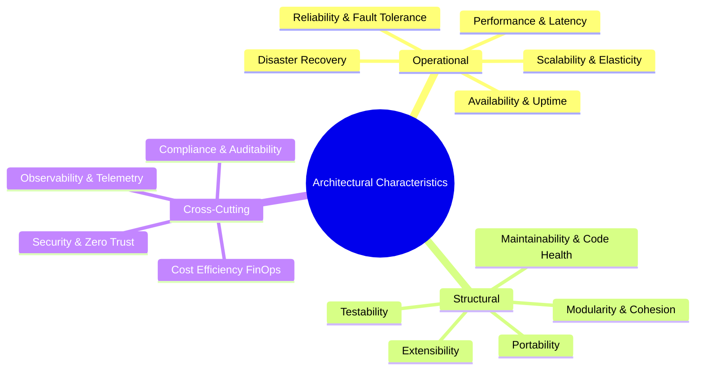
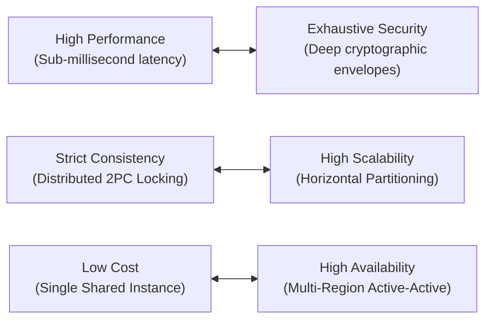

# Architectural Characteristics (The Quality Attributes)

> **Domain**: `00-foundations/architecture-principles`  
> **Status**: Approved  
> **Target Audience**: Solution Architects, Enterprise Architects, Principal Engineers

---

## 1. Problem & Context

A software system can completely fulfill every functional user story (e.g., "User can transfer money") and yet fail completely in production if it cannot survive peak transaction volume, leaks customer credentials, crashes during regional cloud blips, or takes 6 months to deploy a one-line bug fix.

These critical operational and structural requirements are known as **Architectural Characteristics** (historically termed Non-Functional Requirements or NFRs).



---

## 2. Taxonomy of Architectural Characteristics

### 2.1 Operational Characteristics
Directly govern how the software executes, behaves, and survives in live production environments:
* **Availability**: Proportion of time the system is operable and responsive (e.g., 99.99% uptime = 52.6 minutes of unplanned downtime per year).
* **Performance / Latency**: Speed of processing under varying loads (e.g., p95 `< 120ms`, p99 `< 300ms` under 5,000 RPS).
* **Scalability**: Ability to handle increasing workload by dynamically adding compute, storage, or bandwidth resources.
* **Elasticity**: Ability to scale out during traffic surges and immediately scale in when demand subsides to optimize costs.
* **Reliability**: Mean Time Between Failures (MTBF) and ability to deliver correct business results despite transient underlying failures.
* **Recoverability (RPO / RTO)**: Recovery Point Objective (acceptable data loss window) and Recovery Time Objective (acceptable recovery duration).

### 2.2 Structural Characteristics
Directly govern the internal codebase health, maintainability, and developer productivity:
* **Maintainability**: Effort required to modify, refactor, patch, or enhance existing components without introducing regressions.
* **Testability**: Ease with which components can be isolated, mocked, and validated via automated unit, contract, and integration tests.
* **Modularity**: Extent to which the system is decomposed into highly cohesive, loosely coupled units with clean public APIs.
* **Extensibility**: Ability to introduce new business capabilities (e.g., new payment gateways) without rewriting core platform logic.
* **Deployability**: Cadence, risk level, and speed of deploying changes to production (e.g., zero-downtime canary rollouts vs. weekend outages).

### 2.3 Cross-Cutting Governance Characteristics
Enterprise-wide constraints and non-negotiables:
* **Security**: Confidentiality, integrity, availability, and non-repudiation across identity, network, and persistence layers.
* **Privacy & Compliance**: Adherence to statutory legal frameworks (GDPR, PCI-DSS Level 1, HIPAA, SOC 2 Type II).
* **Observability**: Ability to infer internal system health solely from emitted telemetry (structured logs, metrics, distributed traces).
* **Cost Efficiency (FinOps)**: Predictable, sub-linear operational cost scaling relative to user and revenue growth.

---

## 3. The Fallacy of "Support Everything"

A catastrophic architectural mistake is demanding that a system support all 30+ quality attributes at maximum levels.



### The Law of Architectural Selection
An architect must never ask stakeholders: *"Do you want the system to be secure, fast, reliable, scalable, and cheap?"* (The answer is always "yes").  
Instead, the architect must ask:  
> **"Which 3 to 4 characteristics are the critical business differentiators for this platform, and which ones are we willing to compromise on?"**

---

## 4. Prioritization Matrix & Enterprise Trade-offs

| System Archetype | Top Priority Characteristics | Sacrificed / Lower Priority | Rationale |
| :--- | :--- | :--- | :--- |
| **High-Frequency Trading** | Performance (Latency), Consistency, Security | Maintainability, Portability, Cost | Microsecond execution is the core competitive advantage; infrastructure cost is secondary. |
| **Global E-Commerce Platform** | Availability, Scalability, Elasticity | Strict Immediate Consistency | If checkout drops, revenue ceases; eventual consistency on inventory view is acceptable. |
| **Healthcare Diagnostic Records**| Security, Compliance, Durability | Low Latency, Low Cost | A data breach or lost record destroys the business; regulatory fines dwarf hosting fees. |
| **Internal Early-Stage Tooling** | Time-to-Market, Maintainability, Cost | Scalability, High Availability | Modest traffic volume; rapid product validation takes precedence over multi-AZ redundancy. |

---

## 5. Architectural Fitness Functions

Architectural characteristics cannot remain aspirational wishes written in a confluence page. They must be validated using **Automated Architectural Fitness Functions**:

```csharp
// Example: NetArchTest enforcing Layering Invariants in CI
[Fact]
public void DomainLayer_ShouldNotDependOn_InfrastructureLayer()
{
    var result = Types.InAssembly(DomainAssembly)
        .ShouldNot()
        .HaveDependencyOn("Enterprise.Payments.Infrastructure")
        .GetResult();

    Assert.True(result.IsSuccessful, "Domain layer must remain decoupled from infrastructure!");
}
```

* **Performance Fitness Functions**: Automated k6 / Gatling load tests in staging blocking pull requests that increase p99 latency by `> 10%`.
* **Security Fitness Functions**: Container scans (Trivy) failing builds if CVSS `> 7.0` vulnerabilities are introduced.
* **Structural Fitness Functions**: ArchUnit / NetArchTest enforcing domain boundary separation at compile time.
