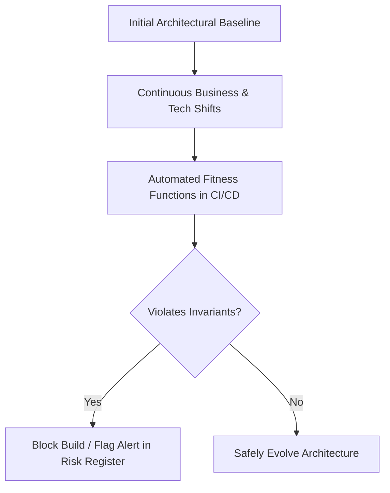
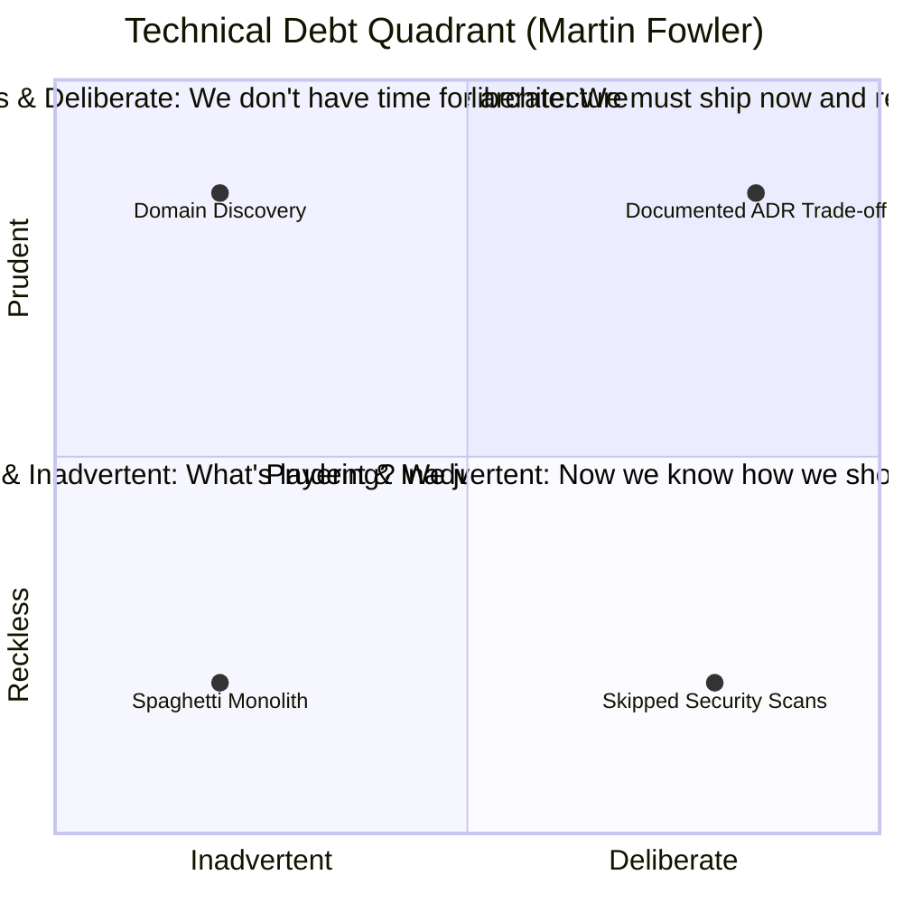

# Evolutionary Architecture & Fitness Functions

> **Domain**: `00-foundations/architecture-principles`  
> **Status**: Approved  
> **Target Audience**: Enterprise Architects, Solution Architects, Principal Engineers

---

## 1. The Myth of the "Final Architecture"

Historically, enterprise IT attempted to practice "Big Design Up Front" (BDUF), producing monolithic 200-page architecture blueprints intended to lock down a system's structure for the next 5 to 10 years. In modern business, this model is dead.

Business requirements change monthly; regulatory compliance evolves constantly; cloud vendors introduce new managed primitives quarterly. Therefore:
> **"An evolutionary architecture supports guided, incremental change across multiple dimensions."**  
> — Neal Ford, Rebecca Parsons & Patrick Kua



---

## 2. Core Pillars of Evolutionary Architecture

1. **Guided Change**: Changes are evaluated against explicit, automated architectural fitness functions that define system health boundaries.
2. **Incremental Delivery**: Architecture must support small, autonomous deployments (Canary, Blue/Green, Feature Flags) rather than risky "big bang" cutovers.
3. **Multiple Dimensions**: Architecture does not evolve solely along functional lines; security, performance, scalability, and maintainability evolve concurrently.

---

## 3. Architectural Fitness Functions in Practice

A **Fitness Function** is any mechanism that provides an objective, automated assessment of an architectural characteristic.

```text
┌─────────────────────────────────────────────────────────────┐
│             SPECTRUM OF ARCHITECTURAL FITNESS FUNCTIONS     │
├───────────────┬─────────────────────────────────────────────┤
│ CATEGORY      │ IMPLEMENTATION TOOL / MECHANISM             │
├───────────────┼─────────────────────────────────────────────┤
│ Structural    │ ArchUnit (Java), NetArchTest (.NET)         │
│ Security      │ Snyk, Trivy, Semgrep, Checkov               │
│ Performance   │ k6, Gatling, Lighthouse (Core Web Vitals)   │
│ Operational   │ Chaos Mesh, Gremlin, Prometheus SLO Alerts  │
│ Cost (FinOps) │ Infracost (Pull request cloud cost diff)    │
└───────────────┴─────────────────────────────────────────────┘
```

### 3.1 Structural Fitness Function Example (Enforcing Hexagonal Boundaries)
```csharp
[Fact]
public void Domain_Must_Not_Reference_Infrastructure_Or_Web()
{
    var domainAssembly = typeof(OrderAggregate).Assembly;

    var result = Types.InAssembly(domainAssembly)
        .ShouldNot()
        .HaveDependencyOnAny(
            "Enterprise.Orders.Infrastructure",
            "Enterprise.Orders.WebAPI",
            "Microsoft.EntityFrameworkCore"
        )
        .GetResult();

    Assert.True(result.IsSuccessful, 
        $"Domain layer violated clean boundaries: {string.Join(", ", result.FailingTypeNames ?? Array.Empty<string>())}");
}
```

### 3.2 FinOps Fitness Function Example (Pull Request Cloud Cost Budget)
Integrating `Infracost` into GitHub Actions:
```yaml
- name: Run Infracost
  run: infracost breakdown --path=terraform/
- name: Fail if monthly cost delta exceeds $500
  run: |
    if [ $(infracost diff --path=terraform/ --format=json | jq '.totalMonthlyCost') -gt 500 ]; then
      echo "Pull request exceeds architectural monthly budget limit!"
      exit 1
    fi
```

---

## 4. Managing Technical Debt as Architectural Entropy

Technical debt is inevitable; unmanaged technical debt is fatal. Evolutionary architecture tracks debt systematically:



### Remediation Protocol: The 20% Rule
Enterprise organizations practicing evolutionary architecture mandate that **20% of every development sprint capacity** is reserved strictly for architectural debt retirement, dependency upgrades, and fitness function expansion.
