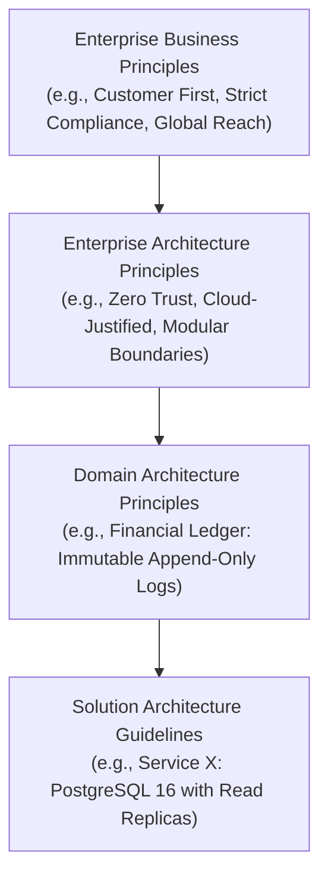
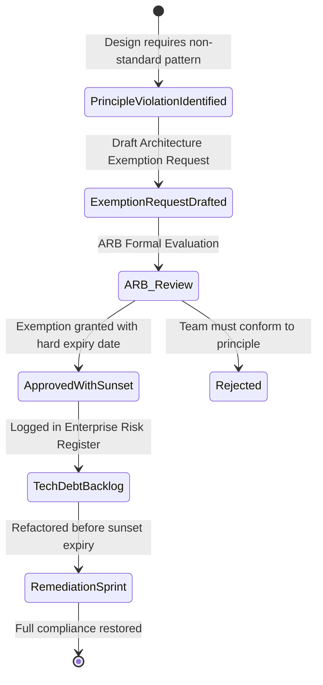

# Architectural Principles: Formulation & Governance

> **Domain**: `00-foundations/architecture-principles`  
> **Status**: Approved  
> **Target Audience**: Enterprise Architects, Solution Architects, Technical Governance Committees

---

## 1. Context & Purpose

An **Architectural Principle** is a declarative, enduring rule that guides and constrains architectural choices across an enterprise. Without clear principles, hundreds of software engineers make thousands of decentralized technology decisions daily in complete isolation, leading to:
* **Severe Architectural Fragmentation**: Five different messaging brokers, four ORMs, and six logging libraries inside a single organization.
* **Unpredictable Operational Reliability**: Inconsistent error handling, divergent security standards, and disparate telemetry.
* **Proliferating Tech Debt**: Solutions optimized for individual developer convenience at the expense of enterprise maintainability and TCO.

---

## 2. Anatomy of an Enterprise Architectural Principle

A professional architectural principle must never be a vague slogan (e.g., "Write high-quality code"). To be actionable, every principle must follow the TOGAF-standard 4-part structure:

```text
┌─────────────────────────────────────────────────────────────┐
│              ANATOMY OF AN ARCHITECTURAL PRINCIPLE          │
├───────────────┬─────────────────────────────────────────────┤
│ 1. Statement  │ Clear, unambiguous rule (One sentence).     │
│ 2. Rationale  │ The economic, operational, or business why. │
│ 3. Implications│ The cost, trade-offs, and behavioral changes│
│               │ demanded across engineering and operations. │
│ 4. Violations │ Clear anti-patterns that breach the rule.   │
└───────────────┴─────────────────────────────────────────────┘
```

### Concrete Example: "API-First Design"
1. **Statement**: Every service boundary must expose an explicit, machine-readable contract (OpenAPI, Protobuf) reviewed and agreed upon before backend implementation begins.
2. **Rationale**: Decouples consumer squads from provider squads, eliminates blocking dependencies, facilitates automated contract testing, and prevents leaking database models into client networks.
3. **Implications**: Teams must allocate time in sprint planning for API reviews; CI pipelines must enforce backward compatibility checks; mock servers must be spun up for front-end integration.
4. **Violations**: A squad writes Entity Framework / Hibernate classes and exposes auto-generated database JSON directly over HTTP without a formal contract.

---

## 3. Principles Hierarchy in Enterprise IT

Principles operate across distinct hierarchical tiers within a Fortune 500 organization:



---

## 4. Principles Governance & Exemption Lifecycles

Principles are living guardrails, not bureaucratic straightjackets. When real-world constraints force a deviation, the organization must follow a formal **Architectural Exemption Process**:



### The Rules of Architectural Exemptions
1. **Time-Bounded**: No permanent exemptions. Every exemption expires within 6 to 12 months.
2. **Owner-Assigned**: An engineering director must formally sign off and own the financial liability and technical debt.
3. **Documented in Risk Register**: Recorded in the [Technical Risk Register](../../16-architecture-deliverables/RISK-REGISTER-TEMPLATE.md).

---

## 5. Summary Reference

For the complete list of 15 non-negotiable enterprise principles governing this handbook, consult the root document:  
👉 [15 Enterprise Architecture Principles](../../ARCHITECTURE-PRINCIPLES.md)
