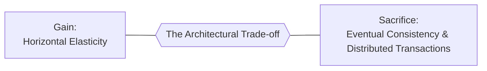

# Architectural Trade-offs & The Law of Conservation of Complexity

> **Domain**: `00-foundations/architecture-principles`  
> **Status**: Approved  
> **Target Audience**: Solution Architects, Enterprise Architects, Principal Engineers

---

## 1. The Fundamental Axiom of Software Architecture

> **"There are no solutions in software architecture; there are only trade-offs."**  
> — Mark Richards & Neal Ford

Every architectural choice is a calculated compromise. If an architect proposes an approach and claims there are "no downsides", one of two things is true:
1. The architect does not understand the technology.
2. The architect has not tested the system under production failure conditions.



---

## 2. Classic Architectural Trade-off Dynamics

### 2.1 Latency vs. Consistency (The PACELC Reality)
* **The Choice**: In the event of network partitions ($P$), choose Availability ($A$) or Consistency ($C$); **Else ($E$)**, choose Latency ($L$) or Consistency ($C$).
* **Trade-off**: If you demand strict serializable ACID consistency across multiple data centers, every write operation must wait for synchronous network round-trips to reach a quorum ($R + W > N$). You cannot have single-digit millisecond writes across continents with strong consistency.
* **Architecture Decision**: Accept eventual consistency for non-financial operations (e.g., product reviews, notifications) to preserve sub-50ms latency.

### 2.2 Microservices vs. Monoliths (Decoupling vs. Operational Complexity)
* **The Gain**: Autonomous team deployments, independent scaling, polyglot freedom.
* **The Sacrifice**: Network latency, partial failures, distributed tracing complexity, distributed transactions (Sagas), data duplication, and massive DevOps overhead.
* **Rule**: Do not accept distributed system complexity until organizational scale or technical throughput mandates it.

### 2.3 Normalized Relational vs. Denormalized NoSQL (Write Integrity vs. Read Speed)
* **Normalized (3NF SQL)**:
  * *Gain*: Zero data redundancy, simple updates, strong transactional integrity.
  * *Sacrifice*: Heavy multi-table joins under high read volume, difficult horizontal sharding.
* **Denormalized (Document/NoSQL)**:
  * *Gain*: Blazing fast single-key reads, trivial horizontal sharding.
  * *Sacrifice*: Eventual consistency, complex application-level updates across duplicated data, risk of data drift.

---

## 3. Tesler’s Law (The Conservation of Complexity)

**Tesler’s Law of Conservation of Complexity** states that *every system contains an inherent amount of irreducible complexity. The only choice is who must deal with it: the user, the developer, the architect, or the operational infrastructure.*

```text
┌─────────────────────────────────────────────────────────────┐
│                  TESLER'S COMPLEXITY SPECTRUM               │
├───────────────────────────────┬─────────────────────────────┤
│ ARCHITECTURAL CHOICE          │ WHERE THE COMPLEXITY LIVES  │
├───────────────────────────────┼─────────────────────────────┤
│ Simple Relational Database    │ Inside the database engine  │
│ Distributed Sharded NoSQL     │ Inside the application code │
│ Event Sourced Microservices   │ Inside the network & DevOps │
│ Serverless Cloud Functions    │ Inside the cloud provider   │
└───────────────────────────────┴─────────────────────────────┘
```

When an architect claims to have "simplified" an architecture by breaking a monolith into 40 microservices, they did not eliminate complexity; they merely transferred complexity from in-process compiler-checked function calls into network sockets, serialization protocols, container orchestrators, and distributed tracing.

---

## 4. The 5-Step Trade-off Evaluation Rubric

When evaluating competing architectural options:

1. **Explicitly Document What is Sacrificed**: Every ADR must have a dedicated section entitled *"Negative Consequences & Sacrifices Accepted"*.
2. **Quantify the Trade-off**: Avoid subjective terms ("slightly slower"). Use hard metrics: *"Increases p99 write latency from 15ms to 85ms across cross-region calls"*.
3. **Map to Business Impact**: Does this sacrifice violate a customer SLA or commercial contract?
4. **Identify the Reversibility Risk**: If this trade-off proves unviable in 12 months, what is the wall-clock time and financial cost to reverse it?
5. **Score via the [Decision-Making Framework](../../DECISION-MAKING-FRAMEWORK.md)**: Utilize the 15-dimension weighted scoring matrix.
