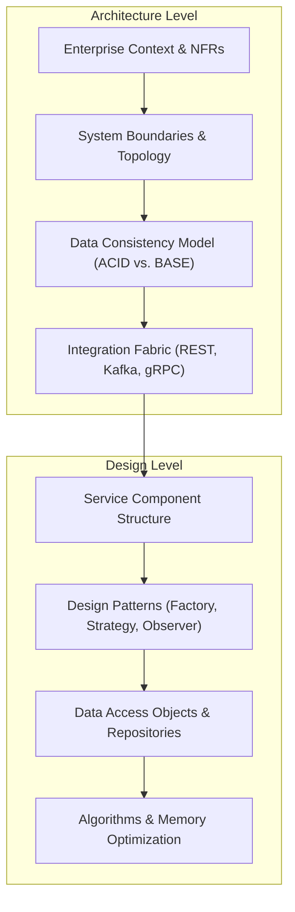

# Architecture vs. Design

> **Domain**: `00-foundations/architecture-principles`  
> **Status**: Approved  
> **Target Audience**: Solution Architects, Principal Engineers, Engineering Managers

---

## 1. Context & The Granularity Spectrum

The boundary between "architecture" and "detailed design" is one of the most contentious debates in enterprise software engineering. While both disciplines are concerned with creating working systems, they operate at fundamentally different levels of abstraction, decision scope, and economic impact.

```text
┌─────────────────────────────────────────────────────────────┐
│                    THE ABSTRACTION SPECTRUM                 │
├───────────────────────────────┬─────────────────────────────┤
│ ARCHITECTURE                  │ DETAILED DESIGN             │
├───────────────────────────────┼─────────────────────────────┤
│ Macro-level structure         │ Micro-level realization     │
│ System boundaries & contracts │ Internal module mechanics   │
│ NFRs & Quality Attributes     │ Class hierarchies & patterns│
│ Irreversible / High-cost      │ Reversible / Low-cost       │
│ Multi-team / Multi-system     │ Single team / Single repo   │
└───────────────────────────────┴─────────────────────────────┘
```

---

## 2. Core Differences Across Engineering Dimensions



### 1. Scope of Influence
* **Architecture**: Cross-cutting and system-wide. An architectural decision (e.g., synchronous REST vs. asynchronous event-driven) impacts all participating services, operational infrastructure, observability tooling, and team topologies.
* **Design**: Localized to a single component, bounded context, or codebase. Choosing the Strategy Pattern to compute shipping fees inside an order service has zero impact on the payment service or cloud networking.

### 2. Lifespan & Volatility
* **Architecture Decisions**: Designed to endure for years. Shifting from microservices back to a modular monolith or migrating from AWS to on-prem is a multi-quarter or multi-year initiative.
* **Design Decisions**: Volatile and iteratively refined. Refactoring a set of classes or swapping out a JSON serializer can be completed in an afternoon sprint.

### 3. Stakeholder Alignment
* **Architects**: Interface with Product Executives, CISOs, Infrastructure Leads, Legal/Compliance, and Engineering Directors.
* **Designers / Senior Engineers**: Interface with Squad Product Owners, QA Engineers, and peer developers.

---

## 3. Practical Comparison Matrix

| Architectural Question | Corresponding Design Question |
| :--- | :--- |
| How do we guarantee 99.99% availability across regional cloud outages? | How do we implement retry logic with exponential backoff in our HTTP client? |
| How do we enforce Zero Trust identity across polyglot microservices? | How do we parse and extract custom claims from an incoming JWT header? |
| Should we use an Event-Sourced persistence model or relational CRUD? | How do we map our domain aggregate to Entity Framework / Hibernate tables? |
| How do we partition customer data to comply with German data residency? | Which database indexing strategy (B-tree vs. Hash) optimizes our user lookups? |
| Should we deploy on multi-tenant Kubernetes or Serverless FaaS? | How many worker threads should be allocated to our background processing pool? |

---

## 4. The Dangerous Overlaps & Anti-Patterns

### 1. Architecture Overreach (Micromanagement)
* **Anti-Pattern**: Enterprise or Solution Architects specifying internal class names, variable naming standards, or repository method signatures in a Solution Architecture Document (SAD).
* **Impact**: Destroys developer autonomy, breeds resentment, slows execution, and prevents engineers from applying domain-specific code optimizations.
* **Remedy**: Architects define the **invariants, contracts, and quality gates**; engineering squads own the internal class and algorithmic design.

### 2. The Architectural Vacuum
* **Anti-Pattern**: Developers making architectural choices inside sprint tickets without governance (e.g., a developer introduces an unmanaged MongoDB cluster inside a single microservice because they didn't want to write SQL migrations).
* **Impact**: Fragmented technology footprint, compliance violations, operational blindspots for on-call SREs.
* **Remedy**: Clear definition of [Architectural Decision Records (ADRs)](../../16-architecture-deliverables/ADR-TEMPLATE.md) triggered whenever a choice impacts data topology, network boundaries, or technology radar rings.

---

## 5. Summary Rule of Thumb

> **"All architecture is design, but not all design is architecture."**  
> Architecture represents the subset of design decisions that are *strategic*, *structural*, *expensive to reverse*, and *essential to meeting non-functional quality attributes*.
