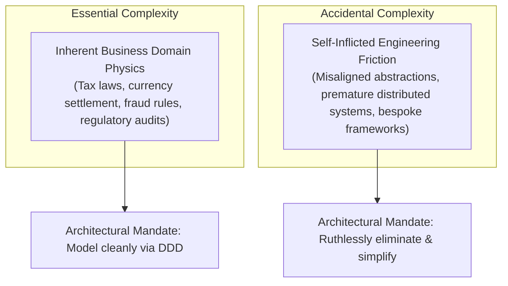

# Complexity Management in Enterprise Systems

> **Domain**: `00-foundations/architecture-principles`  
> **Status**: Approved  
> **Target Audience**: Solution Architects, Enterprise Architects, Principal Engineers

---

## 1. Problem: The Death Spiral of Software Systems

As enterprise software systems age, they tend toward maximum entropy. Each new feature, edge-case patch, and hasty integration adds friction, increasing the cognitive load required to understand the codebase. Eventually, systems hit the **Complexity Death Spiral**:
* Minor bug fixes take weeks to implement and inadvertently break unrelated components.
* Engineering velocity grinds to a halt.
* Developers become terrified of refactoring legacy modules.
* Management proposes an expensive, high-risk "complete system rewrite" (which often fails for the same reasons).

---

## 2. Essential vs. Accidental Complexity

Fred Brooks, in his seminal work *No Silver Bullet*, established the fundamental distinction between two types of complexity:



### Essential Complexity
* **Definition**: The inherent difficulty of the business problem itself.
* **Example**: Calculating multi-jurisdictional value-added tax (VAT) across 27 EU member states with varying exemptions. No framework can make this simple because the tax law is inherently intricate.
* **Architect's Role**: Encapsulate, isolate, and express essential complexity using Strategic Domain-Driven Design (DDD) and ubiquitous language.

### Accidental Complexity
* **Definition**: Complexity introduced by our technical choices, frameworks, infrastructure, or poor abstractions.
* **Example**: Introducing Kubernetes, Kafka, a custom service mesh, and distributed Redis caching for an internal CRUD application with 50 daily active users.
* **Architect's Role**: Prevent, identify, and aggressively eliminate accidental complexity.

---

## 3. The Cynefin Framework for Architects

Architects must adjust their decision-making process based on the domain complexity context defined by Dave Snowden’s **Cynefin Framework**:

```text
┌───────────────────────────────┬───────────────────────────────┐
│ COMPLEX                       │ COMPLICATED                   │
│ (Probe - Sense - Respond)     │ (Sense - Analyze - Respond)   │
│ Unknown unknowns.             │ Known unknowns.               │
│ Emergent architecture.        │ Expert analysis required.     │
│ Rapid prototyping in 99-exp.  │ Systematic trade-off scoring. │
├───────────────────────────────┼─────────────────────────────--┤
│ CHAOTIC                       │ CLEAR / SIMPLE                │
│ (Act - Sense - Respond)       │ (Sense - Categorize - Respond)│
│ High-severity live outage.    │ Best practices exist.         │
│ Stop the bleeding immediately.│ Standardized paved paths.     │
│ Root cause analysis later.    │ Off-the-shelf components.     │
└───────────────────────────────┴───────────────────────────────┘
```

---

## 4. Architectural Strategies for Taming Complexity

### 1. Enforce Strict Bounded Contexts (DDD)
Partition large monolithic domains into discrete subdomains. What happens inside the `BillingContext` must be opaque to the `ShippingContext`. High cohesion within boundaries; low coupling across boundaries.

### 2. Guard Cognitive Load
A single engineering squad (5–8 engineers) should not be expected to understand 40 different microservices, 3 cloud providers, and 5 programming languages. Size service boundaries to match the **Cognitive Load** of the team (Team Topologies).

### 3. Favor Boring, Proven Technology
Novel, bleeding-edge technologies introduce massive accidental complexity due to immature documentation, subtle edge-case runtime bugs, lack of community knowledge, and frequent breaking changes. Leverage mature components in the `ADOPT` ring of the [Technology Radar](../../TECHNOLOGY-RADAR.md).

### 4. Implement Architecture Fitness Functions
Use automated tests (ArchUnit, NetArchTest) in continuous integration to prevent architectural rot, cyclic dependencies, and boundary bleeding.
