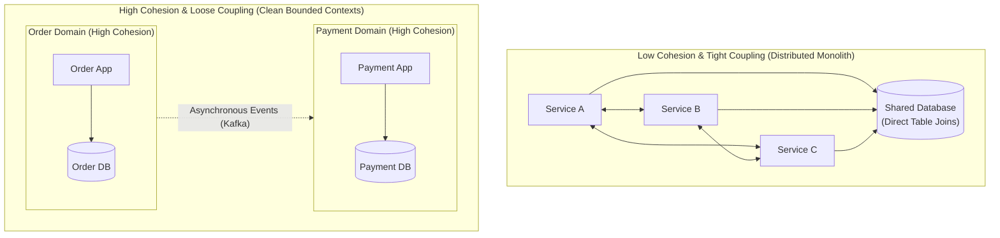
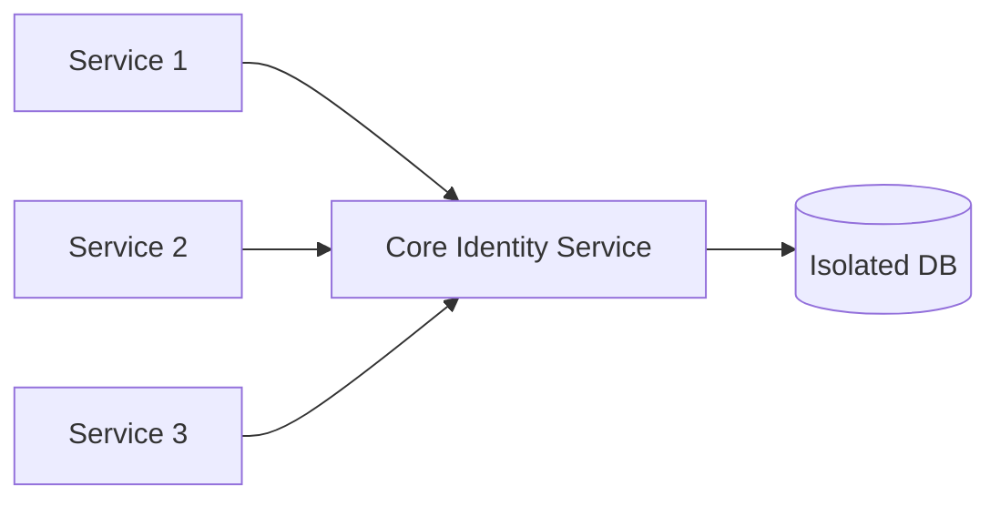

# Coupling and Cohesion in Enterprise Architecture

> **Domain**: `00-foundations/architecture-principles`  
> **Status**: Approved  
> **Target Audience**: Solution Architects, Principal Engineers, Domain Architects

---

## 1. Executive Summary

The twin concepts of **Coupling** and **Cohesion** represent the most foundational structural metrics in software engineering.
* **Cohesion**: The degree to which elements within a boundary belong together.
* **Coupling**: The degree of interdependence between distinct boundaries.

The holy grail of enterprise architecture is:  
> **HIGH COHESION within boundaries, and LOOSE COUPLING across boundaries.**

---

## 2. Cohesion Deep Dive

Cohesion evaluates how strongly related the internal responsibilities of a module, package, or microservice are.

### Cohesion Spectrum (From Worst to Best)
1. **Coincidental Cohesion (Worst)**: Elements bundled arbitrarily with zero conceptual relationship (e.g., the infamous `CommonUtils` or `Helpers` class).
2. **Logical Cohesion**: Elements grouped because they perform logically similar tasks (e.g., an `InputValidator` that validates phone numbers, XML payloads, and SQL dates).
3. **Temporal Cohesion**: Elements grouped because they happen to execute at the same time (e.g., `StartupInitializer` that loads caches, opens database connections, and sends telemetry pings).
4. **Functional / Domain Cohesion (Best)**: Elements grouped strictly because they cooperate to execute a single, well-defined business capability (e.g., `TaxCalculationEngine` or `PaymentProcessingAggregate`).

---

## 3. Coupling Deep Dive & The Connascence Framework

Coupling measures how changes in Component A necessitate changes in Component B. In modern architecture, coupling is analyzed using the **Connascence** metric (Meilir Page-Jones).

### Static Connascence (Discoverable at Compile Time)
* **Connascence of Name (CoN - Weakest / Most Acceptable)**: Components agree on the name of an entity (e.g., method name `calculateTax()`).
* **Connascence of Type (CoT)**: Components agree on the class/type of an argument (e.g., strongly typed DTOs).
* **Connascence of Meaning (CoM - Toxic)**: Components agree on the implicit meaning of magic values (e.g., `status = 1` means active, `status = 2` means suspended). Must be replaced with explicit enums.
* **Connascence of Algorithm (CoA - Toxic)**: Two components must execute the exact same hashing or encryption algorithm to validate data.

### Dynamic Connascence (Discoverable only at Runtime)
* **Connascence of Execution (CoE - Dangerous)**: Order of execution matters across network calls (e.g., must call `init()` before `process()`, or system crashes).
* **Connascence of Timing (CoT - Dangerous)**: Operations must occur within a specific millisecond window or race conditions occur.
* **Connascence of Identity (CoI - Most Toxic)**: Two distributed services must reference the exact same memory instance or share a distributed lock.

---

## 4. Afferent vs. Efferent Coupling

In enterprise systems, architects measure structural stability using Robert C. Martin's package metrics:

* **Afferent Coupling ($C_a$) - Inbound**: Number of outside components that depend on this component. High $C_a$ means high responsibility; this component cannot change easily without breaking many clients.
* **Efferent Coupling ($C_e$) - Outbound**: Number of outside components this component depends on. High $C_e$ means high instability; any change in downstream dependencies impacts this service.
* **Instability Metric ($I$)**:
  $$I = \frac{C_e}{C_a + C_e}$$
  * $I = 0$: Maximally stable component (e.g., a core shared kernel or identity provider).
  * $I = 1$: Maximally volatile component (e.g., a frontend BFF that aggregates 10 backend APIs).

---

## 5. Architectural Checklist for Decoupling

* [ ] Does each service own its private data store? Zero shared database tables.
* [ ] Are communications driven by explicit versioned contracts (OpenAPI, Protobuf)?
* [ ] Can Service A deploy to production while Service B is temporarily offline?
* [ ] Are temporal dependencies eliminated via asynchronous messaging where immediate consistency is not strictly required?
