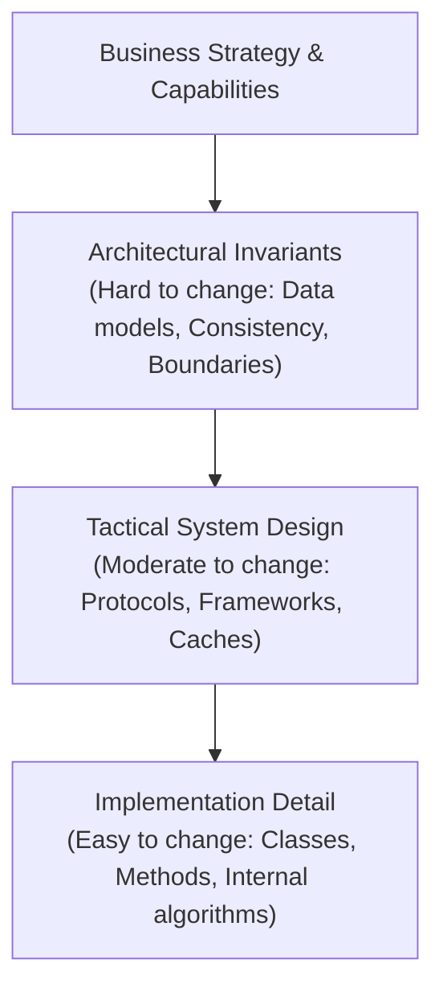
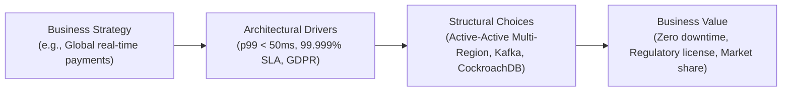

# What is Software Architecture?

> **Domain**: `00-foundations/architecture-principles`  
> **Status**: Approved  
> **Target Audience**: Solution Architects, Enterprise Architects, Principal Engineers

---

## 1. Problem Statement & Conceptual Ambiguity

In enterprise software engineering, "architecture" is often conflated with high-level design, component wiring, technology brand selection, or organizational hierarchy. When architecture is poorly understood, organizations suffer from two destructive extremes:
1. **Ivory Tower Architecture**: Theoretical, disconnected architects produce multi-hundred-page documents that engineering teams ignore because they fail to account for real-world runtime mechanics.
2. **Architecture Absence ("Cowboy Engineering")**: Teams sprint through feature backlogs without establishing structural boundaries, resulting in entangled codebases ("Big Ball of Mud"), severe operational brittleness, and crushing technical debt.

---

## 2. Definitional Precision: Architecture as Irreversible Decisions

At its core, **Software Architecture is the set of fundamental design decisions that are expensive, disruptive, or virtually impossible to change once implemented.**

### The Three Core Pillars of Architecture
1. **System Structure**: How the system is partitioned into components, modules, or services, and the explicit boundaries separating them.
2. **Quality Attributes (Architectural Characteristics)**: The operational and structural "-ilities" (scalability, availability, fault tolerance, security, maintainability) that dictate system behavior under stress.
3. **Architectural Decisions & Governance**: The codified rules, constraints, and fitness functions that preserve the integrity of the system as it evolves over time.

---

## 3. Architecture vs. Implementation: The Decision Horizon

The boundary between architecture and implementation is defined by the **Cost of Reversal (Reversibility Horizon)**:

| Dimension | Architectural Concern | Implementation Concern |
| :--- | :--- | :--- |
| **Persistence** | Choosing Event Sourcing vs. Relational CRUD; Strong vs. Eventual consistency | Selecting an ORM library version; tuning SQL connection pool min-idle |
| **Integration** | Event-Driven Choreography vs. Synchronous Request-Reply; Saga pattern | Configuring HTTP client timeout values; choosing Jackson vs. Gson serializer |
| **Modularity** | Defining Bounded Contexts; Enforcing physical vs. logical service boundaries | Package layout; naming conventions of classes and interfaces |
| **Security** | Zero Trust mutual TLS (mTLS); OAuth2 token delegation topology | Regex for password complexity validation; CSRF token helper functions |
| **Reversibility** | **Type 1 Decision (One-Way Door)**: Months/years of refactoring to change | **Type 2 Decision (Two-Way Door)**: Days/hours to rewrite or swap |

---

## 4. The Business-Driven Imperative

Architecture does not exist in a vacuum. It is an economic activity whose primary mission is to translate business capabilities into technical reality:

* **Cost of Ownership**: Every component introduced adds licensing, hosting, monitoring, and cognitive overhead.
* **Time-to-Market vs. Long-Term Agility**: Prematurely building complex microservices destroys time-to-market for a startup; conversely, building a monolithic tangled database destroys agility for an enterprise with 50 squads.

---

## 5. Architectural Anti-Patterns

### Anti-Pattern 1: The "Everything is Architecture" Fallacy
* *Symptom*: Architects insist on reviewing every pull request, database column rename, and third-party library bump.
* *Consequence*: Architecture becomes a critical delivery bottleneck; development velocity plummets; engineers resent the architecture function.
* *Remedy*: Establish automated fitness functions and paved golden paths; reserve architectural review strictly for Type 1 decisions.

### Anti-Pattern 2: The Resume-Driven Architecture
* *Symptom*: Adopting unproven distributed platforms or novel languages solely because they are trending on tech forums.
* *Consequence*: The enterprise absorbs operational fragility, unpatched CVEs, and high hiring costs for zero business advantage.
* *Remedy*: Enforce the [Architecture Decision-Making Framework](../../DECISION-MAKING-FRAMEWORK.md) and [Technology Radar](../../TECHNOLOGY-RADAR.md).

---

## 6. Real-World Enterprise Scenario

**Context**: A Tier-1 retail bank modernizing its monolithic core banking ledger.  
* **Architectural Decision**: Adopt an append-only, immutable event log for all balance movements with CQRS projections for read queries.
* **Why it is Architectural**: Changing the persistence model from mutable in-place SQL updates (`UPDATE accounts SET balance = balance - 100`) to an immutable event-stream fundamentally alters auditability, failure recovery, concurrency control, and disaster recovery replication. Reversing this choice after 2 years would require a multi-million-dollar core system re-write.

---

## 7. Key Takeaways & Decision Checklist

* [ ] Is this decision a Type 1 (hard to reverse) or Type 2 (easy to reverse) decision?
* [ ] Does this choice directly support a quantified business KPI or regulatory mandate?
* [ ] Have the architectural trade-offs been recorded in an immutable [ADR](../../16-architecture-deliverables/ADR-TEMPLATE.md)?
