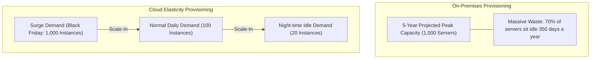
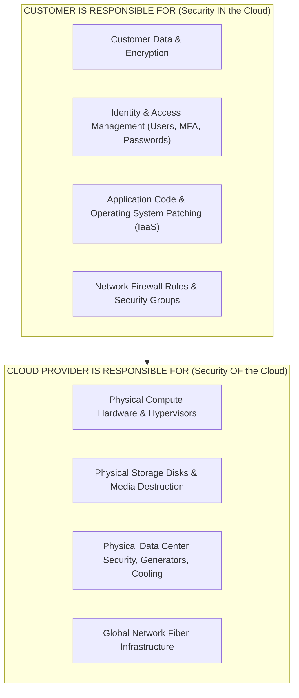

# Cloud Computing: Economic Models & The Shared Responsibility Matrix

> **Domain**: `00-foundations/cloud-fundamentals`  
> **Status**: Approved  
> **Target Audience**: Solution Architects, Enterprise Architects, Cloud Financial Officers

---

## 1. Simple Explanation

**Cloud Computing** is the on-demand delivery of IT resources (compute, database storage, networking, AI) over the internet with pay-as-you-go pricing, replacing capital-intensive physical data centers with elastic, software-defined infrastructure.

---

## 2. The Economic Paradigm Shift: CapEx to OpEx

```text
┌─────────────────────────────────────────────────────────────┐
│                 CAPEX VS. OPEX ECONOMIC SHIFT               │
├───────────────────┬─────────────────────────────────────────┤
│ ON-PREMISES (CapEx)│ CLOUD COMPUTING (OpEx)                 │
├───────────────────┼─────────────────────────────────────────┤
│ Huge upfront      │ Zero upfront capital investment.        │
│ capital expenditure.│ Continuous operational expenditure.   │
│ Provision for 5-year│ Provision dynamically for current load;│
│ peak capacity.    │ scale in during idle hours.             │
│ 80% of server CPU │ Pay only for compute-seconds and        │
│ sits idle at night.│ gigabytes consumed.                     │
└───────────────────┴─────────────────────────────────────────┘
```



---

## 3. The Shared Responsibility Model

The most critical operational concept in cloud architecture is the **Shared Responsibility Model**. Failure to understand who owns what layer leads to data breaches and regulatory fines.



> **The Hard Truth**: If an AWS S3 bucket is left open to the public internet without authentication, **AWS is not breached—the customer made an architectural configuration error.**

---

## 4. Cloud Geography: Regions, Availability Zones & Edge Locations

Understanding the physical geography of hyper-scale cloud providers (AWS/Azure/GCP):

1. **Regions**: A separate geographic area (e.g., `eu-west-1` in Ireland, `us-east-1` in Virginia) completely isolated from other regions. Consists of multiple Availability Zones connected via private low-latency fiber.
2. **Availability Zones (AZs)**: One or more discrete physical data centers located several kilometers apart (to survive local power grid failures, floods, or fires) but within `<= 1.5ms` network latency of each other.
3. **Edge PoPs (Points of Presence)**: Hundreds of caching and network termination locations deployed in major metropolitan cities worldwide.
