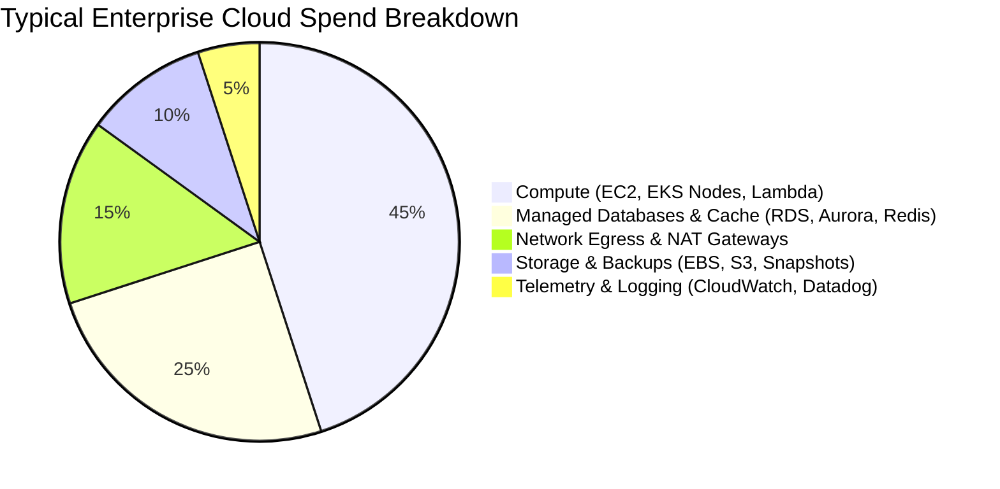

# Cloud Cost Modeling & FinOps Fundamentals

> **Domain**: `00-foundations/cloud-fundamentals`  
> **Status**: Approved  
> **Target Audience**: Solution Architects, Enterprise Architects, FinOps Practitioners

---

## 1. Simple Explanation

In cloud architecture, **Cost is a first-class architectural metric**. Unlike on-premises data centers where hardware was purchased upfront as CapEx, every line of cloud architecture code (Terraform, pod replica counts, database sizing, logging verbosity) directly generates a variable monthly financial bill. **FinOps (Cloud Financial Operations)** is the discipline of bringing financial accountability to architectural design.

---

## 2. The Cloud Cost Hierarchy: Where the Money Goes

In 90% of enterprise cloud bills, costs are concentrated in four core buckets:



---

## 3. The 4 Compute Purchasing Models

Understanding how compute instances are priced in AWS/Azure/GCP:

```text
┌─────────────────────────────────────────────────────────────┐
│                 COMPUTE PURCHASING MODELS                   │
├───────────────────┬─────────────────────────────────────────┤
│ 1. On-Demand      │ Maximum flexibility, pay by the second. │
│                   │ Highest baseline cost (100% price).     │
│                   │ Best for: Unpredictable burst spikes.   │
├───────────────────┼─────────────────────────────────────────┤
│ 2. Reserved       │ 1-Year or 3-Year commitment to a        │
│    Instances (RI) │ specific instance type. 30% - 60% saving│
├───────────────────┼─────────────────────────────────────────┤
│ 3. Savings Plans  │ Commit to hourly spend ($/hr) across any│
│                   │ instance family. 40% - 72% discount.    │
│                   │ The enterprise standard for steady load.│
├───────────────────┼─────────────────────────────────────────┤
│ 4. Spot Instances │ Bid on spare cloud capacity.            │
│                   │ 70% - 90% discount!                     │
│                   │ Cloud can terminate with 2-minute notice│
│                   │ Best for: Stateless workers, batch jobs.│
└───────────────────┴─────────────────────────────────────────┘
```

---

## 4. Architectural FinOps Optimization Levers

### 4.1 The Spot + On-Demand Kubernetes Mixed Node Pool
* Configure Kubernetes clusters (via **Karpenter**):
  * **Critical Path / API Pods**: Run on 3-Year Savings Plan On-Demand instances (100% stability guaranteed).
  * **Asynchronous Queue Workers / Batch ETL**: Run on **Spot Instances** (saving 80% on compute). Pods listen for the 2-minute termination notice (`SIGTERM`), gracefully flush queue state, and reschedule onto a new spot node.

### 4.2 Architecture Optimization for Modern Silicon (ARM64)
* Modern cloud ARM processors (**AWS Graviton3/4, Azure Cobalt, GCP Tau T2A**) deliver **20% to 40% better price-performance** compared to legacy x86 (Intel/AMD) instances.
* Modern runtimes (.NET 8, Java 21, Go, Python, Node.js) compile natively to Linux ARM64 with zero code modifications!

### 4.3 Log Ingestion Cost Containment
* Third-party observability tools (Datadog, Splunk) charge up to **$0.50 per GB of ingested log data**.
* An application emitting chatty debug logs at 10,000 requests/second will generate a **$20,000 monthly observability bill** that dwarfs the compute cost of the actual service!
* **Remedy**: Enforce structured JSON logging with dynamic runtime sampling (e.g., sample 100% of errors, but only 1% of successful `GET 200` requests).
