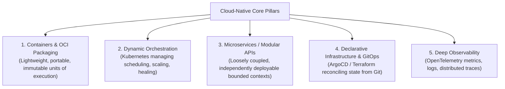

# Cloud-Native Architecture: Principles & The CNCF Landscape

> **Domain**: `00-foundations/cloud-fundamentals`  
> **Status**: Approved  
> **Target Audience**: Solution Architects, Enterprise Architects, Cloud Engineers

---

## 1. Simple Explanation

"Cloud-Native" does not mean simply taking a 20-year-old monolithic application running on an on-prem VM and "lifting and shifting" it onto an AWS EC2 instance.  
**Cloud-Native** describes software designed from scratch to thrive in dynamic, elastic, automated cloud environments, utilizing containers, service meshes, microservices, immutable infrastructure, and declarative APIs.

---

## 2. The CNCF Definition of Cloud-Native

The **Cloud Native Computing Foundation (CNCF)** formally defines cloud-native technologies as those that:
> *"Empower organizations to build and run scalable applications in modern, dynamic environments such as public, private, and hybrid clouds. Containers, service meshes, microservices, immutable infrastructure, and declarative APIs exemplify this approach.*  
> *These techniques enable loosely coupled systems that are resilient, manageable, and observable. Combined with robust automation, they allow engineers to make high-impact changes frequently and predictably with minimal toil."*

---

## 3. "Cloud-Hosted" vs. "Cloud-Native"

Understanding the difference between a legacy app in the cloud and a true cloud-native platform:

| Dimension | Cloud-Hosted (Lift & Shift) | Cloud-Native |
| :--- | :--- | :--- |
| **Server Lifecycle** | **Pets**: Long-lived VMs, manually patched, given human names (`web-prod-01`). | **Cattle**: Ephemeral containers, immutable, destroyed and replaced in seconds. |
| **Scaling Mechanism** | Vertical: Provisioning a larger VM during maintenance windows. | Horizontal & Elastic: Autoscaling pods and nodes dynamically based on real-time load. |
| **Deployment Strategy**| Manual SSH or script; requires scheduled maintenance downtime. | Zero-downtime: Continuous delivery via Canary or Blue/Green rollouts. |
| **Configuration** | Baked into the machine image or local files on disk. | Injected dynamically at runtime via Environment Variables / ConfigMaps. |
| **Failure Response** | Disaster: Server crash requires on-call engineer to reboot machine. | Self-Healing: Orchestrator detects failed health probe and restarts pod instantly. |

---

## 4. Architectural Trap: Cloud-Native Complexity Overload

The dark side of cloud-native is adopting every open-source tool on the sprawling CNCF landscape map simultaneously.
* **The Symptom**: A 10-person engineering team attempting to maintain custom Kubernetes operators, Istio service mesh, Prometheus/Thanos, Kafka, Vault, and Spinnaker.
* **The Consequence**: 80% of engineering time is spent debugging infrastructure and upgrade scripts rather than writing business features.
* **The Architectural Antidote**: **Pragmatic Cloud-Native**. Utilize cloud-managed services (EKS/AKS, RDS, Managed Kafka) and adopt advanced CNCF primitives only when organizational scale justifies the operational overhead.
