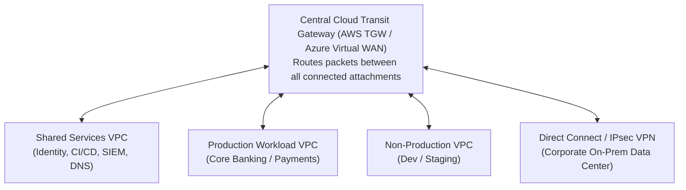
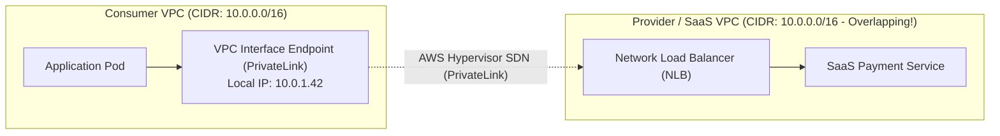

# Cloud Networking: VPCs, Transit Gateways & PrivateLink

> **Domain**: `00-foundations/cloud-fundamentals`  
> **Status**: Approved  
> **Target Audience**: Solution Architects, Cloud Network Architects, Infrastructure Engineers

---

## 1. Simple Explanation

In cloud infrastructure, **Virtual Private Cloud (VPC)** networking provides an isolated, software-defined virtual network for your cloud resources. Connecting dozens of separate VPCs across multiple enterprise business units, accounts, and on-premises data centers requires specialized hub-and-spoke routing and private service endpoints.

---

## 2. Hub-and-Spoke Topology via Cloud Transit Gateway

In large Fortune 500 enterprises with hundreds of AWS accounts:
* **The Mesh Anti-Pattern**: Attempting to connect every VPC to every other VPC via VPC Peering creates an unmanageable $N(N-1)/2$ web of point-to-point connections.
* **The Enterprise Standard**: A centralized **Cloud Transit Gateway (TGW)** acting as a regional cloud router.



---

## 3. VPC Peering vs. Transit Gateway vs. PrivateLink

```text
┌─────────────────────────────────────────────────────────────┐
│                 CLOUD INTERCONNECT COMPARISON               │
├───────────────────┬─────────────────────────────────────────┤
│ VPC PEERING       │ Fast, simple, lowest cost ($0/hr).      │
│                   │ Non-transitive routing (Cannot hop from │
│                   │ A -> B -> C). Best for 2-3 VPC pairs.   │
├───────────────────┼─────────────────────────────────────────┤
│ TRANSIT GATEWAY   │ Hub-and-spoke router for 5 to 5,000 VPCs│
│ (TGW)             │ Supports transitive routing, on-prem    │
│                   │ DirectConnect, and centralized firewalls│
├───────────────────┼─────────────────────────────────────────┤
│ AWS PRIVATELINK / │ Exposes a single service (NLB) across   │
│ AZURE PRIVATELINK │ accounts without network peering!       │
│                   │ Zero CIDR overlap risk; unidirectional. │
└───────────────────┴─────────────────────────────────────────┘
```

---

## 4. The Overlapping CIDR Nightmare & PrivateLink

When two companies merge (M&A) or when connecting to an external SaaS partner:
* Company A’s VPC uses `10.0.0.0/16`.
* Company B’s VPC also uses `10.0.0.0/16`.
* **Standard VPC Peering or VPN is physically impossible** because IP addresses collide!



### The Solution: AWS PrivateLink / Azure Private Endpoint
* Instead of peering the entire network, the provider publishes an **Endpoint Service** backed by an NLB.
* The consumer provisions a local **Interface Endpoint (ENI)** inside their own private subnet.
* Traffic routes unidirectionally across the cloud provider's underlying hypervisor network using network address translation (NAT).
* **Solves overlapping CIDRs permanently and prevents consumers from accessing anything else in the provider's VPC.**
