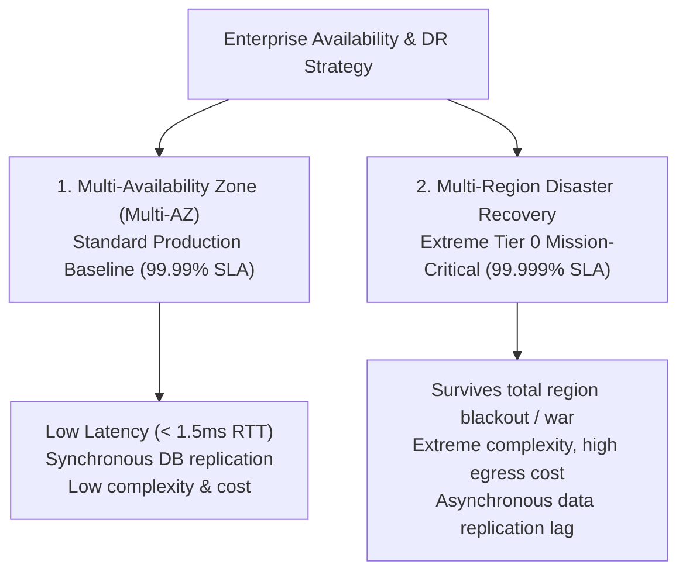
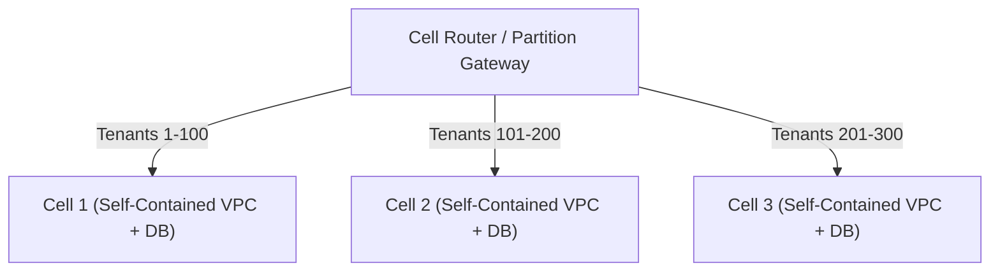

# Cloud Resilience: Multi-AZ vs. Multi-Region Architectures

> **Domain**: `00-foundations/cloud-fundamentals`  
> **Status**: Approved  
> **Target Audience**: Solution Architects, Enterprise Architects, Principal SREs

---

## 1. Simple Explanation

In cloud systems, hardware components and power grids will fail. **Cloud Resilience** is the architectural strategy that ensures an application survives the catastrophic failure of an entire physical data center (Availability Zone outage) or an entire geographical area (Cloud Region outage) with minimal downtime and zero data loss.

---

## 2. Multi-AZ vs. Multi-Region: The Great Architectural Trade-off



---

## 3. The Multi-Region Disaster Recovery Spectrum

If an enterprise mandates multi-region redundancy, the architect must select one of four standard disaster recovery tiers based on business **RPO** (Recovery Point Objective) and **RTO** (Recovery Time Objective):

```mermaid
flowchart LR
    Tier1["1. Backup & Restore\nRTO: 24h, RPO: 24h\nCost: $"] --> Tier2["2. Pilot Light\nRTO: 1-2h, RPO: 15m\nCost: $$"]
    Tier2 --> Tier3["3. Warm Standby\nRTO: 10m, RPO: 1m\nCost: $$$"]
    Tier3 --> Tier4["4. Multi-Region Active-Active\nRTO: 0s, RPO: 0s\nCost: $$$$$"]
```

### 3.1 Tier 1: Backup & Restore
* **Mechanics**: Nightly database snapshots replicated to a secondary region.
* **Recovery**: In an outage, provision cloud infrastructure from Terraform and restore snapshots.
* **Fit**: Non-critical internal batch systems where a 24-hour outage is acceptable.

### 3.2 Tier 2: Pilot Light
* **Mechanics**: Core persistence (database) is running continuously in the secondary region with live asynchronous replication. Compute nodes (Kubernetes clusters) are configured in code (Terraform), but have **zero running instances** (scaled to 0).
* **Recovery**: In an outage, scale Kubernetes node pools from 0 to 50 nodes. Service boots in 15–30 minutes.

### 3.3 Tier 3: Warm Standby
* **Mechanics**: A scaled-down, functional copy of the entire platform runs 24/7 in the secondary region (e.g., sized at 20% capacity).
* **Recovery**: Route 53 DNS shifts traffic to secondary region; horizontal pod autoscalers scale capacity from 20% to 100% within 5 minutes.

### 3.4 Tier 4: Multi-Region Active-Active
* **Mechanics**: Both regions serve live customer read and write traffic simultaneously 24/7.
* **The Physics Challenge**: **The Speed of Light**. You cannot have synchronous relational database replication between Ireland and Virginia without adding 75ms of network latency to every database commit. Requires Distributed SQL (CockroachDB/Spanner) or sophisticated event-driven CRDTs.
* **Cost**: $3\times$ to $5\times$ more expensive in cloud infrastructure and engineering maintenance.

---

## 4. Blast Radius Containment: Cellular Architectures

Hyper-scale cloud operators (AWS, Slack, Netflix) do not build massive single-region mega-clusters. They deploy **Cell-Based Architectures**:



* Each Cell is an entirely independent deployment unit (its own VPC, Kubernetes pods, and database). Cells share zero infrastructure.
* **The Fault Tolerance Benefit**: A catastrophic bug, corrupt database migration, or memory leak in Cell 1 impacts **only 5% of customers**. The remaining 95% of users experience zero disruption!
