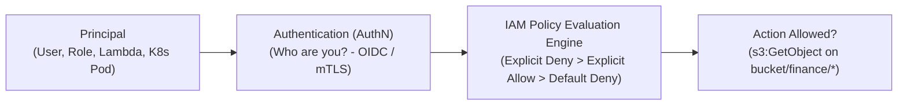
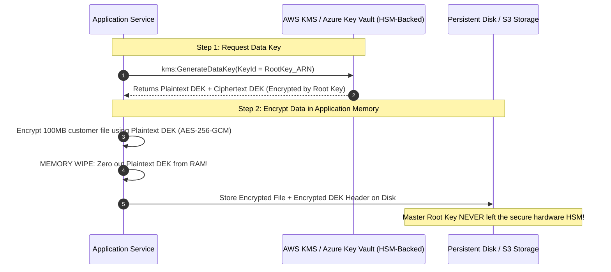

# Cloud Security, IAM Governance & Encryption Envelopes

> **Domain**: `00-foundations/cloud-fundamentals`  
> **Status**: Approved  
> **Target Audience**: Solution Architects, Cloud Security Architects, CISO Teams

---

## 1. Simple Explanation

In cloud environments, **Identity is the new network perimeter**. You cannot secure cloud systems purely with firewall IP rules because services scale elastically, IP addresses change constantly, and APIs are accessible over global internet endpoints. **Cloud Security** centers on Identity and Access Management (IAM), least privilege, and cryptographic envelope encryption.

---

## 2. Cloud IAM Architecture: Principle of Least Privilege

Cloud IAM (AWS IAM, Azure Entra ID, GCP IAM) governs *who* can do *what* on *which resource* under *what conditions*:

### 2.1 The Golden Rules of Cloud IAM
1. **Never Create IAM Users for Applications**: Do not generate long-lived AWS Access Keys (`AKIA...`) or Azure Client Secrets for apps. Use ephemeral **IAM Roles** (AWS IAM Roles for Service Accounts - IRSA, Azure Managed Identities) that rotate temporary credentials automatically every hour.
2. **Deny Overrides Everything**: An explicit `Deny` in any policy evaluation tree instantly overrides all matching `Allow` permissions.
3. **Guardrails via Service Control Policies (SCPs)**: In multi-account organizations, apply SCPs at the organization root to enforce immutable guardrails (e.g., *deny disabling CloudTrail logs in any account; deny provisioning resources in non-approved regions*).

---

## 3. Cryptographic Envelope Encryption & Cloud KMS

How do cloud providers (AWS KMS, Azure Key Vault, Google Cloud KMS) encrypt petabytes of customer data without choking performance or risking master key theft?

### Why Envelope Encryption is Architectural Genius
1. **Performance**: Encrypting gigabytes of data directly inside KMS over the network would saturate network bandwidth and exhaust KMS API rate limits. With envelope encryption, the heavy data encryption happens locally in application RAM using the temporary **Data Encryption Key (DEK)**.
2. **Security**: The master root key (Key Encryption Key - KEK) never leaves the FIPS 140-2 Level 3 certified Hardware Security Module (HSM).
3. **Cryptographic Erasure**: To securely delete a customer's multi-terabyte dataset instantly, destroy their unique KMS root key; all corresponding ciphertext and backups become mathematically impossible to decrypt.

---

## 4. Cloud Audit Logging & SIEM Integration

Every API call made in the cloud (whether by an engineer in the console, a Terraform CI script, or an attacker) is logged:
* **AWS CloudTrail / Azure Activity Log / GCP Cloud Audit Logs**: Streams every management-plane event (`CreateBucket`, `AuthorizeSecurityGroupIngress`, `AssumeRole`) to an immutable, locked S3 bucket.
* **SIEM Integration**: Real-time log forwarding to Splunk, Datadog, or AWS Security Hub with automated alerts triggering within 60 seconds on high-severity events (e.g., `RootUserLogin` or `SecurityGroupModified: 0.0.0.0/0`).
