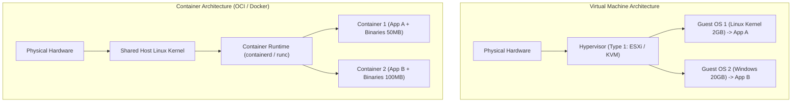

# Containers & OCI Runtime Internals: Namespaces & Cgroups

> **Domain**: `00-foundations/cloud-fundamentals`  
> **Status**: Approved  
> **Target Audience**: Solution Architects, Platform Engineers, Systems Engineers

---

## 1. Simple Explanation

A **Virtual Machine (VM)** virtualizes physical hardware: each VM runs a full guest operating system, virtual BIOS, and virtual devices on top of a hypervisor.  
A **Container** virtualizes the operating system: multiple containers share the exact same host Linux kernel, packaged with only their application code and user-space dependencies, starting in milliseconds and consuming megabytes of RAM instead of gigabytes.

---

## 2. Virtual Machines vs. Containers



---

## 3. What a Container Actually Is: The Linux Primitives

There is no physical entity called a "container" inside the Linux kernel. A container is simply a standard Linux process isolated by three core kernel primitives:

### 1. Linux Namespaces (What the Process Can SEE)
Namespaces provide process isolation, creating the illusion that the process is running on its own dedicated operating system:
* **PID Namespace**: Process gets its own PID tree (appears as PID 1 inside the container).
* **NET Namespace**: Container gets its own private virtual network interface (veth), IP address, and routing table.
* **MNT (Mount) Namespace**: Container gets its own isolated root filesystem (`/`).
* **IPC Namespace**: Isolates inter-process shared memory.
* **UTS Namespace**: Allows the container to have its own hostname.
* **USER Namespace**: Maps container root user (UID 0) to an unprivileged user (UID 10001) on the host machine.

### 2. Control Groups (cgroups - What the Process Can USE)
While namespaces control visibility, **cgroups** enforce hard resource limits:
* **CPU Limits**: Restricts how many CPU shares or millicores the process can consume (`cpu.cfs_quota_us`).
* **Memory Limits**: Hard caps on RAM (`memory.limit_in_bytes`). If the process exceeds this, the kernel fires an **OOM Killer (Out Of Memory)** and terminates the process immediately.
* **I/O & Disk Limits**: Throttles disk read/write throughput to prevent noisy neighbor starvation.

### 3. Securing Containers: Seccomp & Capabilities
* **Linux Capabilities**: Breaks root privileges into fine-grained permissions (e.g., `CAP_NET_BIND_SERVICE`). Containers should drop all capabilities by default (`drop: ALL`).
* **Seccomp (Secure Computing Mode)**: Restricts which kernel system calls (syscalls) the container process can execute, preventing container breakout exploits.

---

## 4. OCI Standards & Base Image Security

### 4.1 Open Container Initiative (OCI)
Standardized by the Linux Foundation:
* **OCI Image Specification**: The tarball format of image layers and manifest metadata.
* **OCI Runtime Specification (`runc`)**: The standardized CLI tool that accepts an unpacked image and launches the kernel namespaces and cgroups.

### 4.2 Production Golden Rule: Distroless & Non-Root
```dockerfile
# ENTERPRISE HARDENED DOCKERFILE
FROM mcr.microsoft.com/dotnet/sdk:8.0 AS build
WORKDIR /src
COPY . .
RUN dotnet publish -c Release -o /app/publish

# Runtime stage uses Google Distroless (Zero shell, zero package manager, zero curl!)
FROM gcr.io/distroless/dotnet:8.0
WORKDIR /app
COPY --from=build /app/publish .
# Strictly run as non-root user!
USER 10001
ENTRYPOINT ["./Enterprise.API"]
```
* **Why Distroless?** If an attacker finds a remote code execution (RCE) bug, they cannot run `sh`, `bash`, `curl`, or download malware because no shell exists in the container!
