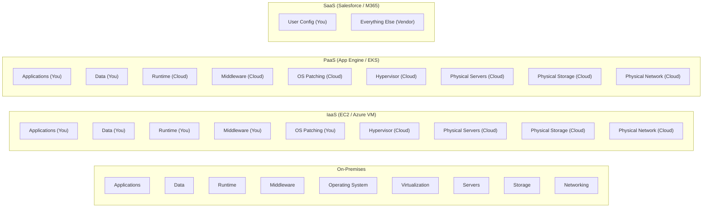

# IaaS, PaaS & SaaS: The Cloud Responsibility Spectrum

> **Domain**: `00-foundations/cloud-fundamentals`  
> **Status**: Approved  
> **Target Audience**: Solution Architects, Enterprise Architects, IT Directors

---

## 1. Simple Explanation

Cloud services fall into three primary service models:
* **IaaS (Infrastructure as a Service)**: Renting raw virtual hardware (VMs, disks, networks). You install and maintain everything.
* **PaaS (Platform as a Service)**: Renting an application runtime environment. The cloud manages the OS, patching, and hardware; you deploy your application code.
* **SaaS (Software as a Service)**: Renting a complete, finished software application over the web (e.g., Salesforce, Microsoft 365). You only manage users and configuration.

---

## 2. The Responsibility Spectrum Matrix

---

## 3. Deep Dive Comparison

| Dimension | IaaS (e.g., AWS EC2, GCE) | PaaS (e.g., Heroku, AWS App Runner, Cloudflare Workers) | SaaS (e.g., Salesforce, Workday) |
| :--- | :--- | :--- | :--- |
| **Control** | **Maximum**: Full root access to kernel, custom network interfaces, arbitrary binaries. | **Moderate**: Restricted to supported language runtimes, container images, and environment variables. | **Minimal**: Restricted to vendor UI, workflows, and extension APIs. |
| **Operational Burden**| **High**: Team must patch Linux kernels, manage OS vulnerabilities, configure firewalls, tune sysctls. | **Low**: Automatic OS patching, automated scaling, automated runtime health restarts. | **Zero**: Vendor manages all infrastructure, availability, and upgrades. |
| **Vendor Lock-In** | **Low**: Can move standard Linux VMs between AWS, Azure, GCP, or on-premises easily. | **Moderate**: Often uses open container standards, but can bind to proprietary cloud SDKs. | **Extreme**: Proprietary data formats, custom APIs; migration costs are enormous. |
| **Cost Profile** | Lower baseline compute cost, but **higher staffing/operational cost**. | Higher per-minute compute cost, but **minimal maintenance staffing**. | Subscription per-user/seat per month ($$$). |

---

## 4. Architectural Selection Heuristic

> **"Prefer SaaS for non-differentiating business utilities, PaaS for core customer-facing software, and IaaS only when specialized hardware or legacy constraints require it."**

* **Choose SaaS**: For generic enterprise capabilities (Email, CRM, HRIS, Identity Provider, Ticketing). Building a custom HR system creates zero competitive advantage.
* **Choose PaaS / Managed Containers**: For your core proprietary business platform. Maximizes engineering squad velocity by offloading OS maintenance.
* **Choose IaaS**: When hosting legacy Windows applications that cannot be containerized, specialized kernel drivers, or custom hardware appliances.
