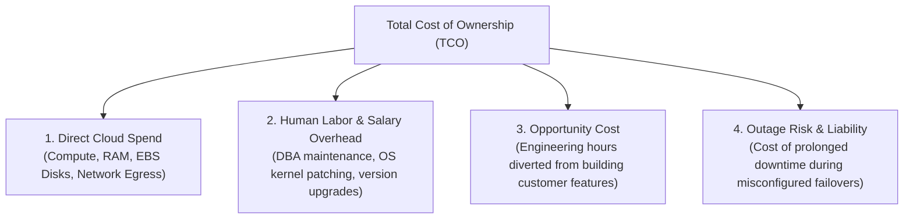

# Managed Services vs. Self-Hosted Infrastructure

> **Domain**: `00-foundations/cloud-fundamentals`  
> **Status**: Approved  
> **Target Audience**: Solution Architects, Enterprise Architects, IT Operations Leads

---

## 1. Problem & Context

Engineering teams frequently debate whether to adopt a cloud-managed service (e.g., AWS Aurora, AWS MSK Managed Kafka, Azure Cosmos DB) or self-host open-source equivalents on raw Kubernetes/EC2 nodes.

Developers often look purely at the **raw compute cost** (*"Running Kafka on EC2 costs $300/month, but AWS MSK costs $800/month; let's self-host!"*).  
The Solution Architect must evaluate the **Total Cost of Ownership (TCO)**, including engineering salaries, on-call alert toil, patching, and disaster recovery liabilities.

---

## 2. Total Cost of Ownership (TCO) Model

### The $250,000 "Cheap" Database
* Raw EC2 savings: Saved $500/month ($6,000/year).
* Operational reality: Requires 25% of a Senior SRE's time ($50,000/year salary allocation) to manage backups, failovers, and security patches.
* Unexpected outage: A junior engineer misconfigures a disk volume resize during an outage; platform is down for 6 hours ($200,000 lost revenue and customer SLA penalties).
* **Net Result: Attempting to save $6,000 cost the enterprise $250,000.**

---

## 3. The "Undifferentiated Heavy Lifting" Test

Jeff Bezos coined the phrase **Undifferentiated Heavy Lifting** to describe tasks that consume massive engineering effort but do not make your company's product unique or competitive in the market:
* Patching Linux kernel CVEs on a database VM is undifferentiated heavy lifting.
* Managing ZooKeeper/KRaft quorum disks for a Kafka cluster is undifferentiated heavy lifting.
* Configuring automated nightly S3 snapshots and WAL archiving is undifferentiated heavy lifting.

> **Architectural Principle**:  
> **"Never spend enterprise engineering hours building or maintaining what a cloud provider offers as a reliable managed service, unless it directly represents a core competitive differentiator for your business."**

---

## 4. When Self-Hosting Infrastructure IS Justified

There are specific, legitimate enterprise scenarios where self-hosting on Kubernetes or raw infrastructure is the superior choice:

1. **Massive Hyper-Scale Unit Economics**: At extreme scale (e.g., Netflix, Uber, or managing 500+ TB Kafka clusters), cloud-managed service markups (300% to 500% over raw compute) reach millions of dollars annually, easily justifying a dedicated specialized SRE squad.
2. **Strict Multi-Cloud Portability Mandates**: Regulatory or commercial requirements forcing identical deployment topologies across AWS, Azure, on-premises data centers, and air-gapped sovereign clouds.
3. **Advanced Engine Configuration & Extensions**: Requiring custom C-extensions for PostgreSQL (e.g., bleeding-edge vector search or proprietary geospatial plugins) not supported by AWS RDS or Azure Flexible Server.
4. **Latency SLAs Beyond Hypervisor Bounds**: Ultra-low latency trading systems requiring bare-metal kernel bypass (DPDK/Solarflare) that virtualized managed services cannot provide.
