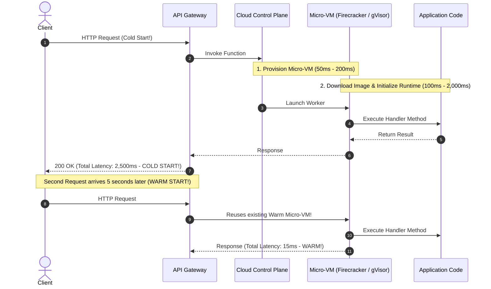

# Serverless Computing & Function-as-a-Service (FaaS)

> **Domain**: `00-foundations/cloud-fundamentals`  
> **Status**: Approved  
> **Target Audience**: Solution Architects, Enterprise Architects, Cloud Engineers

---

## 1. Simple Explanation

**Serverless** does not mean there are no servers. It means **you, the customer, never manage, provision, patch, or pay for idle servers**.  
In **Function-as-a-Service (FaaS)** (e.g., AWS Lambda, Azure Functions, Google Cloud Functions), you upload a single function of code; the cloud provider spins up a micro-VM on-demand to execute the request in response to an event, scales to thousands of instances in seconds, and tears them down immediately—charging you strictly for the execution milliseconds consumed.

---

## 2. Architect-Level Deep Dive: FaaS Execution Lifecycles



---

## 3. The Cold Start Problem & Concurrency Limits

### 3.1 Cold Start Realities
* **What Causes It**: When no pre-warmed execution environment exists, the cloud must download container layers, boot the micro-VM, initialize the language runtime (JVM/CLR initialization is notoriously slow), and establish database connections.
* **Cold Start Latency by Runtime**:
  * Node.js / Python / Go: `50ms - 200ms`
  * Modern .NET 8 (AOT Native): `100ms - 300ms`
  * Java 21 (without GraalVM Native Image): `1,500ms - 5,000ms` (Unacceptable for synchronous user-facing APIs!)
* **Architectural Remedies**:
  1. Use **Provisioned Concurrency** (pre-warms an allocation of instances for a fee).
  2. Compile Java to native binaries via **GraalVM Native Image** or .NET Native AOT.
  3. Avoid bloated monolithic dependencies and heavy dependency injection graphs.

### 3.2 Concurrency Caps & Account Throttling
Every cloud account has a regional concurrent execution ceiling (e.g., default 1,000 concurrent executions in AWS Lambda).
* If a runaway batch job or recursive queue triggers 1,000 concurrent lambda executions, **every other serverless API in that entire cloud account is throttled with HTTP 429 errors!**
* **Remedy**: Always configure **Reserved Concurrency limits** per function to isolate critical paths.

---

## 4. When Serverless Wins vs. When It Fails

```text
┌─────────────────────────────────────────────────────────────┐
│                 SERVERLESS FIT EVALUATION                   │
├───────────────────────────────┬─────────────────────────────┤
│ PERFECT FOR SERVERLESS        │ POOR FIT FOR SERVERLESS     │
├───────────────────────────────┼─────────────────────────────┤
│ - Spiky, bursty, unpredictable│ - Steady-state 24/7 high-   │
│   traffic workloads.          │   volume traffic (EKS is far│
│ - Event-driven pipelines      │   cheaper above 500 RPS).   │
│   (S3 upload -> resize image).│ - Long-running compute jobs │
│ - Asynchronous queue workers  │   (FaaS has a hard 15-minute│
│   (SQS / EventBridge).        │   execution timeout).       │
│ - Cron jobs & batch scripts.  │ - Ultra-low latency p99 APIs│
│ - Rapid prototyping / MVPs.   │   vulnerable to cold starts.│
└───────────────────────────────┴─────────────────────────────┘
```

---

## 5. Architectural Rule: Serverless is an Ecosystem, Not Just Functions

True serverless architecture is not just AWS Lambda; it is pairing FaaS with serverless persistence and messaging:
* **Compute**: AWS Lambda / Cloudflare Workers
* **Event Ingress**: Amazon EventBridge / SQS
* **Persistence**: Amazon DynamoDB (On-Demand) / Aurora Serverless v2
* **Storage**: Amazon S3
