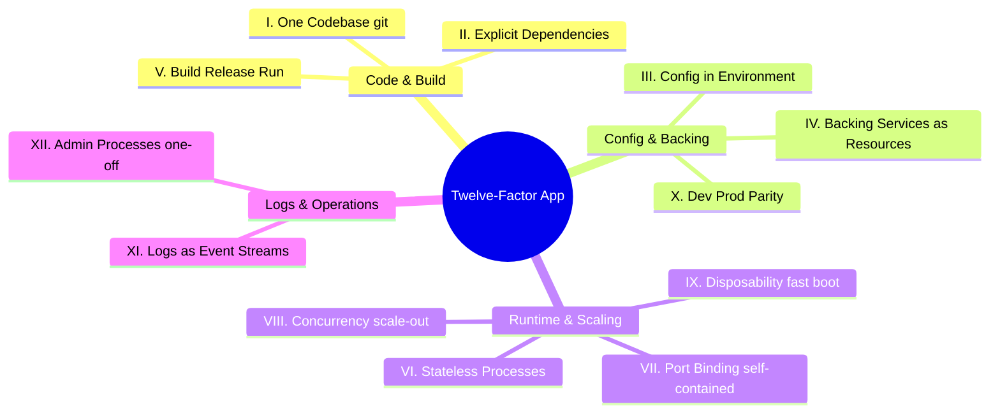

# The Twelve-Factor App: Modern Enterprise Architecture Interpretation

> **Domain**: `00-foundations/cloud-fundamentals`  
> **Status**: Approved  
> **Target Audience**: Solution Architects, Principal Software Engineers, DevOps Leads

---

## 1. Simple Explanation

Drafted by engineers at Heroku (Adam Wiggins et al.), the **Twelve-Factor App** methodology establishes 12 architectural principles for building software-as-a-service applications that can scale cleanly, deploy portably across diverse environments, and operate reliably in modern cloud and container platforms.

---

## 2. Modern Enterprise Interpretation of the 12 Factors

### I. Codebase: One codebase tracked in revision control, many deploys
* A single Git repository per service. If multiple services share the exact same code, extract a versioned shared library or merge into a managed monorepo. Never share code across repos by copy-pasting.

### II. Dependencies: Explicitly declare and isolate dependencies
* Never assume libraries exist globally on the host server. Bundle dependencies via Docker, Maven, NuGet, or npm.

### III. Config: Store configuration in the environment
* Strictly separate configuration (database credentials, API keys, endpoints) from code. Secrets and configs must be injected via **Environment Variables** or Kubernetes ConfigMaps/Secrets, never hardcoded in source control.

### IV. Backing Services: Treat backing services as attached resources
* Databases, message queues, and mail servers are accessed via URL/credentials (`DATABASE_URL=postgres://...`). The app should be able to swap from a local database to AWS Aurora without code changes.

### V. Build, Release, Run: Strictly separate build and run stages
* Code moves through an immutable pipeline: **Build** (compile & package) $\to$ **Release** (combine build artifact with environment config) $\to$ **Run** (execute in runtime). Never edit code live on a production server.

### VI. Processes: Execute the app as one or more stateless processes
* **Stateless and Share-Nothing**: Any data that needs to persist must be stored in a stateful backing service (database, cache, object store). Memory and local disk are ephemeral and wiped on restart.

### VII. Port Binding: Export services via port binding
* The app is completely self-contained. It does not run inside a heavyweight web container (like Apache Tomcat or IIS). It embeds its own HTTP server (Kestrel in .NET, Netty in Spring Boot, Uvicorn in Python) and binds directly to a port (`:8080`).

### VIII. Concurrency: Scale out via the process model
* Scale horizontally by adding more container instances/processes, not by creating massive multi-gigabyte heap JVMs.

### IX. Disposability: Maximize robustness with fast startup and graceful shutdown
* Containers must start in seconds and respond immediately to `SIGTERM` signals, finishing active transactions and cleanly closing database connections within a 30-second grace period.

### X. Dev/Prod Parity: Keep development, staging, and production as similar as possible
* Eliminate the "it worked on my machine" problem. Run the exact same database engine (e.g., PostgreSQL via Docker) locally in development as in production; never use SQLite in dev and Oracle in prod.

### XI. Logs: Treat logs as event streams
* Applications must never write logs to local files on disk (which fill up disks and get destroyed on pod restart). Apps write structured JSON logs directly to `stdout`/`stderr`. The platform (Fluentbit, CloudWatch, Datadog) captures and aggregates the stream.

### XII. Admin Processes: Run admin/management tasks as one-off processes
* Database schema migrations (`dotnet ef database update` / Flyway) and maintenance scripts must run as one-off standalone batch jobs (Kubernetes Jobs), not inside web request request-loops.
