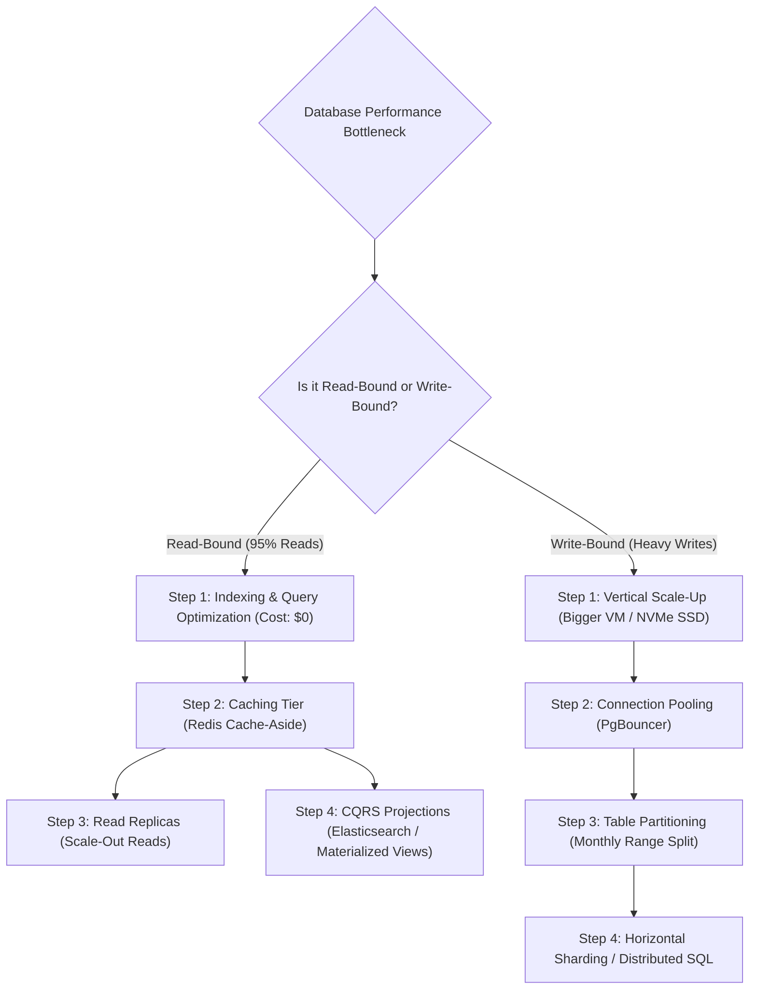

# Database Scaling Strategies: Read vs. Write Scaling

> **Domain**: `00-foundations/databases`  
> **Status**: Approved  
> **Target Audience**: Solution Architects, Data Architects, Performance Engineers

---

## 1. Simple Explanation

When a database becomes saturated with traffic, scaling it is fundamentally different depending on whether the bottleneck is caused by **Read Queries** (`SELECT`) or **Write Transactions** (`INSERT`, `UPDATE`, `DELETE`).

---

## 2. The Database Scaling Hierarchy

---

## 3. Read Scaling Strategies

### 1. In-Memory Distributed Caching (Redis)
* **Impact**: Deflects **80% to 95%** of read queries before they ever touch the database engine.
* **Pattern**: Cache-Aside (Look up in Redis; if miss, query PostgreSQL, set in Redis with 1-hour TTL).

### 2. Read Replicas with Read-Write Splitting
* Application routes mutating calls to Primary (`writeDbConnection`) and read queries across an array of read replicas (`readDbConnectionPool`).
* *The Challenge*: Handling replication lag.

### 3. Command Query Responsibility Segregation (CQRS)
* When read models require complex aggregations across multiple domains, do not run heavy analytical queries against your transactional OLTP database.
* Use Change Data Capture (Debezium) to stream database changes into **Elasticsearch** (for search) or **Snowflake** (for analytics).

---

## 4. Write Scaling Strategies

Write scaling is orders of magnitude harder than read scaling because writes require disk flushes, replication consensus, and lock management:

1. **Vertical Scale-Up First**: Before sharding, upgrade the server. Modern AWS instances (e.g., `u-12tb1.112xlarge`) offer up to 448 vCPUs and 12 TB of RAM. Scaling vertically takes 15 minutes of downtime; sharding takes 9 months of engineering!
2. **Buffer Writes via Messaging (Kafka / SQS)**: Instead of executing synchronous database writes directly from API requests, write the mutation to a Kafka topic. A pool of background consumers drains the queue and executes high-speed batch inserts (`INSERT ... VALUES (...), (...), (...)`).
3. **Partition & Shard**: When single-node write ceilings are reached, horizontally shard by `tenant_id` or `user_id`.
