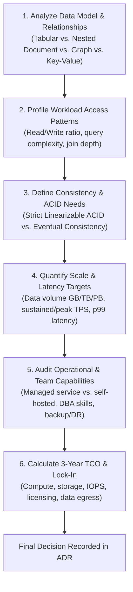

# Database Selection: A Practical Architecture Framework

> **Domain**: `00-foundations/databases`  
> **Status**: Approved  
> **Target Audience**: Solution Architects, Enterprise Architects, Principal Engineers

---

## 1. Problem Statement

Engineers and architects often select databases based on familiarity, vendor marketing, or hype cycles. Choosing the wrong database engine results in severe production crises: corrupted financial transactions, runaway cloud costs, or an inability to scale.

This framework provides an objective, 6-step evaluation process for selecting database technology in enterprise systems.

---

## 2. The 6-Step Database Selection Framework

---

## 3. The Enterprise Database Scorecard

When comparing candidate database engines (e.g., PostgreSQL vs. MongoDB vs. DynamoDB vs. CockroachDB):

| Evaluation Dimension | Weight | Engine Candidate A | Engine Candidate B | Engine Candidate C |
| :--- | :---: | :--- | :--- | :--- |
| **Data Model Fit** | 20% | Relational 3NF with JSONB | Hierarchical Document | Key-Value / Wide-Column |
| **ACID / Consistency** | 20% | Full multi-table ACID | Single-document ACID | Tunable / Eventual |
| **p99 Latency SLA** | 15% | `< 20ms` (Cached `< 2ms`) | `< 10ms` | `< 5ms` single-key |
| **Horizontal Scalability**| 15% | Scale-up / Read replicas | Sharded clusters | Native elastic scale-out |
| **Operational Simplicity**| 15% | Turnkey AWS RDS / Aurora | Managed Atlas | Serverless on-demand |
| **Total Cost (3-Yr TCO)**| 15% | Predictable RI pricing | Expensive memory sizing | Pay-per-request / WCU-RCU |
| **TOTAL SCORE** | **100%** | **Score: 4.6 / 5.0** | **Score: 3.8 / 5.0** | **Score: 3.9 / 5.0** |

---

## 4. Default Architectural Recommendations

Unless explicit NFRs mandate otherwise, enterprise architects should adhere to the following defaults:

1. **Default OLTP Persistence**: **PostgreSQL 16+** (AWS Aurora / Azure Flexible Server / GCP Cloud SQL). Natively satisfies 85% of all enterprise transactional, relational, and semi-structured document requirements.
2. **Default In-Memory Caching / Sessions**: **Redis Cluster** (AWS ElastiCache / Azure Managed Redis).
3. **Default Event Streaming**: **Apache Kafka** (AWS MSK / Confluent Cloud).
4. **Default Text Search & Analytics**: **OpenSearch / Elasticsearch**.
5. **Default Analytical Data Warehouse**: **Snowflake / Google BigQuery**.
