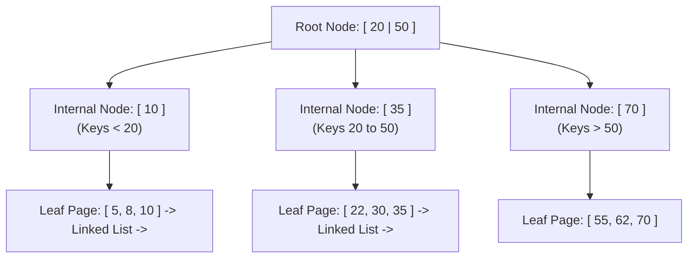
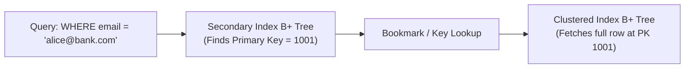

# Database Indexing Internals: B+ Trees, LSM-Trees & Covering Indexes

> **Domain**: `00-foundations/databases`  
> **Status**: Approved  
> **Target Audience**: Solution Architects, Principal Backend Engineers, Database Architects

---

## 1. Simple Explanation

Without an index, a database must scan every single row on disk from start to finish (**Full Table Scan** / Sequential Scan) to find a record—taking seconds or minutes on a 100-million row table.  
An **Index** is an auxiliary data structure that points directly to the physical location of the row, enabling the database to locate records in milliseconds ($O(\log N)$ time).

---

## 2. B+ Tree Internals (The Standard OLTP Storage Engine)

Almost all modern relational databases (PostgreSQL, MySQL InnoDB, SQL Server, Oracle) utilize **B+ Trees** for their primary and secondary indexes.



### Why B+ Trees Outperform Binary Search Trees on Disk
1. **High Fan-Out (Branching Factor)**: A single B+ tree node page is typically 8KB or 16KB, holding hundreds of keys. A 4-level B+ tree can index **billions of rows** while requiring only 3 to 4 disk page lookups!
2. **Linked Leaf Nodes**: Leaf nodes are doubly linked lists. Range queries (`WHERE age BETWEEN 25 AND 40`) find the start key in $O(\log N)$ and then simply scan horizontally along the leaf pointers without re-traversing the tree.

---

## 3. Clustered vs. Non-Clustered Indexes

```text
┌─────────────────────────────────────────────────────────────┐
│                 CLUSTERED VS. NON-CLUSTERED                 │
├───────────────────────────────┬─────────────────────────────┤
│ CLUSTERED INDEX (Primary Key) │ NON-CLUSTERED (Secondary)   │
├───────────────────────────────┼─────────────────────────────┤
│ The physical table IS the     │ A separate auxiliary B+ tree│
│ B+ tree. Leaf pages contain   │ Leaf pages store the        │
│ the actual full row data.     │ indexed column + pointer to │
│ Exactly ONE per table.        │ the Clustered Key / RowID.  │
└───────────────────────────────┴─────────────────────────────┘
```



---

## 4. Advanced Enterprise Indexing Strategies

### 4.1 Covering Indexes (Index-Only Scans)
If an index contains **every column requested by the query**, the database never touches the main table data pages on disk!
```sql
-- Create Covering Index with INCLUDE clause
CREATE INDEX idx_orders_covering 
ON orders (customer_id, order_date) 
INCLUDE (total_amount, status);

-- This query executes purely inside RAM memory from the index!
SELECT total_amount, status 
FROM orders 
WHERE customer_id = 42 AND order_date >= '2026-01-01';
```

### 4.2 Composite Index Column Ordering Rule
In a composite index on `(A, B, C)`:
* **The Equality Rule**: Put columns queried with exact equality (`A = 5`) first.
* **The Range Rule**: Put columns queried with ranges (`B > 10`) last.
* *Why?* Once the database encounters a range comparison, it cannot use subsequent index columns for tree traversal.

### 4.3 Partial Indexes
Why index 100 million rows if you only ever query active ones?
```sql
CREATE INDEX idx_active_pending_orders 
ON orders (created_at) 
WHERE status = 'PENDING';
```
Reduces index disk space by 98% and keeps the entire index in RAM!

---

## 5. The Write Tax: Why Over-Indexing Kills Systems

Every index added to a table is **not free**:
* Every single `INSERT`, `UPDATE`, or `DELETE` must synchronously update **every index B+ tree** on that table on disk.
* High index counts cause page splits, write amplification, and lock contention.
* **Architectural Standard**: Avoid having more than 5 to 7 indexes per transactional OLTP table without explicit profiling justification.
