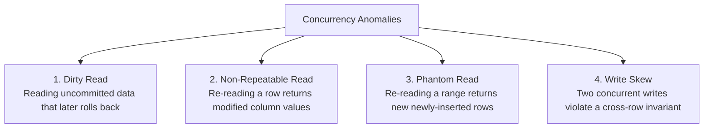

# Transaction Isolation Levels & Concurrency Anomalies

> **Domain**: `00-foundations/databases`  
> **Status**: Approved  
> **Target Audience**: Solution Architects, Principal Engineers, Database Architects

---

## 1. Simple Explanation

In a high-throughput enterprise application, thousands of users read and write to the same database tables simultaneously. **Isolation Levels** define how strictly the database isolates transactions from each other. Higher isolation prevents data corruption anomalies, but requires more locking and reduces concurrency throughput.

---

## 2. The 4 Standard ANSI SQL Isolation Levels

From lowest isolation (highest concurrency) to highest isolation (strictest consistency):

```text
┌─────────────────────────────────────────────────────────────┐
│                 ANSI SQL ISOLATION LEVELS                   │
├───────────────────┬─────────────────────────────────────────┤
│ 1. Read           │ Reads uncommitted data of other running │
│    Uncommitted    │ transactions. (Dirty Reads possible).   │
├───────────────────┼─────────────────────────────────────────┤
│ 2. Read           │ Reads only committed data. Each query   │
│    Committed      │ takes a fresh snapshot. (Default in     │
│                   │ PostgreSQL, Oracle, SQL Server).        │
├───────────────────┼─────────────────────────────────────────┤
│ 3. Repeatable     │ Guarantees that if a query reads a row, │
│    Read           │ re-reading it in the same transaction   │
│                   │ returns the exact same value. (MySQL).  │
├───────────────────┼─────────────────────────────────────────┤
│ 4. Serializable   │ Full isolation. Transactions behave as  │
│                   │ if executed sequentially in single file.│
└───────────────────┴─────────────────────────────────────────┘
```

---

## 3. The 4 Classic Concurrency Anomalies



### 3.1 Dirty Read
* Transaction A updates a user's balance from $100 to $500, but has not committed yet.
* Transaction B reads the balance as $500 and approves a $400 purchase.
* Transaction A rolls back due to an error! The balance reverts to $100. Transaction B approved a purchase based on phantom money!

### 3.2 Non-Repeatable Read (Fuzzy Read)
* Transaction A reads a row (e.g., `balance = $100`).
* Transaction B updates the row (`balance = $20`) and commits.
* Transaction A reads the same row again; it now sees `$20`.

### 3.3 Phantom Read
* Transaction A queries: `SELECT COUNT(*) FROM orders WHERE customer_id = 42` (returns `5`).
* Transaction B inserts a 6th order for customer 42 and commits.
* Transaction A runs the exact same query again; it now returns `6`.

### 3.4 The Subtle Killer: Write Skew & Snapshot Isolation
Standard Snapshot Isolation (often called Repeatable Read) prevents dirty reads, non-repeatable reads, and phantoms on individual rows. However, it **does not prevent Write Skew**.

#### The On-Call Doctor Write Skew Scenario
* **Business Rule**: At least one doctor must remain on call in the emergency room.
* Currently on call: Dr. Alice and Dr. Bob (Total on call = 2).
* Dr. Alice requests leave: System queries `SELECT COUNT(*) WHERE on_call = true` (returns 2). Checks `2 > 1`, so Alice's leave is approved (`on_call = false`).
* Concurrently, Dr. Bob requests leave: System queries `SELECT COUNT(*) WHERE on_call = true` (returns 2). Checks `2 > 1`, so Bob's leave is approved (`on_call = false`).
* Both transactions commit under Repeatable Read / Snapshot Isolation!
* **Outcome**: **Zero doctors are on call! Anarchy in the hospital!**

---

## 4. How to Prevent Write Skew in Architecture

1. **Serializable Isolation**: Set isolation to `SERIALIZABLE`. The database engine tracks read-locks (SSI - Serializable Snapshot Isolation) and aborts one of the conflicting transactions with a `40001 serialization_failure`.
2. **Explicit Pessimistic Locking**:
   ```sql
   SELECT * FROM doctors WHERE on_call = true FOR UPDATE;
   ```
   Locks the matching rows, forcing concurrent transactions to serialize.
