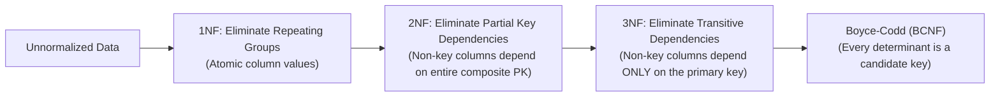

# Database Normalization vs. Pragmatic Denormalization

> **Domain**: `00-foundations/databases`  
> **Status**: Approved  
> **Target Audience**: Solution Architects, Data Architects, Database Engineers

---

## 1. Simple Explanation

**Normalization** is the systematic process of organizing database tables to reduce data redundancy and eliminate anomalies during inserts, updates, and deletes.  
**Denormalization** is the deliberate, controlled re-introduction of redundancy to optimize read performance and eliminate expensive table joins in high-scale systems.

---

## 2. The Normal Forms (1NF through BCNF)



### 2.1 First Normal Form (1NF) - Atomicity
* Each column must contain atomic (indivisible) values.
* *Violation*: Storing a comma-separated list of phone numbers: `"555-1234, 555-5678"`.
* *Remedy*: Create a separate `customer_phones` table with one row per phone number.

### 2.2 Second Normal Form (2NF) - No Partial Dependencies
* Table must be in 1NF, and all non-key columns must depend on the **entire** primary key (applies to composite primary keys).
* *Violation*: In `order_items (order_id, product_id, quantity, product_name)`, `product_name` depends only on `product_id`, not on `order_id`.
* *Remedy*: Move `product_name` to the `products` table.

### 2.3 Third Normal Form (3NF) - No Transitive Dependencies
* Table must be in 2NF, and no non-key column depends on another non-key column ($A \to B \to C$).
* *Violation*: In `employees (emp_id, department_id, department_name)`, `department_name` depends on `department_id`, which depends on `emp_id`.
* *Remedy*: Move `department_name` to a separate `departments` table.

---

## 3. The Performance Problem with Pure 3NF at Scale

While 3NF guarantees zero update anomalies, it exacts a brutal performance penalty on read-heavy enterprise workloads:

```sql
-- 3NF Pure Read: Requires 6 Joins for a simple order screen!
SELECT o.id, c.name, p.title, s.carrier, a.city 
FROM orders o
JOIN customers c ON o.customer_id = c.id
JOIN order_items oi ON oi.order_id = o.id
JOIN products p ON oi.product_id = p.id
JOIN shipments s ON s.order_id = o.id
JOIN addresses a ON o.shipping_address_id = a.id
WHERE o.id = 1001;
```

Under 10,000 requests/second, executing a 6-table join across clustered SSD disks saturates database CPU and memory buffer pools.

---

## 4. Pragmatic Denormalization: When and How

Denormalization is an architectural optimization that trades **Write Complexity** for **Read Speed**:

```text
┌─────────────────────────────────────────────────────────────┐
│                 PRAGMATIC DENORMALIZATION RULES             │
├───────────────────────────────┬─────────────────────────────┤
│ 1. Read-Heavy Ratio           │ When reads exceed writes    │
│                               │ by 20:1 or 100:1.           │
├───────────────────────────────┼─────────────────────────────┤
│ 2. Point-in-Time Immutability │ Storing historical snapshots│
│                               │ (e.g., product price at the │
│                               │ exact second of purchase).  │
├───────────────────────────────┼─────────────────────────────┤
│ 3. Pre-Aggregated Summary     │ Storing `total_order_count` │
│    Counters                   │ on the `customer` row to    │
│                               │ avoid `SELECT COUNT(*)`.    │
└───────────────────────────────┴─────────────────────────────┘
```

### The Architectural Golden Rule of Denormalization
> **Always design the conceptual model in 3NF first.**  
> Never denormalize out of laziness. Denormalize only when empirical APM profiling proves that join latency is the system bottleneck, and implement automated background reconciliation jobs to detect and correct data drift!
