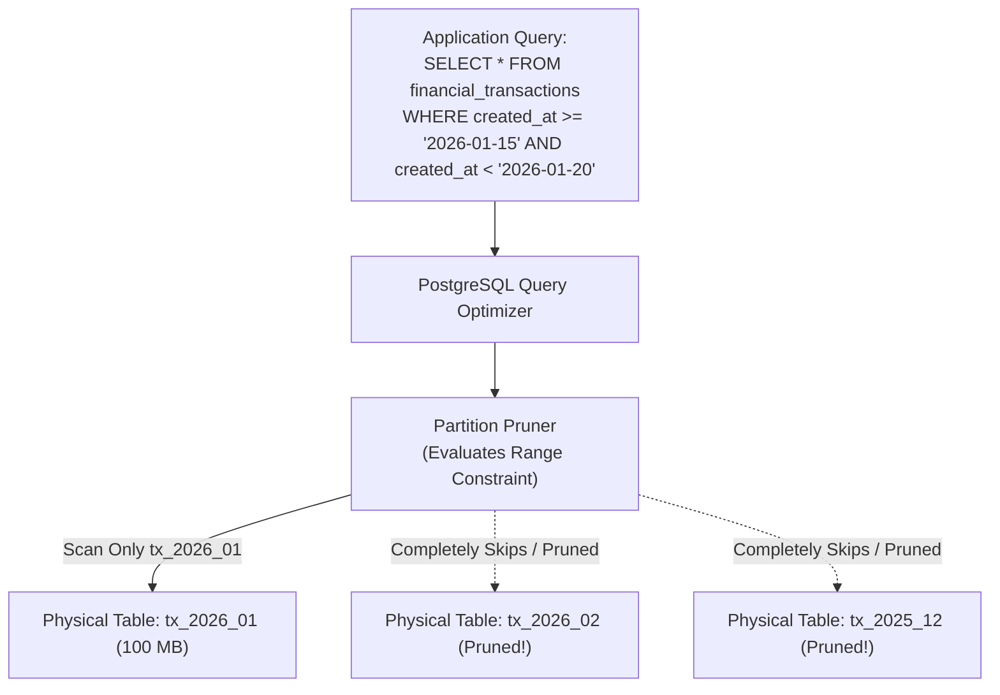

# Table Partitioning: Declarative Mechanics & Pruning

> **Domain**: `00-foundations/databases`  
> **Status**: Approved  
> **Target Audience**: Solution Architects, Data Architects, Database Engineers

---

## 1. Simple Explanation

In relational database management, **Table Partitioning** splits a single logically massive table (e.g., a 100-million row `audit_logs` table) into multiple smaller physical tables under the hood, while exposing a single unified table name to the application layer.

---

## 2. Declarative Table Partitioning (PostgreSQL & MySQL)

Modern enterprise databases implement **Declarative Partitioning**:

```sql
-- Create Master Partitioned Table
CREATE TABLE financial_transactions (
    transaction_id UUID NOT NULL,
    account_id UUID NOT NULL,
    amount NUMERIC(12, 2) NOT NULL,
    created_at TIMESTAMPTZ NOT NULL,
    PRIMARY KEY (transaction_id, created_at)
) PARTITION BY RANGE (created_at);

-- Create Physical Monthly Partitions
CREATE TABLE tx_2026_01 PARTITION OF financial_transactions
    FOR VALUES FROM ('2026-01-01 00:00:00') TO ('2026-02-01 00:00:00');

CREATE TABLE tx_2026_02 PARTITION OF financial_transactions
    FOR VALUES FROM ('2026-02-01 00:00:00') TO ('2026-03-01 00:00:00');
```



---

## 3. The Power of Partition Pruning

When an application queries partitioned data with a filter on the partition key (`created_at`):
* The database query optimizer executes **Partition Pruning**: it identifies which physical tables can contain matching rows and **completely ignores all other partitions**.
* Disk I/O drops by **95%+**; queries that previously required scanning 50GB of disk pages now scan only 500MB!

---

## 4. Operational Lifecycle: Instant Archival & Dropping

The single greatest operational advantage of table partitioning is **Zero-Downtime Data Purging**:

```text
┌─────────────────────────────────────────────────────────────┐
│              PURGING 10 MILLION HISTORICAL ROWS             │
├───────────────────────────────┬─────────────────────────────┤
│ TRADITIONAL DELETE (Bad)      │ PARTITION DETACH (Architect)│
├───────────────────────────────┼─────────────────────────────┤
│ DELETE FROM logs WHERE ...    │ ALTER TABLE logs DETACH     │
│ - Scans millions of rows.     │   PARTITION log_2024_01;    │
│ - Writes 10M WAL records.     │ - Pure metadata operation!  │
│ - Leaves table bloated.       │ - Takes 1 millisecond.      │
│ - Takes 45 minutes to run.    │ - Zero WAL write load.      │
│ - Locks table rows.           │ - DROP TABLE is instant.    │
└───────────────────────────────┴─────────────────────────────┘
```

### Architectural Retention Automation
A scheduled cron job executes monthly:
1. Provisions the new partition for month $T+1$.
2. Detaches partition $T-12$ (1-year retention expired).
3. Streams detached partition to Parquet files on AWS S3 Glacier (Cold Storage).
4. Drops the detached local table, reclaiming 100% of physical disk storage instantly.
