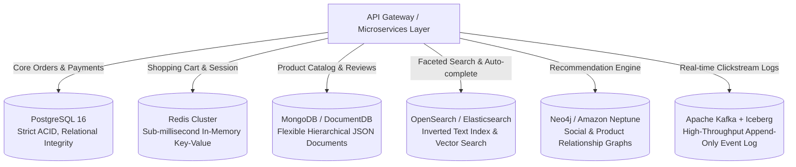

# Polyglot Persistence in Enterprise Platforms

> **Domain**: `00-foundations/databases`  
> **Status**: Approved  
> **Target Audience**: Solution Architects, Enterprise Architects, Principal Engineers

---

## 1. Simple Explanation

**Polyglot Persistence** is the architectural practice of using different database engines to handle different data storage needs within the same enterprise platform, choosing the best persistence technology for each specific domain capability rather than forcing everything into a single one-size-fits-all database.

---

## 2. Architect-Level Deep Dive: Fitting Storage to Domain Needs

In a modern enterprise e-commerce platform:



---

## 3. The Operational Tax of Polyglot Persistence

While polyglot persistence offers theoretical elegance, it exacts a **massive operational and financial tax** on the enterprise:

```text
┌─────────────────────────────────────────────────────────────┐
│                 THE POLYGLOT PERSISTENCE TAX                │
├───────────────────────┬─────────────────────────────────────┤
│ 1. Cognitive Load     │ Engineering teams must learn 5      │
│                       │ different query languages & drivers.│
├───────────────────────┼─────────────────────────────────────┤
│ 2. Backup & DR        │ Disaster recovery requires 5        │
│                       │ disparate backup/restore procedures.│
├───────────────────────┼─────────────────────────────────────┤
│ 3. Data Synchronization│ Keeping PostgreSQL, Elasticsearch,  │
│    Drift              │ and Redis in sync requires complex  │
│                       │ CDC and dual-write reconciliations. │
├───────────────────────┼─────────────────────────────────────┤
│ 4. Licensing & Hosting│ 5 different managed cluster bills.  │
└───────────────────────┴─────────────────────────────────────┘
```

---

## 4. The Modern Solution: Constrained Polyglot Persistence

The Enterprise Architect must establish **Paved Guardrails**:
1. **The Rule of Three**: An enterprise platform should never adopt more than 2 to 3 core storage technologies as standard production defaults (e.g., PostgreSQL for Relational/Document, Redis for Caching, OpenSearch for Search).
2. **Require an ADR for Every New Storage Engine**: Introducing a 4th engine (e.g., Neo4j or Cassandra) mandates a formal [Architecture Decision Record](../../16-architecture-deliverables/ADR-TEMPLATE.md) proving that existing standards cannot meet the business NFRs.
3. **Automate Sync via CDC**: Synchronize secondary stores (Elasticsearch, Redis) strictly via Change Data Capture (Debezium/Kafka) rather than dual application writes.
