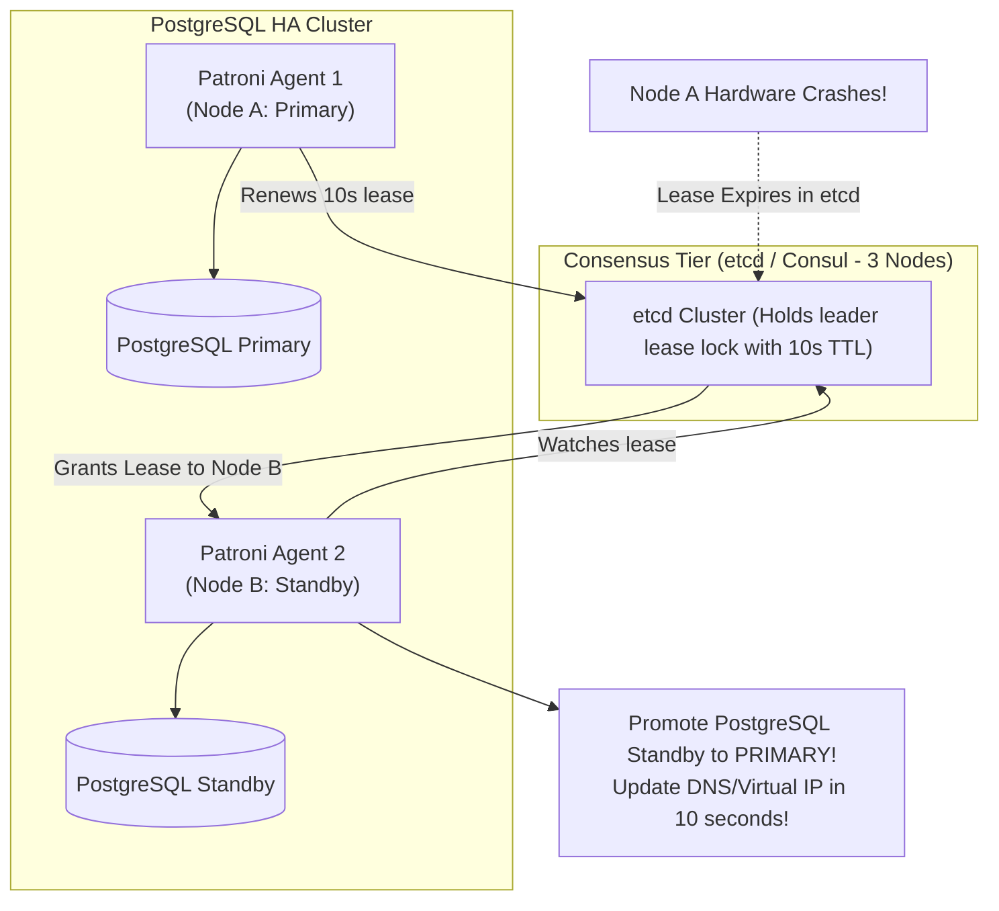

# Database Replication Architectures: Physical vs. Logical

> **Domain**: `00-foundations/databases`  
> **Status**: Approved  
> **Target Audience**: Solution Architects, Database Architects, SREs

---

## 1. Simple Explanation

In database engineering, **Replication** streams transactions from a primary database node to secondary replica nodes to ensure high availability during hardware failure and to offload read queries from the primary server.

---

## 2. Physical vs. Logical Replication

```text
┌─────────────────────────────────────────────────────────────┐
│               PHYSICAL VS. LOGICAL REPLICATION              │
├───────────────────┬─────────────────────────────────────────┤
│ PHYSICAL (WAL-Based)│ LOGICAL (Row/Event-Based)             │
├───────────────────┼─────────────────────────────────────────┤
│ Replicates exact  │ Replicates decoded SQL operations:      │
│ disk block bytes  │ INSERT, UPDATE, DELETE stream.          │
│ (byte-for-byte).  │ Engine: Debezium CDC, pg_logical.       │
│ Identical DB      │ Cross-major-version upgrades (v12->v16).│
│ version required. │ Replicates subset of tables to Kafka    │
│ Pure read replica │ or external data lakehouse.             │
└───────────────────┴─────────────────────────────────────────┘
```

```mermaid
flowchart TD
    Primary["Primary Database (PostgreSQL 16)"] --> WAL["Write-Ahead Log (WAL)"]

    subgraph PhysicalReplication ["Physical Streaming (HA Tier)"]
        WAL -->|Binary Block Stream| HA_Replica["Standby Replica (PostgreSQL 16)\n(Byte-for-byte clone in AZ-B)"]
    end

    subgraph LogicalReplication ["Logical Decoding (Integration Tier)"]
        WAL -->|Logical Decoder (wal2json)| Debezium["Debezium CDC Connector"]
        Debezium --> Kafka{{"Kafka Topic: orders.events"}}
        Kafka --> Snowflake[("Snowflake Data Warehouse")]
        Kafka --> Search[("Elasticsearch Search Index")]
    end
```

---

## 3. High Availability Failover Topologies: Patroni & Raft

How do enterprise relational databases failover without split-brain corruption?

### The Patroni Architecture (The Enterprise Standard for PostgreSQL)
Relying on simple heartbeats between two database nodes leads to split-brain if the network link between them blips (both nodes promote themselves to primary and accept conflicting writes!).



---

## 4. Architectural Rules for Read Replicas

1. **Never Assume Read Replicas are Strictly Consistent**: In asynchronous setups, replication lag is variable. If a user mutates data, pin that user's subsequent read queries to the primary leader for a 10-second grace window.
2. **Monitor Replication Lag Continuously**: Measure lag in **bytes and seconds** (`pg_stat_replication`). If replica lag exceeds 10 seconds, remove the replica from the read-balancer pool.
