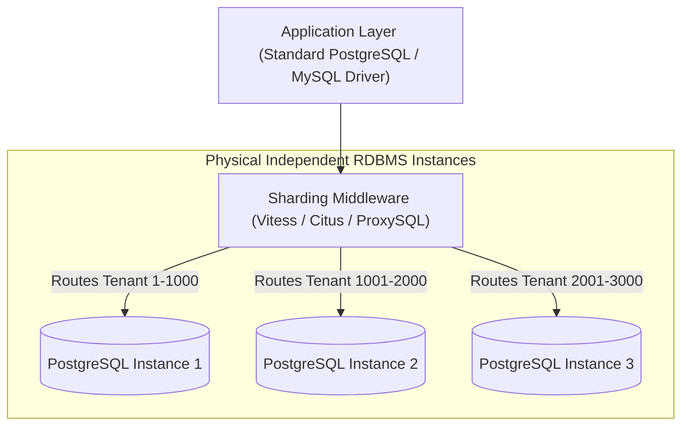
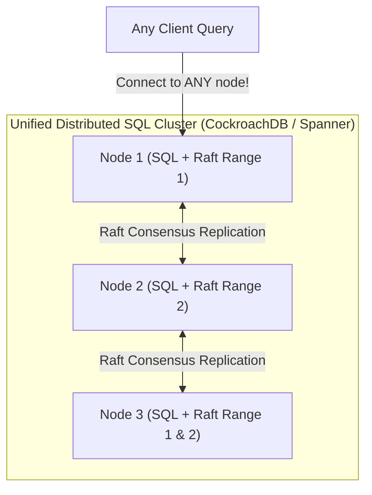

# Sharding Architectures: Distributed SQL vs. Proxy-Based

> **Domain**: `00-foundations/databases`  
> **Status**: Approved  
> **Target Audience**: Solution Architects, Principal Data Architects

---

## 1. Simple Explanation

When an enterprise relational database outgrows the largest available single cloud server (e.g., AWS `r6i.32xlarge` with 128 vCPUs and 1 TB RAM) and write throughput continues climbing, the database must be **Sharded** across multiple physical instances.

In modern enterprise architecture, there are two competing paradigms: **Proxy-Based Sharding** (Vitess, Citus) and native **Distributed SQL** (CockroachDB, YugabyteDB, Google Spanner).

---

## 2. Proxy-Based Sharding (e.g., Vitess / Citus)

* **Mechanics**: Middleware sits between application and standard monolithic database instances. It rewrites SQL queries, directs traffic to the correct physical shard based on the hash of the sharding key, and handles scatter-gather queries.
* **Production Track Record**: Powering YouTube, Slack, and GitHub at scale.
* **Trade-off**: Managing schema migrations across 100 independent physical database instances requires complex orchestration tooling.

---

## 3. Distributed SQL (e.g., CockroachDB / YugabyteDB)

Distributed SQL re-architects the database engine from scratch to be cloud-native:

### The Architecture of Distributed SQL
1. **SQL Layer**: Parses SQL, optimizes queries, and converts queries into distributed key-value operations. Any node in the cluster can accept any SQL query.
2. **Transactional Layer**: Executes transactions using distributed snapshot isolation and hybrid logical clocks.
3. **Consensus & Storage Layer (Multi-Raft + RocksDB/Pebble)**: Data is partitioned into small 64MB **Ranges**. Each range is replicated across 3 or 5 nodes using an independent **Raft consensus group**!

---

## 4. Architectural Comparison: Proxy vs. Distributed SQL

| Dimension | Proxy-Based Sharding (Vitess / Citus) | Distributed SQL (CockroachDB / Yugabyte) |
| :--- | :--- | :--- |
| **Engine Foundation** | Standard MySQL / PostgreSQL | Custom ground-up Raft + KV storage engine |
| **ACID Guarantees** | Single-shard ACID (Cross-shard requires slow 2PC) | Multi-node distributed ACID out-of-the-box |
| **Re-sharding** | Complex manual split operations | **Auto-rebalancing**: Splitting 64MB ranges dynamically |
| **Multi-Region Latency**| Difficult cross-region replication | Native survival of entire cloud region outages |
| **Single-Node Performance**| High (Native raw C/C++ engine) | Moderate (Higher consensus & CPU coordination overhead) |
| **When to Choose** | Massive legacy MySQL/PostgreSQL migration | Greenfield global scale; active-active multi-region |
