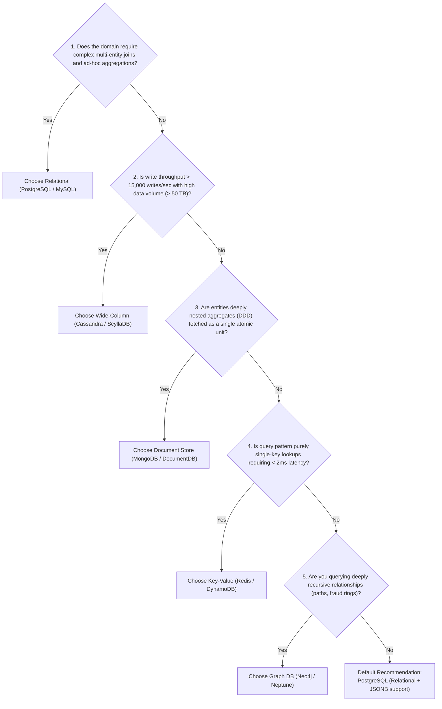

# SQL vs. NoSQL: Objective Decision Framework

> **Domain**: `00-foundations/databases`  
> **Status**: Approved  
> **Target Audience**: Solution Architects, Enterprise Architects, Data Architects

---

## 1. Problem & Context

The debate between SQL and NoSQL is often distorted by dogmatism. Early NoSQL advocates claimed relational databases were dead; SQL purists claim NoSQL corrupts data.

The modern Enterprise Solution Architect recognizes that **SQL and NoSQL solve fundamentally different mathematical and architectural problems**. Selecting the wrong persistence model creates permanent performance degradation, developer friction, and financial waste.

---

## 2. Comprehensive Comparison Matrix

| Architectural Dimension | Relational (SQL / RDBMS) | Non-Relational (NoSQL) |
| :--- | :--- | :--- |
| **Primary Data Model** | Strict tabular relations (Tables, Rows, Columns) | Polyglot (JSON Documents, Key-Value, Columns, Graphs) |
| **Schema Flexibility** | **Schema-on-Write**: Enforced strictly by database engine at insertion time | **Schema-on-Read**: Flexible; application code parses fields as needed |
| **Transactions & Integrity**| Strict ACID guarantees; multi-table atomic transactions | BASE (Basically Available, Soft state, Eventual consistency); single-record atomicity |
| **Query Flexibility** | Highly flexible ad-hoc queries, joins, aggregations via ANSI SQL | Constrained access patterns; queries must be designed alongside the table schema |
| **Scaling Strategy** | Primary strategy is **Vertical Scaling (Scale-Up)**; Read scaling via replicas; Sharding requires proxy | Native **Horizontal Scaling (Scale-Out)** via built-in hash partitioning across nodes |
| **Performance Profile** | Sub-millisecond reads when cached; slows down with multi-table joins under scale | High throughput; low latency for key-based lookups; zero join overhead |
| **Maturity & Tooling** | 50+ years of tooling, battle-tested DBAs, rich ORMs, universal skillsets | Mature for specific engines (Redis, Mongo), but requires specialized query expertise |

---

## 3. The 6-Question Architectural Decision Tree

When deciding between SQL and NoSQL for a bounded context:

---

## 4. The "PostgreSQL with JSONB" Sweet Spot

In 80% of modern enterprise applications, the traditional division between SQL and NoSQL is obsolete.

Modern PostgreSQL natively supports **`JSONB` (Binary JSON)** with GIN (Generalized Inverted Index) indexing:
* You get the ACID guarantees, strict schemas, foreign keys, and SQL joins of a relational database for core transactional data (`accounts`, `orders`).
* You get the dynamic, unstructured document storage and indexing of a NoSQL database for flexible metadata (`order_metadata JSONB`).
* **Architectural Takeaway**: Default to PostgreSQL until proven that write throughput, data volume, or specialized traversal patterns mandate a dedicated NoSQL engine.
