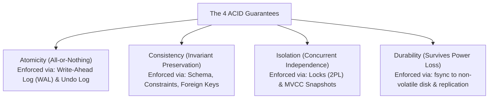

# Database Transactions & ACID Deep Dive

> **Domain**: `00-foundations/databases`  
> **Status**: Approved  
> **Target Audience**: Solution Architects, Data Architects, Principal Backend Engineers

---

## 1. Simple Explanation

A **Database Transaction** is a single logical unit of work that bundles multiple operations into an all-or-nothing execution block. The database guarantees that either all operations succeed together, or if any part fails or the server loses power midway, the entire transaction is completely rolled back, leaving the system in a clean, uncorrupted state.

---

## 2. Architect-Level Deep Dive: The ACID Invariants

### 2.1 Atomicity (A)
* **Definition**: If a transaction updates 5 rows and crashes on the 6th, all changes made by the previous 5 operations must be completely undone.
* **Under the Hood**: The storage engine writes old row state to an **Undo Log**. On crash recovery, the recovery manager reads the undo log and rolls back uncommitted changes.

### 2.2 Consistency (C)
* **Definition**: Data transitions strictly from one valid state to another valid state, never violating explicit database constraints (e.g., `CHECK (balance >= 0)`, `UNIQUE`, `FOREIGN KEY`).
* **Architectural Caveat**: This is *application-level integrity*, completely distinct from the "C" in CAP (which means linearizability).

### 2.3 Isolation (I)
* **Definition**: Even though thousands of transactions execute concurrently on multiple CPU cores, the intermediate, uncommitted state of Transaction A is invisible to Transaction B.
* **Under the Hood**: Achieved via **Multi-Version Concurrency Control (MVCC)** snapshots or **Two-Phase Locking (2PL)**.

### 2.4 Durability (D)
* **Definition**: Once the database acknowledges that a transaction has committed (`200 OK`), the data is permanently recorded and will survive power failure, operating system crash, or server reboot.
* **Under the Hood**: The `COMMIT` operation must execute a synchronous disk flush (`fsync`) of the Write-Ahead Log (WAL) to non-volatile SSD storage before returning success to the client application.

---

## 3. The Durability Trade-off: Group Commit & Asynchronous Commit

Executing an `fsync` on every individual transaction limits maximum single-node write throughput to the physical disk I/O limit (typically 2,000–5,000 IOPS on cloud block storage).

### Architectural Tuning Levers
1. **Group Commit**: The database waits a microsecond window to batch 50 concurrent transactions into a single physical disk `fsync`, multiplying write throughput by $10\times$.
2. **Asynchronous Commit (`synchronous_commit = off` in PostgreSQL)**:
   * Returns success to client immediately after writing to in-memory WAL buffer; disk flush happens in the background every 200ms.
   * *The Trade-off*: Multiplies write throughput by $5\times$, but risks losing the last 200ms of committed transactions if the server physically crashes.
   * *When to Use*: High-throughput logging, telemetry, or game state where losing 200ms of data is acceptable.
