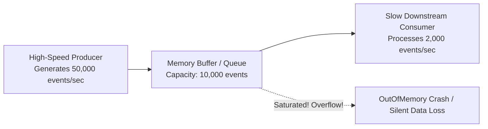
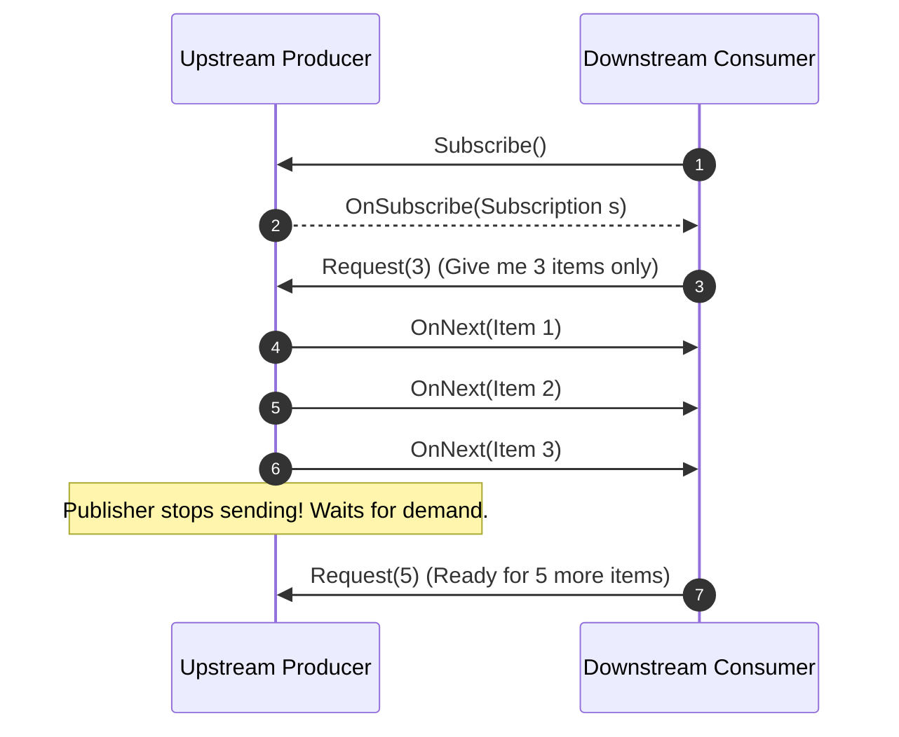

# Backpressure & Flow Control in Distributed Pipelines

> **Domain**: `00-foundations/distributed-systems`  
> **Status**: Approved  
> **Target Audience**: Solution Architects, Streaming Engineers, Principal Backend Engineers

---

## 1. Simple Explanation

**Backpressure** is a flow-control mechanism where a downstream consumer that is being overwhelmed with data signals the upstream producer to slow down or halt transmission until the consumer catches up.

Without backpressure, an unconstrained producer will saturate consumer memory buffers, resulting in catastrophic `OutOfMemoryError` (OOM) crashes.

---

## 2. Architect-Level Deep Dive: The Producer-Consumer Imbalance



### The Three Strategies for Handling Buffer Saturation
When a consumer cannot keep pace with producer ingress, an architect must choose one of three fundamental flow control strategies:

```text
┌─────────────────────────────────────────────────────────────┐
│                 FLOW CONTROL STRATEGIES                     │
├───────────────────┬─────────────────────────────────────────┤
│ 1. Buffer (Queue) │ Hold in memory/disk. Vulnerable to OOM  │
│                   │ if the imbalance is sustained.          │
├───────────────────┼─────────────────────────────────────────┤
│ 2. Drop (Shed)    │ Drop messages when buffer exceeds limit.│
│                   │ Drop oldest (FIFO) or drop newest.      │
├───────────────────┼─────────────────────────────────────────┤
│ 3. Push-back      │ Slow down or block the producer at the  │
│    (Backpressure) │ source (Reactive Streams / TCP window). │
└───────────────────┴─────────────────────────────────────────┘
```

---

## 3. Backpressure Mechanisms in Enterprise Architecture

### 3.1 Network Layer: TCP Window Flow Control
TCP natively implements backpressure via the **Receive Window (rwnd)**:
* Consumer OS advertises available buffer space in every TCP ACK packet.
* If consumer application is slow to read from the socket buffer, `rwnd` shrinks to `0` (Zero Window).
* Sender's TCP stack halts transmission immediately until consumer reads socket bytes.

### 3.2 Application Layer: The Reactive Streams Specification
The Reactive Streams standard (Project Reactor, RxJava, Akka Streams, .NET System.Threading.Channels) replaces unbounded *Push* with **Dynamic Pull**:



### 3.3 Messaging Layer: Kafka Consumer Pull Model
Unlike traditional message queues (RabbitMQ, ActiveMQ) that default to pushing messages to consumers until workers choke, **Apache Kafka utilizes a pure Pull-based architecture**:
* Consumers poll for records explicitly: `consumer.poll(Duration.ofMillis(100))`.
* A consumer only fetches what it has the memory and CPU capacity to process. Backpressure is baked into the architecture by design.

---

## 4. Production Architectural Checklist for Backpressure

* [ ] Are all in-memory queues bounded (`ArrayBlockingQueue(1000)` instead of unbounded `LinkedBlockingQueue`)?
* [ ] Is there an explicit saturation policy configured (Drop Oldest, Drop Newest, or Block Caller)?
* [ ] Do message streaming consumers pull batches explicitly based on available memory headroom?
