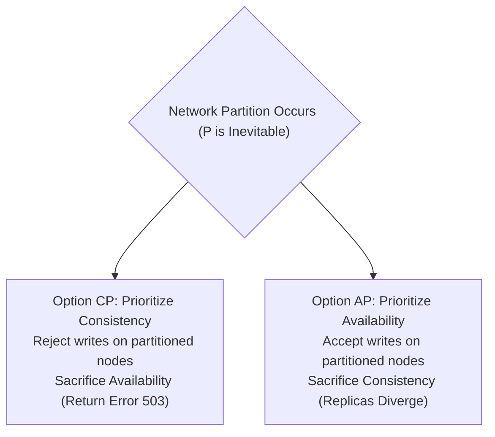

# The CAP Theorem: Proof, Realities & Misconceptions

> **Domain**: `00-foundations/distributed-systems`  
> **Status**: Approved  
> **Target Audience**: Solution Architects, Enterprise Architects, Principal Engineers

---

## 1. Simple Explanation

The **CAP Theorem** states that in any distributed data store that communicates over an unreliable network, you can never guarantee both **Consistency** (everyone sees the same data at the same time) and **Availability** (every request gets a non-error response) whenever a **Network Partition** occurs.

---

## 2. Architect-Level Deep Dive: The True Definition of CAP

Formulated by Eric Brewer in 2000 and mathematically proven by Seth Gilbert and Nancy Lynch in 2002, the three letters have very specific definitions that are frequently misunderstood:

```text
┌─────────────────────────────────────────────────────────────┐
│                     THE CAP PROPERTIES                      │
├───────────────────┬─────────────────────────────────────────┤
│ C (Consistency)   │ Linearizability: Every read returns the │
│                   │ most recent write or an error.          │
├───────────────────┼─────────────────────────────────────────┤
│ A (Availability)  │ Every non-failing node must return a    │
│                   │ non-error response (no timeouts/500s).  │
├───────────────────┼─────────────────────────────────────────┤
│ P (Partition      │ The network is allowed to drop or delay │
│    Tolerance)     │ arbitrary messages between nodes.       │
└───────────────────┴─────────────────────────────────────────┘
```



---

## 3. The Great Misconception: "Pick 2 out of 3"

Marketing materials often claim: *"Pick any two: C, A, or P"*.  
**This is mathematically false.**

You cannot choose "CA".  
In the physical world, networks consist of physical routers, switches, fiber optic cables, and cloud virtualized hypervisors. Cables will be severed; cloud VPCs will drop packets; latency will spike. **Partition Tolerance (P) is a physical reality of distributed computing, not a design choice.**

Therefore, the true formulation of CAP is:
> **In the presence of a network partition, an architect must choose between Consistency (CP) or Availability (AP).**

---

## 4. CP vs. AP in Production

### 4.1 CP Systems (Consistency over Availability)
* **Behavior During Network Partition**: When the network splits, nodes that cannot contact the majority quorum **refuse to accept writes** and return errors or timeouts.
* **Database Examples**: PostgreSQL with synchronous replication, Google Spanner, CockroachDB, etcd, MongoDB (default majority write concern).
* **Enterprise Fit**: Financial transactions, stock trading, inventory reservation, identity and access management.

### 4.2 AP Systems (Availability over Consistency)
* **Behavior During Network Partition**: Both sides of the split continue accepting writes and reads. The system guarantees that every client gets a successful response, but the two partitions diverge. Replicas must be reconciled later.
* **Database Examples**: Apache Cassandra, Amazon DynamoDB (when configured for eventual consistency), CouchDB.
* **Enterprise Fit**: Social media feeds, product browsing, telemetry ingestion, shopping cart additions.

---

## 5. Architectural Checklist for CAP Evaluation

* [ ] Has product leadership explicitly agreed whether the system should fail closed (CP) or fail open (AP) during an outage?
* [ ] If choosing AP, what is the automated conflict resolution strategy (CRDT, LWW, manual human review)?
* [ ] Does the system require strong consistency only on a subset of tables (e.g., CP for `Accounts`, AP for `AuditLogs`)?
