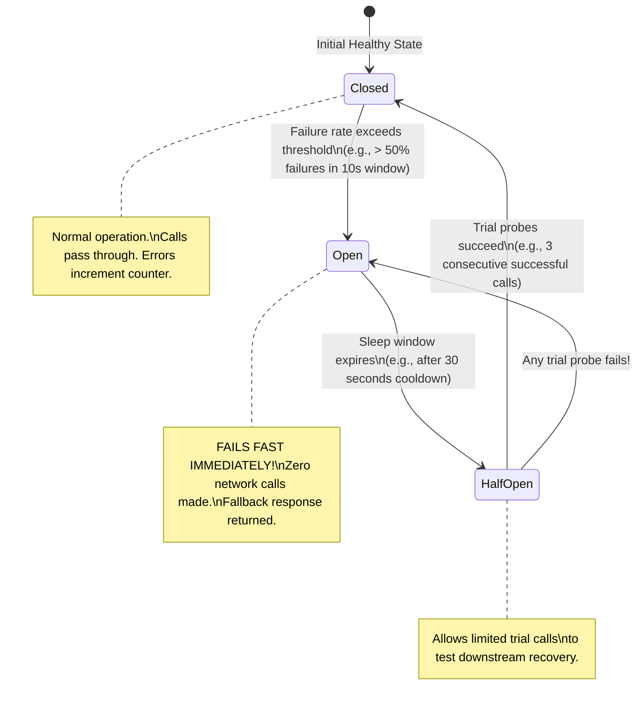

# The Circuit Breaker Pattern

> **Domain**: `00-foundations/distributed-systems`  
> **Status**: Approved  
> **Target Audience**: Solution Architects, Principal Engineers, SREs

---

## 1. Simple Explanation

In household electrical engineering, a **Circuit Breaker** detects when current exceeds safe levels and physically breaks the circuit, stopping the flow of electricity to prevent an electrical fire.

In software architecture, a **Circuit Breaker** wraps remote network calls. When the remote service begins failing or timing out repeatedly, the circuit breaker **trips open**, immediately failing future calls without waiting for network timeouts, giving the struggling downstream service room to recover and protecting the caller from thread exhaustion.

---

## 2. Architect-Level Deep Dive: The 3-State Machine

Michael Nygard formalized the pattern in *Release It!*. The circuit breaker operates as a formal finite state machine across three distinct states:

---

## 3. The Three States Detailed

### 1. Closed State (Healthy)
* All calls are passed through to the downstream service.
* The circuit breaker maintains a sliding time-window or ring-buffer of results (e.g., the last 100 calls or last 10 seconds).
* If the failure rate (HTTP 5xx, socket timeouts) breaches the configured threshold (e.g., `50%` failure rate), the breaker **trips to OPEN**.

### 2. Open State (Tripped / Failing Fast)
* **Zero network traffic is permitted to the downstream service.**
* Any incoming request **fails immediately** in `< 1 millisecond`, throwing a `CircuitBreakerOpenException` or executing an automated fallback routine.
* This achieves two critical goals:
  1. Protects the caller's connection and thread pools from being exhausted.
  2. Protects the struggling downstream service from being bombarded with traffic while it is rebooting or recovering.

### 3. Half-Open State (Probing Recovery)
* After a configured cooldown duration (e.g., `30 seconds`), the breaker transitions to **Half-Open**.
* It permits a small, controlled sample of requests (e.g., 3 trial requests) to pass through to the downstream service.
* If all trial requests succeed, the breaker resets to **CLOSED** (normal operation resumed).
* If any trial request fails or times out, the breaker immediately trips back to **OPEN** for another cooldown period.

---

## 4. Fallback Strategies in Production

When the circuit breaker is OPEN, the architect must specify a deterministic **Fallback Behavior**:

| Fallback Strategy | Implementation Example | Production Use Case |
| :--- | :--- | :--- |
| **Cached Stale Data** | Return cached user profile from Redis (even if 1 hour stale) | Non-critical read queries (Product recommendations, User profile) |
| **Graceful Degradation**| Return an empty list `[]` or default view | "Customers who bought this also bought..." widget on retail site |
| **Asynchronous Queuing** | Write order payload to local disk/Kafka queue for deferred processing | Order submission, telemetry logging |
| **Fail-Fast Error** | Return HTTP `503 Service Unavailable` with `Retry-After: 30` | Financial transfers where stale data or guessing is prohibited |

---

## 5. Enterprise Frameworks

* **.NET**: Polly (`ResiliencePipeline` with `AddCircuitBreaker`).
* **Java / Spring Boot**: Resilience4j (`CircuitBreakerRegistry`).
* **Service Mesh (Envoy / Istio)**: Outlier Detection (Connection pool circuit breaking at the sidecar network layer without modifying application code).
