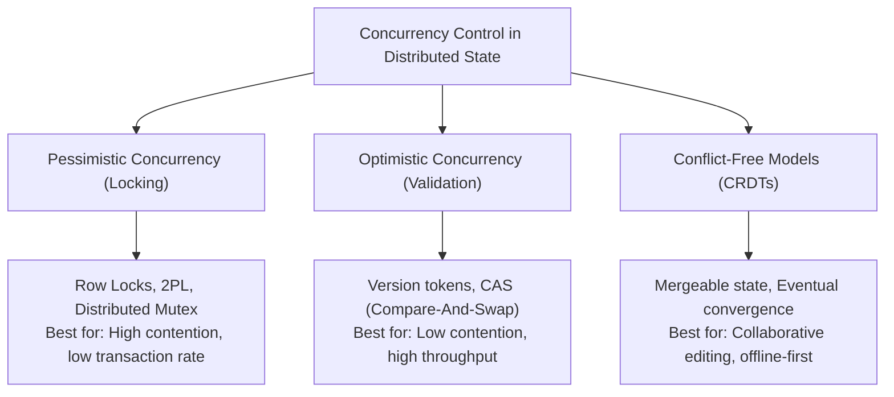

# Concurrency, Race Conditions & Isolation

> **Domain**: `00-foundations/distributed-systems`  
> **Status**: Approved  
> **Target Audience**: Solution Architects, Principal Backend Engineers

---

## 1. Simple Explanation

**Concurrency** is the ability of different parts of a program or distinct systems to execute out-of-order or in partial order without affecting the final outcome. When two operations attempt to modify the same shared state at the same instant without coordination, a **Race Condition** occurs, leading to silent data corruption (e.g., two users purchasing the last available flight seat simultaneously).

---

## 2. Architect-Level Deep Dive: Concurrency Control Paradigms



### 2.1 Pessimistic Concurrency Control
* **Mechanics**: Assume conflicts will happen. Acquire an exclusive lock on the record before reading or mutating it (`SELECT FOR UPDATE`). Hold the lock until the transaction commits.
* **Trade-offs**:
  * *Advantage*: Guarantees strict consistency; zero rollbacks due to race conditions.
  * *Disadvantage*: Severe concurrency bottleneck. If Transaction 1 holds a lock for 200ms, all other requests queue up. Risk of distributed deadlocks.
* **When to Use**: High-value, high-contention operations (e.g., ticket seat allocation during flash sales).

### 2.2 Optimistic Concurrency Control (OCC)
* **Mechanics**: Assume conflicts are rare. Read the record with its `version` or timestamp. Mutate locally. When writing back, execute a conditional write:
  ```sql
  UPDATE inventory 
  SET quantity = quantity - 1, version = version + 1 
  WHERE product_id = :id AND version = :current_version;
  ```
  If zero rows are updated, another transaction mutated the record first. Roll back, re-fetch, and retry.
* **Trade-offs**:
  * *Advantage*: Zero lock contention; high read throughput; non-blocking.
  * *Disadvantage*: Under heavy write contention, retry storms degrade performance.
* **When to Use**: High read-to-write ratios (e.g., 95% reads, 5% writes), typical enterprise web apps.

---

## 3. Distributed Locks (Redlock vs. Database Locks)

When managing concurrency across multiple stateless application instances:

```text
┌─────────────────────────────────────────────────────────────┐
│                 DISTRIBUTED LOCKING MECHANISMS              │
├───────────────────────┬─────────────────────────────────────┤
│ MECHANISM             │ ARCHITECTURAL VERDICT               │
├───────────────────────┼─────────────────────────────────────┤
│ Database Advisory Lock│ Safe, transactional, uses existing  │
│ (PostgreSQL pg_locks) │ ACID engine. Preferred default.     │
├───────────────────────┼─────────────────────────────────────┤
│ Redis (Redlock)       │ Fast, but vulnerable to GC pauses,  │
│                       │ clock drift, and split-brain. Use   │
│                       │ only with fencing tokens.           │
├───────────────────────┼─────────────────────────────────────┤
│ ZooKeeper / etcd      │ Strong consensus-backed lease lock. │
│                       │ Production-safe for leader election.│
└───────────────────────┴─────────────────────────────────────┘
```

> **Caution on Distributed Locks**: Martin Kleppmann famously proved that distributed locks without **fencing tokens** (monotonically incrementing counters checked by the storage engine) are unsafe in the presence of process pauses (e.g., JVM garbage collection or network delay).
