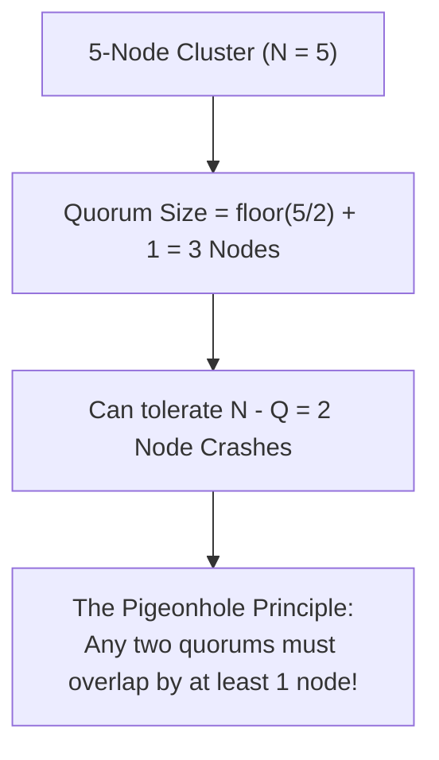
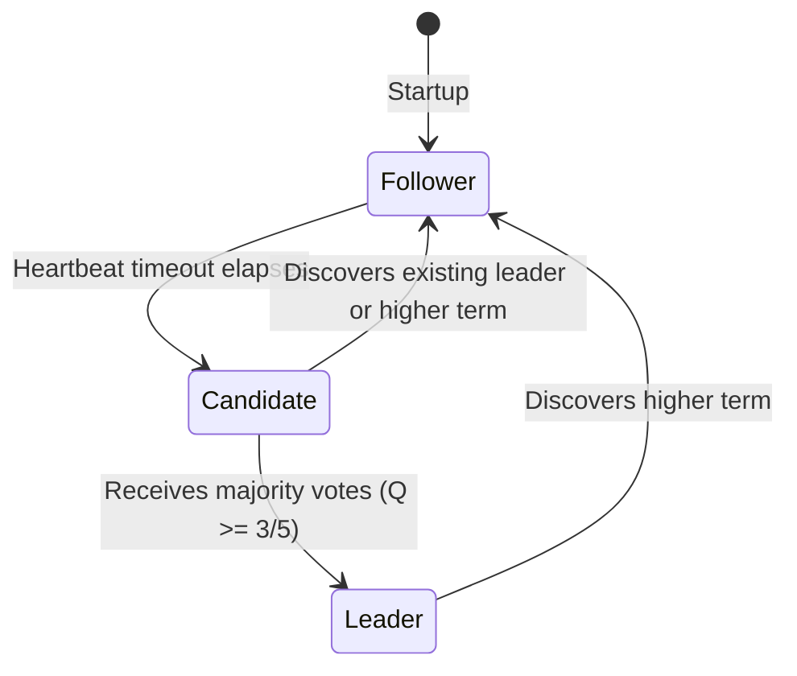
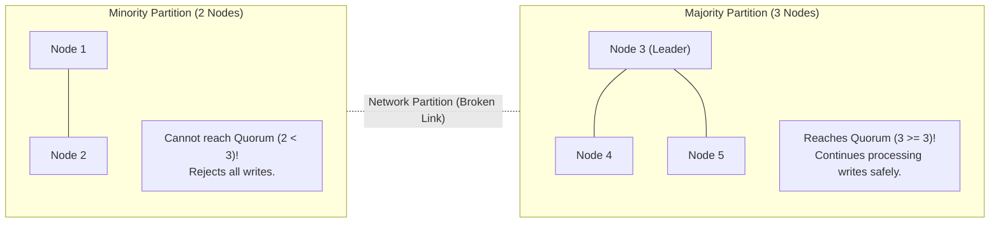

# Distributed Consensus & Quorums (Paxos vs. Raft)

> **Domain**: `00-foundations/distributed-systems`  
> **Status**: Approved  
> **Target Audience**: Solution Architects, Distributed Systems Engineers

---

## 1. Simple Explanation

**Consensus** means getting multiple computers to agree on a single value or sequence of actions (such as "Who is the cluster leader?" or "What is transaction #1049?"), even if some computers crash or the network drops packets.

---

## 2. Architect-Level Deep Dive: Quorum Mathematics

In a cluster of $N$ nodes, a **Quorum** is a majority subset of nodes whose agreement is sufficient to make a binding decision.

$$\text{Quorum Size } Q = \left\lfloor \frac{N}{2} \right\rfloor + 1$$



### Why Cluster Sizes Must Be Odd Numbers ($3, 5, 7$)
* A **3-node cluster** requires $2$ nodes for quorum; can tolerate **1 failure**.
* A **4-node cluster** requires $3$ nodes for quorum; can tolerate **1 failure**.
* **Architectural Insight**: A 4-node cluster provides *zero additional fault tolerance* over a 3-node cluster, but increases network communication costs. Always size consensus clusters with odd node counts ($3$ or $5$).

---

## 3. Paxos vs. Raft: The Two Great Consensus Algorithms

```text
┌─────────────────────────────────────────────────────────────┐
│                       PAXOS VS. RAFT                        │
├───────────────────────────────┬─────────────────────────────┤
│ PAXOS (Leslie Lamport, 1998)  │ RAFT (Ongaro & Ousterhout)  │
├───────────────────────────────┼─────────────────────────────┤
│ Historically notorious for    │ Designed explicitly for     │
│ conceptual difficulty and     │ understandability and clean │
│ edge-case ambiguity.          │ enterprise implementation.  │
│ Proposers, Acceptors, Learners│ Leader, Follower, Candidate │
│ Implemented in Google Chubby  │ Implemented in etcd, Consul,│
│ and Microsoft Azure internal. │ Kafka (KRaft), CockroachDB. │
└───────────────────────────────┴─────────────────────────────┘
```

### 3.1 Raft State Machine & Lifecycle
Raft decomposes consensus into three independent subproblems:



1. **Leader Election**: When a follower stops receiving heartbeats from the leader, it transitions to *Candidate*, increments the *Term* counter, and requests votes. If it wins a majority quorum, it becomes the new *Leader*.
2. **Log Replication**: Clients send writes only to the Leader. The Leader appends the entry to its log and sends `AppendEntries` RPCs to followers.
3. **Commit Rule**: Once a majority of followers acknowledge writing the log entry to their disk, the entry is considered **Committed**. The leader applies it to its local state machine and returns success to the client.

---

## 4. Split-Brain Prevention

A **Split-Brain** occurs when a network partition divides a 5-node cluster into two isolated partitions: a minority partition (2 nodes) and a majority partition (3 nodes).



Because the minority partition cannot assemble a quorum ($2 < 3$), it **strictly refuses to commit writes**, mathematically preventing conflicting data splits!

---

## 5. Enterprise Usage Guidelines

* **Do NOT Implement Your Own Consensus**: Writing a production-grade consensus algorithm from scratch has a 99% failure rate due to subtle disk flush, thread scheduling, and network partition bugs.
* **Leverage Proven Consensus Engines**: Rely on battle-tested consensus backbones:
  * **etcd**: Kubernetes cluster state and leader coordination.
  * **HashiCorp Consul**: Service mesh and distributed configuration.
  * **Apache Kafka (KRaft)**: High-throughput metadata log consensus.
