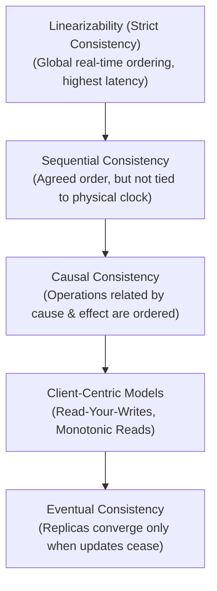

# Consistency Models in Distributed Systems

> **Domain**: `00-foundations/distributed-systems`  
> **Status**: Approved  
> **Target Audience**: Solution Architects, Data Architects, Distributed Systems Engineers

---

## 1. Simple Explanation

In a single-node database, **Consistency** (the "C" in ACID) means that data always satisfies business integrity rules (e.g., balance cannot be negative).  
In a distributed system, **Consistency** (the "C" in CAP) means something completely different: **it refers to whether all replicas across a network agree on the same value at the same point in time.**

---

## 2. The Spectrum of Consistency Models

Consistency is not a binary choice between "Immediate" and "Broken". It is a formal spectrum ranging from strictly coordinated linearizability down to loose eventual convergence:

---

## 3. Detailed Model Breakdown

### 3.1 Linearizability (External Consistency / Strict Serializability)
* **Definition**: The gold standard. As soon as a single write operation completes in real wall-clock time, all subsequent reads across *any* node in the universe must return that new value or a newer one.
* **Cost**: Massive. Requires atomic physical clocks (Google TrueTime) or synchronous two-phase commits / consensus round trips on every write.
* **Examples**: Google Spanner, CockroachDB (when configured for serializable isolation).

### 3.2 Sequential Consistency
* **Definition**: All operations appear to take place in some sequential order that is identical across all nodes. Program order within each client is preserved, but the global sequence is not bound to physical wall-clock time.

### 3.3 Causal Consistency
* **Definition**: If Event A *causes* Event B (e.g., a question followed by an answer), all nodes must observe Event A before Event B. Concurrent operations that are independent may be seen in different orders on different nodes.
* **Advantage**: Strongest known consistency model that is 100% available under network partitions!

### 3.4 Client-Centric Consistency Models
Guarantee consistency for an individual user, even if different users observe different states:
1. **Read-Your-Own-Writes**: A user who updates their profile always sees their updated profile immediately.
2. **Monotonic Reads**: If a user reads state at version 5, they will never subsequently observe state at version 4.
3. **Monotonic Writes**: A user's writes are applied in the order they were submitted.

### 3.5 Eventual Consistency
* **Definition**: If no further updates are made to an entity, all replicas will eventually converge to the same value.
* **Trade-off**: Fastest possible writes and reads; zero cross-node coordination; but clients can read stale data arbitrarily.
* **Examples**: DNS, Apache Cassandra, Amazon S3.

---

## 4. Architectural Decision Matrix

| Business Domain | Minimum Required Consistency | Viable Database Engines |
| :--- | :--- | :--- |
| **Financial Ledger / Balances** | Linearizable / Serializable | PostgreSQL (ACID), CockroachDB, Google Spanner |
| **Document Collaboration / Wiki**| Causal Consistency / CRDTs | CouchDB, Yjs, ShareDB |
| **E-Commerce Product Catalog** | Read-Your-Writes | PostgreSQL Replicas, Redis, DynamoDB |
| **User Notifications / Chat Likes**| Eventual Consistency | Cassandra, ScyllaDB, DynamoDB |
