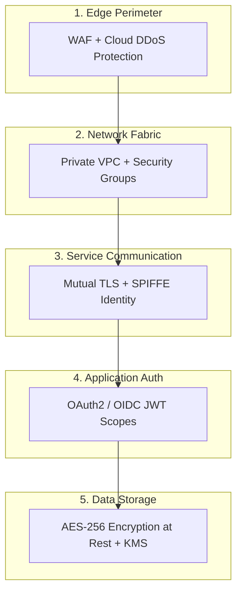

# Distributed Design Principle: Defense-in-Depth

## 1. Core Principle Definition

Defense-in-Depth is a cybersecurity and architectural principle where multiple layers of redundant security controls are established throughout an enterprise system, ensuring that if one defensive layer is breached, subsequent layers prevent catastrophic compromise.

---

## 2. Multi-Layered Security Rings

---

## 3. Production Invariants

- **Never Trust the Internal Network**: Assume attackers have compromised internal subnets (Zero Trust Architecture). All internal service-to-service calls must require mTLS authentication and granular authorization.
- **Principle of Least Privilege**: IAM roles must grant strictly the minimum permissions required for a service to execute.
