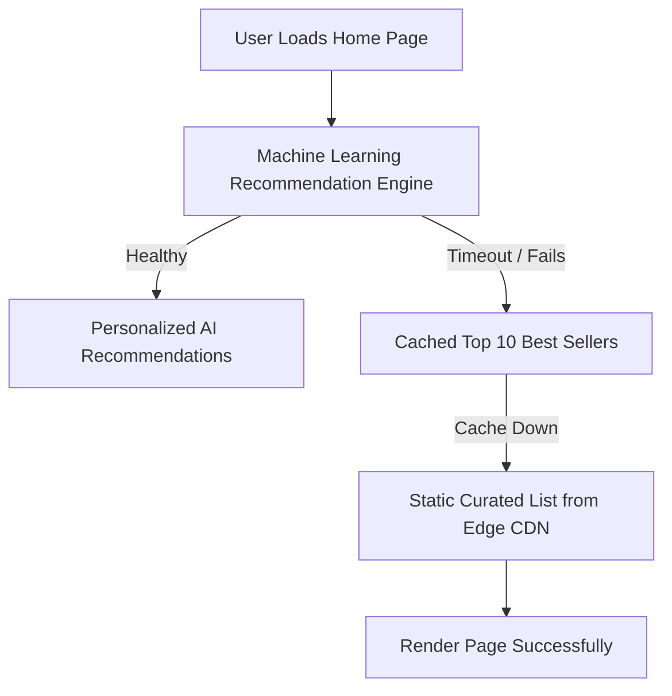

# Distributed Design Principle: Graceful Degradation

## 1. Core Principle Definition

Graceful Degradation ensures that when an internal component, third-party dependency, or database partition fails, the system continues to function and serve users with reduced fidelity or secondary fallback capabilities, rather than presenting a hard 500 error page.

---

## 2. Fallback Hierarchies

---

## 3. Production Techniques

- **Static Fallbacks**: Return default catalog items if personalization services crash.
- **Read-Only Mode**: If primary write databases fail, keep read replicas accessible and disable the "Save" button with a clear user notice.
- **Feature Shedding**: Disable expensive UI elements (e.g., live stock quotes, related products) under high CPU load.
