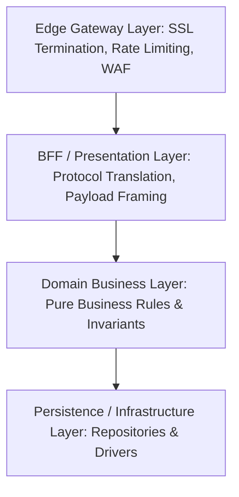

# Distributed Design Principle: Separation of Concerns (SoC)

## 1. Core Principle Definition

Separation of Concerns is an architectural principle that mandates breaking a software system into distinct, non-overlapping sections, where each section addresses a specific aspect of the system's operational or business requirements.

---

## 2. Layered Enterprise Separation

---

## 3. Enterprise Applications

- **Cross-Cutting Concerns**: Delegate authentication, distributed tracing, rate limiting, and mTLS to an API Gateway or Service Mesh (Envoy sidecar) rather than duplicating security code inside every microservice application container.
- **Decouple Business Logic from Transport**: Domain entities should never import HTTP framework packages (`express`, `flask`, `aspnetcore`).
