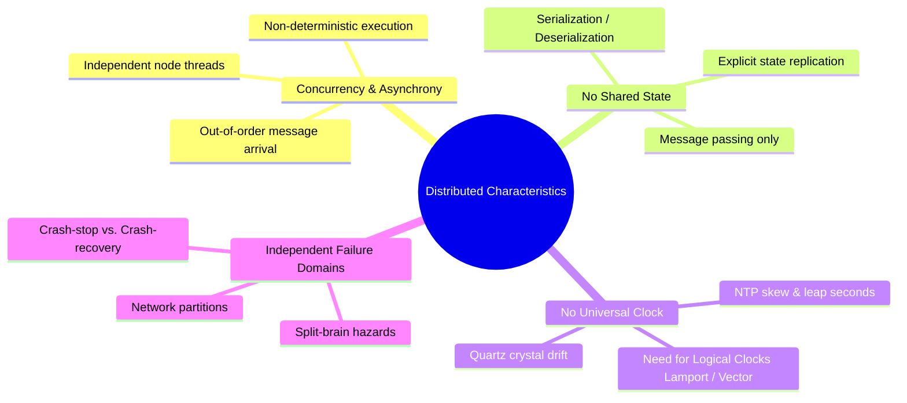

# Distributed System Characteristics & Physics

> **Domain**: `00-foundations/distributed-systems`  
> **Status**: Approved  
> **Target Audience**: Solution Architects, Distributed Systems Engineers

---

## 1. Simple Explanation

Unlike a single computer running software in its own memory, a distributed system must coordinate across multiple computers that do not share memory or a physical clock. The system must maintain correct behavior despite individual machines running at different speeds, crashing, or losing network connectivity.

---

## 2. Architect-Level Deep Dive: The Core Characteristics

### 1. Concurrency & Non-Determinism
Operations execute concurrently on independent physical processors. Messages across network links arrive out of order. A response to request $B$ may arrive before the response to request $A$, even if $A$ was sent first.

### 2. The Clock Problem: TrueTime vs. Logical Clocks
Physical clocks on standard server motherboards drift by several milliseconds to seconds per day. Relying on `DateTime.UtcNow` or `System.currentTimeMillis()` to determine transaction ordering across nodes causes silent data loss:
* **NTP (Network Time Protocol)**: Synchronizes clocks over network packets, but jitter causes offsets of 10ms–100ms.
* **Google TrueTime**: Relies on synchronized atomic clocks and GPS receivers in each data center, bounding uncertainty to $\pm 7\text{ms}$ (used by Google Spanner).
* **Lamport Timestamps & Vector Clocks**: Logical monotonic counters that establish a "happened-before" causal relationship ($A \to B$) without relying on physical wall-clock time.

### 3. Asymmetric Network Partitions
A network failure is rarely a clean break. Often, Node A can talk to Node B, but Node B cannot talk to Node A; or Node A can reach Node C, but Node B cannot reach Node C. This asymmetric visibility makes consensus algorithms (Raft, Paxos) essential.

---

## 3. Practical Example: Vector Clocks in Conflict Resolution

In a distributed multi-master shopping cart service:
1. Client 1 adds item $X$ on Node A: Vector Clock $V_A = [A:1, B:0]$.
2. Client 2 concurrently adds item $Y$ on Node B: Vector Clock $V_B = [A:0, B:1]$.
3. Node A and Node B replicate to each other. Because neither vector clock dominates the other, the system detects a concurrent write conflict.
4. **Resolution Strategy**: Application-level conflict resolution merges the sets: Cart = $\{X, Y\}$.

---

## 4. Production Implications & Trade-offs

* **Never Use Wall-Clock Time for Ordering**: Use database auto-incrementing WAL sequences, distributed Snowflake IDs (Twitter Snowflake / UUIDv7), or consensus logs.
* **Expect Out-of-Order Execution**: Message consumers must verify message sequencing or implement idempotent state machine transitions.
