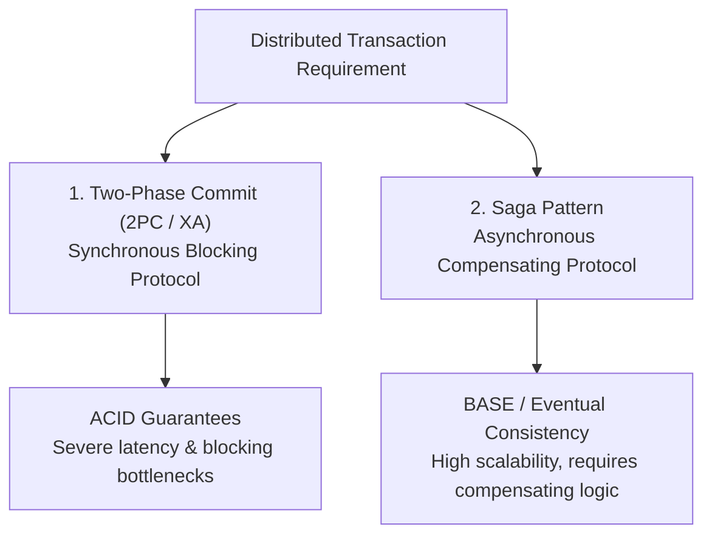
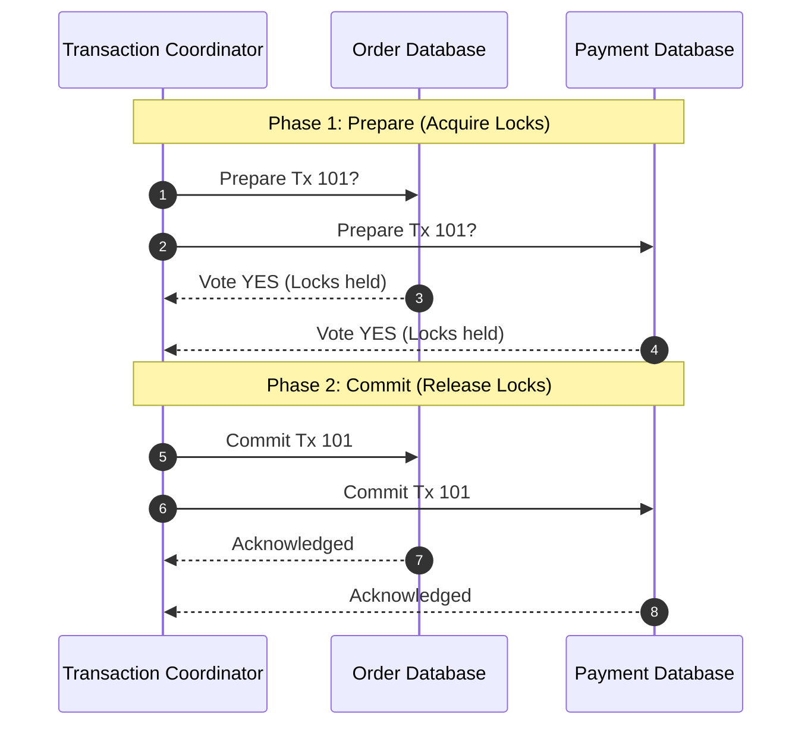
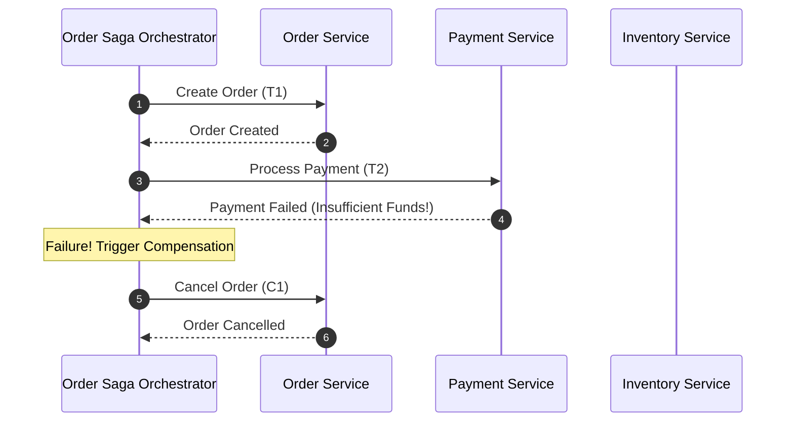

# Distributed Transactions: 2PC vs. Saga Pattern

> **Domain**: `00-foundations/distributed-systems`  
> **Status**: Approved  
> **Target Audience**: Solution Architects, Enterprise Architects, Principal Engineers

---

## 1. Simple Explanation

In a traditional monolithic database, a transaction is simple: you write `BEGIN TRANSACTION`, perform 5 SQL operations, and write `COMMIT`. Either all 5 happen, or none do (Atomicity).  
In a distributed microservices architecture where Order Service, Payment Service, and Inventory Service each own independent databases, **there is no shared database transaction**. A **Distributed Transaction** must coordinate atomicity across independent network services.

---

## 2. Architect-Level Deep Dive: The Two Architectural Solutions



---

## 3. Two-Phase Commit (2PC / XA Transactions)

### 3.1 The 2PC Protocol Mechanics
1. **Phase 1: Prepare Phase**: Coordinator asks all participants: *"Can you commit this transaction?"* Participants acquire local database locks, prepare changes, write to undo/redo logs, and vote `YES` or `NO`.
2. **Phase 2: Commit Phase**: If all vote `YES`, Coordinator writes `COMMIT` to its log and commands all participants to commit and release locks. If any vote `NO` (or timeout occurs), Coordinator commands all to rollback.



### 3.2 The Fatal Flaw of 2PC in Modern Cloud
* **Blocking Protocol**: If the coordinator crashes or a network partition occurs while participants have voted `YES`, participants **must hold database row locks indefinitely** waiting for the coordinator to recover.
* **Latency Amplification**: Holds locks across multiple network round-trips over the WAN. Database throughput drops by 90%+.
* **Architectural Verdict**: **Strictly avoid 2PC across microservices and cloud networks.**

---

## 4. The Saga Pattern (The Modern Standard)

A **Saga** breaks a distributed transaction into a sequence of local transactions:
$$T_1, T_2, T_3, \dots, T_n$$
Each local transaction updates its own database and emits an event. If any local transaction $T_k$ fails, the Saga executes a sequence of **Compensating Transactions**:
$$C_{k-1}, \dots, C_2, C_1$$
to undo the semantic business effects.

### 4.1 Orchestrated vs. Choreographed Sagas

```text
┌─────────────────────────────────────────────────────────────┐
│                 ORCHESTRATION VS. CHOREOGRAPHY              │
├───────────────────────────────┬─────────────────────────────┤
│ CHOREOGRAPHY                  │ ORCHESTRATION               │
├───────────────────────────────┼─────────────────────────────┤
│ Decentralized event pub/sub.  │ Centralized orchestrator    │
│ Services react to events.     │ state machine coordinates.  │
│ Best for: Simple 2-3 step     │ Best for: Complex 5+ step   │
│ workflows; loose coupling.    │ enterprise business flows.  │
│ Risk: Event spaghetti.        │ Tooling: Temporal, Camunda. │
└───────────────────────────────┴─────────────────────────────┘
```



---

## 5. The Dual-Write Trap & The Transactional Outbox

A classic developer mistake in event-driven systems is writing to the database and then calling the message broker:
```csharp
// FATAL ANTI-PATTERN: THE DUAL-WRITE BUG
await _db.Orders.AddAsync(order);
await _db.SaveChangesAsync(); // What if process crashes HERE?
await _kafka.PublishAsync("order-created", order); // Message never sent!
```
If the process crashes between the database commit and the Kafka publish, the database record exists, but no downstream services are notified!

### The Solution: The Transactional Outbox Pattern
Write the business entity and an event record into an `outbox` table within the **same local ACID database transaction**. A reliable background worker (or Debezium CDC) tails the outbox table and streams events to Kafka with guaranteed delivery.
