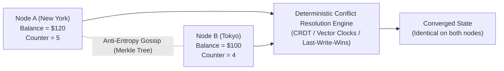

# Eventual Consistency & Conflict Resolution (CRDTs)

> **Domain**: `00-foundations/distributed-systems`  
> **Status**: Approved  
> **Target Audience**: Solution Architects, Data Architects, Distributed Systems Engineers

---

## 1. Simple Explanation

**Eventual Consistency** is a consistency model where replicas are allowed to diverge temporarily during write operations or network disconnects, with the mathematical guarantee that *if no new updates occur, all replicas will eventually synchronize and hold identical data*.

---

## 2. Architect-Level Deep Dive: Convergence Mechanics

In eventually consistent systems, how do diverging nodes converge without a centralized master?



### 2.1 Anti-Entropy with Merkle Trees
* Nodes periodically compare cryptographic hash trees (**Merkle Trees**) representing their datasets.
* Comparing root hashes takes milliseconds; if root hashes match, datasets are identical. If they differ, nodes traverse down the tree branches to pinpoint and synchronize only the divergent keys, avoiding full-table scans over the WAN.

### 2.2 Read Repair
When a client reads data with quorum $R=2$, the coordinator queries two replicas. If Replica A returns version 5 and Replica B returns version 4, the coordinator returns version 5 to the client and asynchronously sends a "read repair" write to Replica B in the background.

---

## 3. Conflict-Free Replicated Data Types (CRDTs)

CRDTs are mathematically sound data structures that can be replicated concurrently across multiple nodes without coordination, guaranteeing deterministic, mathematically conflict-free convergence.

```text
┌─────────────────────────────────────────────────────────────┐
│                       CRDT TAXONOMY                         │
├───────────────────────────────┬─────────────────────────────┤
│ Operation-Based (CmRDT)       │ State-Based (CvRDT)         │
├───────────────────────────────┼─────────────────────────────┤
│ Replicates operations         │ Replicates entire state payload;│
│ Requires causal, at-most-once │ Merged using a mathematical │
│ message delivery network.     │ join semi-lattice (LUB).    │
└───────────────────────────────┴─────────────────────────────┘
```

### Common CRDT Primitives
* **G-Counter (Grow-Only Counter)**: Each node maintains its own local counter slot in an array. To increment, Node A increments its own slot. Value = sum of all slots. Merge = element-wise maximum.
* **PN-Counter (Positive-Negative Counter)**: Uses two G-Counters (one for increments, one for decrements).
* **LWW-Element-Set (Last-Write-Wins Set)**: Adds elements with a timestamp. Conflicts resolved in favor of the latest timestamp (vulnerable to clock drift).
* **OR-Set (Observed-Remove Set)**: Allows adding and removing elements repeatedly without collision; handles concurrent add/remove deterministically.

---

## 4. Production Trade-offs: The Business Reality

* **When to Embrace Eventual Consistency**:
  * High-availability requirements where downtime is financially catastrophic (Amazon shopping cart, Netflix movie ratings, Twitter likes).
  * Offline-first mobile applications that must function on airplanes or in subway tunnels.
* **When to Reject Eventual Consistency**:
  * Banking general ledgers, stock trading systems, inventory allocation for low-stock items.
  * *Business Penalty*: Selling the same physical airline seat or unique hotel room to two different customers requires human customer service intervention and compensation vouchers.
