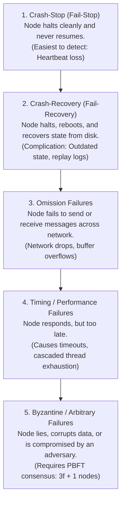
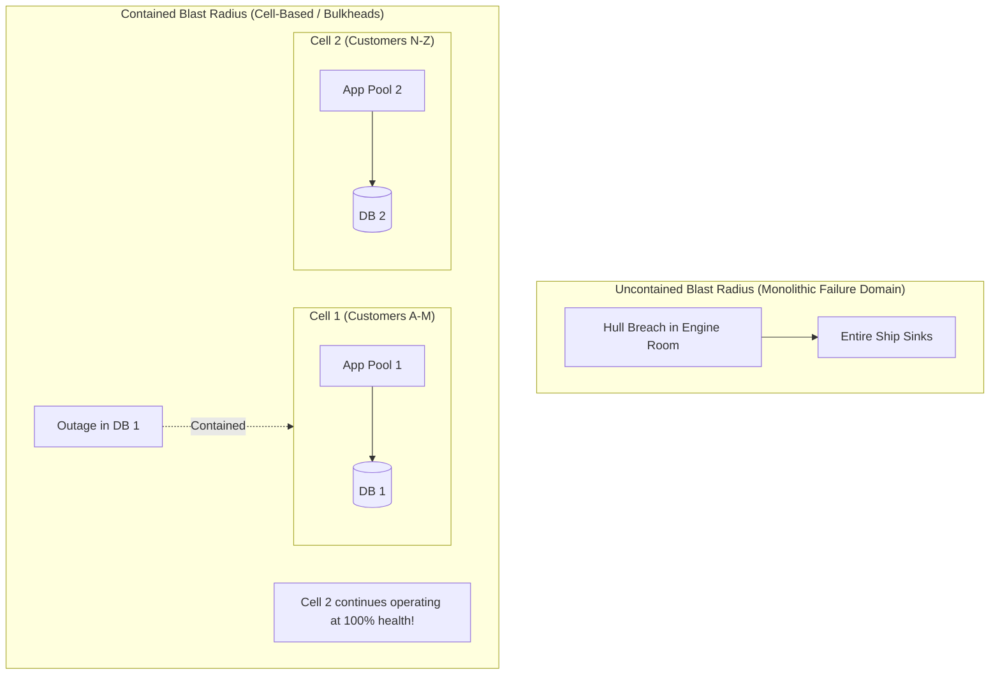

# Distributed Failure Models & Blast Radius Containment

> **Domain**: `00-foundations/distributed-systems`  
> **Status**: Approved  
> **Target Audience**: Solution Architects, Distributed Systems Engineers, SREs

---

## 1. Simple Explanation

In distributed systems, things fail all the time. A **Failure Model** is a formal specification of *how* components are assumed to fail. Knowing your system's failure model allows you to design architectures that continue operating safely even when specific parts crash, corrupt data, or act erratically.

---

## 2. The Hierarchy of Distributed Failure Models

From most benign to most catastrophic:

---

## 3. Detailed Model Analysis

### 3.1 Crash-Stop vs. Crash-Recovery
* **Crash-Stop**: Once a node crashes, it remains dead forever. Detecting failure is simple: if node stops responding to pings after $T$ seconds, assume it is dead and reassign work.
* **Crash-Recovery (The Real World)**: In production cloud environments, nodes crash due to OOM kills, kernel panics, or power flickers, and then reboot automatically.
  * *The Architectural Challenge*: When the node recovers, its local memory is wiped, but its local disk may contain stale, uncommitted transaction logs. The system must implement Write-Ahead Log (WAL) recovery and catch up via snapshot replication.

### 3.2 Byzantine Faults vs. Enterprise Crash Faults
* **Crash Fault Tolerance (CFT)**: Assumes all nodes are honest. If a node fails, it simply stops responding or crashes cleanly. (Handled by Raft, Paxos, ZooKeeper, etcd). Tolerates $f$ failures with $2f + 1$ nodes.
* **Byzantine Fault Tolerance (BFT)**: Assumes nodes can act maliciously, send conflicting messages to different peers, or lie about their state. (Handled by PBFT, blockchain consensus). Tolerates $f$ malicious nodes with $3f + 1$ nodes.
* *Architectural Reality*: Inside a private enterprise VPC behind a firewall, **CFT (Raft) is the standard**. BFT is only required in untrusted multi-party consortium networks.

---

## 4. Blast Radius Containment & Bulkhead Isolation

When a failure occurs, the architect's primary goal is to **contain the Blast Radius**—ensuring that a catastrophic failure in one component does not propagate and destroy adjacent systems.

### The Bulkhead Pattern (Michael Nygard)
Named after the watertight physical partitions in a ship's hull. If one compartment fills with water, the bulkhead seals, preventing the entire ship from sinking.

### Production Implementations of Bulkheads
1. **Isolated Thread Pools**: In application code, assign separate thread pools or HTTP client pools for critical payment APIs vs. non-critical analytics APIs.
2. **Cell-Based Architecture (AWS / Slack Pattern)**: Partition the entire platform into completely independent "Cells" (each with its own API gateway, microservices, and databases). If Cell 1 suffers a database crash, only 5% of enterprise customers are impacted; 95% of users notice nothing.
3. **Multi-AZ Availability Boundaries**: Isolate blast radius so that a power failure in AWS AZ `us-east-1a` cannot impact pods running in `us-east-1b` or `us-east-1c`.
