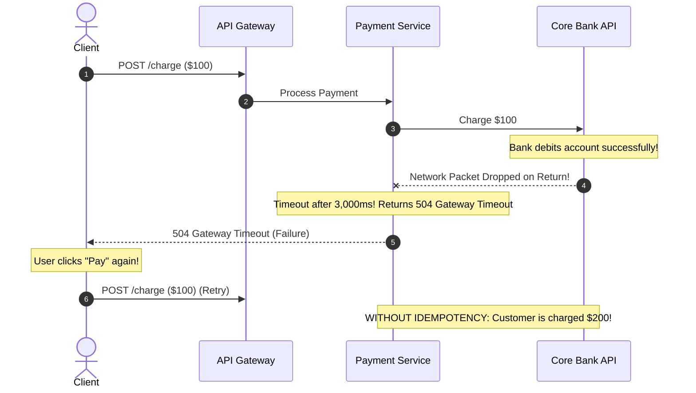
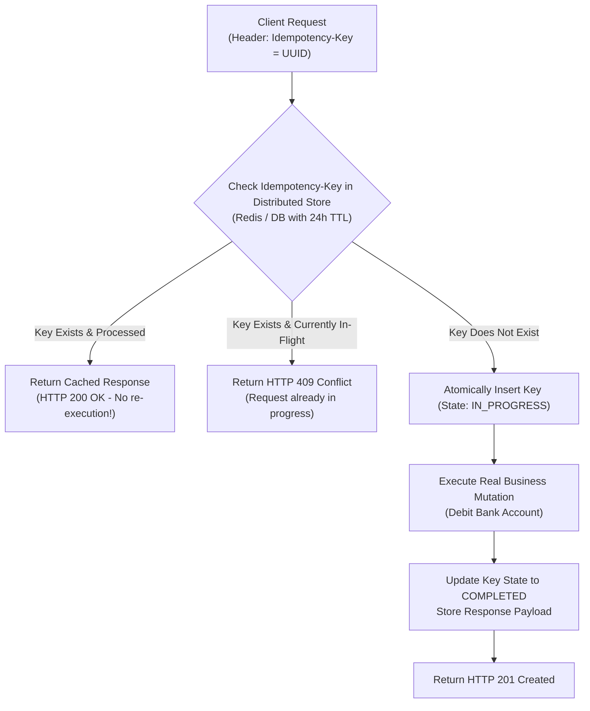

# Idempotency in Distributed APIs & Messaging

> **Domain**: `00-foundations/distributed-systems`  
> **Status**: Approved  
> **Target Audience**: Solution Architects, Principal Backend Engineers, API Designers

---

## 1. Simple Explanation

An operation is **Idempotent** if performing it once produces the exact same result as performing it multiple times.
* $f(x) = f(f(x))$
* In human terms: Pressing an elevator button once calls the elevator; pressing it 10 times does not summon 10 elevators.

In distributed systems where network packets drop, timeouts occur, and clients automatically retry, **idempotency is the only mechanism that prevents duplicate payments, duplicate orders, or corrupted account balances.**

---

## 2. Architect-Level Deep Dive: The Timeout Trap

Why is idempotency mandatory for all mutating distributed APIs?

Because the client cannot differentiate between a request that failed *before* execution and a request whose response dropped *after* execution, **every network retry must be assumed to be a potential duplicate.**

---

## 3. Implementation Pattern: The Idempotency Key

The industry standard pattern (pioneered by Stripe and Adyen) utilizes an `Idempotency-Key` header:

---

## 4. Idempotency Across HTTP Verbs

| HTTP Method | RFC Standard Specification | Architectural Caveat |
| :--- | :--- | :--- |
| `GET` | **Idempotent & Safe** | Must never mutate server state; safe to retry indefinitely. |
| `DELETE` | **Idempotent** | Deleting resource #123 once returns `204 No Content`. Deleting it a second time returns `404 Not Found` or `204`, but server state is unchanged. |
| `PUT` | **Idempotent** | Full resource replacement (`SET name = 'Alice'`). Safe to retry. |
| `POST` | **NOT Idempotent** by default | Appends new entity (`INSERT`). **Mandates explicit `Idempotency-Key` implementation.** |
| `PATCH` | **NOT Idempotent** (Context-dependent) | `SET age = 30` is idempotent; `INCREMENT age BY 1` is NOT idempotent. |

---

## 5. Production Checklist for Idempotency

* [ ] Is the `Idempotency-Key` scoped to the authenticated `tenant_id` and `user_id` to prevent cross-tenant key hijacking?
* [ ] Is the key persisted in high-speed storage (Redis/PostgreSQL) with an appropriate TTL (e.g., 24 to 48 hours)?
* [ ] Does the implementation handle concurrent duplicate requests by rejecting in-flight duplicates with `409 Conflict`?
