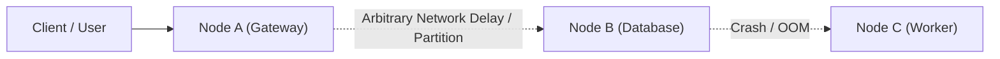

# Introduction to Distributed Systems & The 8 Fallacies

> **Domain**: `00-foundations/distributed-systems`  
> **Status**: Approved  
> **Target Audience**: Solution Architects, Enterprise Architects, Principal Engineers

---

## 1. Simple Explanation

A distributed system is a collection of independent computers that communicate over a network and coordinate by passing messages, appearing to end-users as a single coherent system. 

As Leslie Lamport famously observed:  
> *"A distributed system is one in which the failure of a computer you didn't even know existed can render your own computer unusable."*

---

## 2. Architect-Level Deep Dive

In a monolithic process running on a single server, function calls are deterministic: they succeed, fail with an exception, or panic. Memory is shared, clocks are synchronized, and execution state is local.

In a distributed system, physical space, network physics, and separate hardware failure domains intervene:
1. **Partial Failures**: Components fail independently while other nodes continue operating unaware of the failure.
2. **Unreliable Communication**: Networks can drop packets, duplicate packets, reorder packets, or delay packets arbitrarily.
3. **Absence of a Global Clock**: There is no universal "now". Every physical machine has quartz crystal drift, making physical timestamps dangerous for transaction ordering.

---

## 3. The 8 Fallacies of Distributed Computing

Engineered by L. Peter Deutsch and James Gosling at Sun Microsystems, these eight false assumptions lie at the root of almost every enterprise system outage:

| Fallacy | Reality in Enterprise Production | Architectural Mitigation |
| :--- | :--- | :--- |
| **1. The network is reliable** | Packet loss, cable cuts, cloud VPC drops, and switch reboots happen daily. | Implement bounded timeouts, circuit breakers, idempotency, and retries with jitter. |
| **2. Latency is zero** | In-process call = ~10 nanoseconds; Inter-AZ network call = ~1-2 milliseconds; Cross-region = 50-100ms. | Cache locally; batch operations; avoid chatty fine-grained RPC networks. |
| **3. Bandwidth is infinite** | Saturated NICs, cross-AZ cloud network throttles, and serialization overhead choke throughput. | Compress payloads (Protobuf/Avro over verbose JSON); paginate; filter fields. |
| **4. The network is secure** | Perimeter networks get breached; internal malicious actors exist; cloud VPCs share physical hypervisors. | Zero Trust architecture: mutual TLS (mTLS), token validation, encryption at rest and in transit. |
| **5. Topology doesn't change** | Cloud autoscaling, container restarts, Kubernetes node draining constantly alter IP endpoints. | Dynamic service discovery (CoreDNS, Consul), load balancers, virtual IP addresses. |
| **6. There is one administrator** | Disparate teams own infrastructure, cloud networks, databases, third-party SaaS, and apps. | Strict API contracts, SLAs/SLOs, automated CI/CD guardrails, centralized observability. |
| **7. Transport cost is zero** | Cloud providers charge heavily for inter-region and internet data egress (FinOps disaster). | Co-locate high-bandwidth services; leverage regional endpoints; minimize payload bloat. |
| **8. The network is homogeneous** | Polyglot microservices, mixed Linux/Windows hosts, heterogeneous client devices (iOS, Android, Web). | Standardized wire protocols (HTTP/2, gRPC, JSON/Protobuf, CloudEvents). |

---

## 4. Production Failure Scenario

**The "Infinite Timeout" Outage**: A backend service made synchronous HTTP calls to a third-party credit check API with default unbounded socket timeouts. The third-party API hung due to a database deadlock. Within 90 seconds, all 500 worker threads in the enterprise application server were blocked waiting on socket reads. Connection pools exhausted; health probes failed; Kubernetes restarted the pods; incoming traffic immediately choked the fresh pods. The entire enterprise core collapsed.

**Architectural Takeaway**: Never rely on default network library settings. Every outbound network socket must have an explicit connection timeout (e.g., 500ms) and socket read timeout (e.g., 2,000ms).
