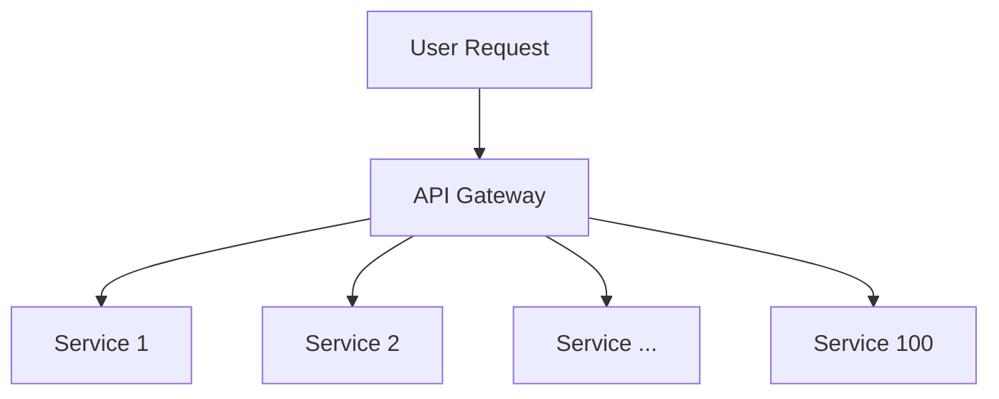

# Latency & Tail Latency Amplification

> **Domain**: `00-foundations/distributed-systems`  
> **Status**: Approved  
> **Target Audience**: Solution Architects, Performance Engineers, SREs

---

## 1. Simple Explanation

**Latency** is the time elapsed between initiating a request and receiving the response. While "average" latency tells you what a typical user experiences, **Tail Latency** (p95, p99, p99.9) tells you what your most valuable or complex user journeys experience when systems are under stress.

---

## 2. Architect-Level Deep Dive

In enterprise microservices, a single user request often triggers a fan-out of 10 to 100 downstream internal service calls. This causes catastrophic **Tail Latency Amplification**.

### The Mathematics of Tail Amplification
If a single service call has a 99th percentile latency of 1 second (meaning 1% of requests take $\ge 1\text{s}$), and a user transaction requires **100 independent parallel service calls**, the probability that the overall user transaction experiences a tail delay is:
$$P(\text{Tail Delay}) = 1 - (1 - 0.01)^{100} = 1 - (0.99)^{100} \approx 63.4\%$$

**More than 63% of your users will experience the 99th-percentile worst-case latency!**

---

## 3. Numbers Every Architect Must Know (Latency Numbers)

* L1 CPU cache reference: `0.5 ns`
* L2 CPU cache reference: `7 ns`
* Main memory (RAM) reference: `100 ns`
* Read 1 MB sequentially from RAM: `3,000 ns (3 µs)`
* Read 1 MB sequentially from NVMe SSD: `1,000,000 ns (1 ms)`
* Round-trip inside same cloud data center: `500,000 ns (0.5 ms)`
* Round-trip cross-AZ in AWS (e.g., us-east-1a to us-east-1b): `1,500,000 ns (1.5 ms)`
* Round-trip transcontinental (NY to London via fiber): `60,000,000 ns (60 ms)`

---

## 4. Architectural Mitigation Strategies

### 1. Hedged Requests / Tied Requests
If a downstream read call has not responded within the 95th percentile expected latency (e.g., 50ms), fire a duplicate request to another replica. Use whichever response arrives first and cancel the slower request. (Pioneered by Google in *The Tail at Scale*).

### 2. Strict Latency Budgets
Allocate fractional latency budgets down the call hierarchy:
* Total User Budget: `300ms`
* Ingress / Gateway: `20ms`
* Application Business Logic: `80ms`
* Database / Caching: `150ms`
* External Third-Party APIs: `50ms`

### 3. Asynchronous Decoupling & Batching
Avoid synchronous fan-out where possible. Use Kafka or read-model projections (CQRS) so the user query reads from a single pre-computed materialized view.
