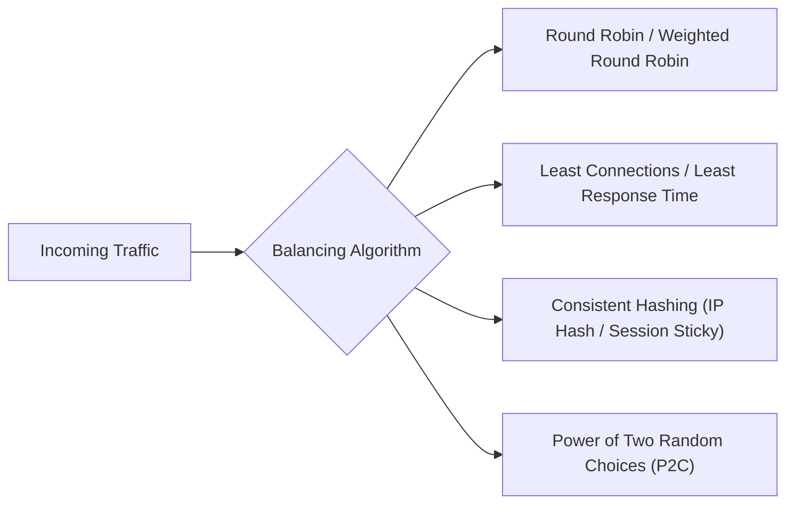

# Load Balancing Algorithms & Topologies (L4 vs. L7)

> **Domain**: `00-foundations/distributed-systems`  
> **Status**: Approved  
> **Target Audience**: Solution Architects, Network Architects, Infrastructure Engineers

---

## 1. Simple Explanation

A **Load Balancer** acts as a reverse proxy traffic cop sitting in front of your servers, distributing incoming client requests across multiple backend instances to ensure no single server is overwhelmed, maximizing throughput and eliminating single points of failure.

---

## 2. Architect-Level Deep Dive: Layer 4 vs. Layer 7

The most critical architectural distinction is the OSI layer at which load balancing takes place:

```mermaid
flowchart TD
    Client["Client Request"] --> Ingress{"Load Balancer Tier"}

    Ingress -->|Layer 4 (Transport)| L4["L4 Load Balancer (AWS NLB, IPVS)\nInspects: Source/Dest IP & TCP/UDP Port\nZero packet inspection; ultra-fast; line-rate throughput"]

    Ingress -->|Layer 7 (Application)| L7["L7 Load Balancer (AWS ALB, Nginx, Envoy)\nInspects: HTTP URI, Headers, Cookies, JWT claims, gRPC method\nSmart routing, TLS termination, higher CPU overhead"]
```

### Comparative Breakdown

| Architectural Feature | Layer 4 (Transport Level) | Layer 7 (Application Level) |
| :--- | :--- | :--- |
| **Data Inspected** | IP addresses, TCP/UDP ports only | Full HTTP payload, URI path, headers, cookies, query parameters |
| **Throughput & Speed**| Ultra-high (Millions of packets/sec, line-rate, hardware-accelerated) | Moderate to high (Requires parsing HTTP/2, TLS decrypt/encrypt) |
| **TLS Termination** | Passes raw encrypted TCP bytes through to backends | Terminates TLS at load balancer; can inspect plain HTTP |
| **Smart Routing** | Cannot route based on URI path | Can route `/api/orders` to Order Pods and `/api/auth` to Auth Pods |
| **gRPC & WebSockets** | Sees raw TCP stream; cannot multiplex individual gRPC streams | Natively multiplexes gRPC calls across connections |

---

## 3. Load Balancing Algorithms



### 3.1 Round Robin & Weighted Round Robin
* **Mechanics**: Requests distributed sequentially ($1 \to 2 \to 3 \to 1$). Weighted Round Robin assigns higher proportions to beefier servers (e.g., Server with 8 cores gets $2\times$ traffic of a 4-core server).
* **Limitation**: Ignores actual server load. If Request 1 takes 10 seconds and Request 2 takes 1 millisecond, servers become severely unbalanced.

### 3.2 Least Connections & Least Response Time
* **Mechanics**: Routes the request to the server with the lowest active TCP connections or fastest moving-average latency.
* **Fit**: Long-lived connections, database queries, transactions with wildly unpredictable processing durations.

### 3.3 Consistent Hashing (IP Hash)
* **Mechanics**: Hashes client IP or cookie (`Hash(IP) % Ring`).
* **Fit**: Caching tiers where keeping client requests on the same backend node maximizes in-memory L1 cache hits.

### 3.4 Power of Two Random Choices (P2C - The Modern Standard)
* **Mechanics**: Pick two servers at random. Query their active load. Route the request to the less-loaded of the two.
* **Theoretical Power**: Michael Mitzenmacher mathematically proved that this simple algorithm eliminates herd behavior and approaches the performance of global least-connections without requiring centralized coordination! (Used in Envoy and Nginx).

---

## 4. Health Probes & The "Gray Failure" Trap

Load balancers monitor backends using **Health Probes** (Liveness and Readiness):
* **Readiness Probe**: Is this pod ready to accept traffic? If failing, remove pod from load balancer pool immediately, but do NOT restart it.
* **Liveness Probe**: Is this pod deadlocked? If failing, kill the pod and restart container.

> **Caution on Deep Health Checks**: Never configure `/health` to execute a heavy database query or call downstream APIs. If the database lags for 2 seconds, all health checks fail simultaneously; the load balancer marks 100% of servers as dead, turning a minor database hiccup into a total platform blackout.
