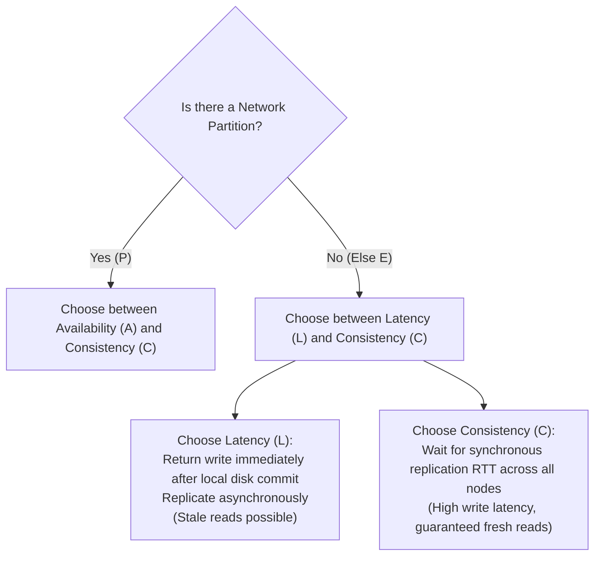

# The PACELC Theorem: Consistency vs. Latency

> **Domain**: `00-foundations/distributed-systems`  
> **Status**: Approved  
> **Target Audience**: Solution Architects, Data Architects, Distributed Systems Engineers

---

## 1. Simple Explanation

The **PACELC Theorem** extends the CAP theorem to describe how distributed databases behave **during normal, non-partitioned operation** (which is 99.9% of the time).

PACELC states:
* If there is a **Partition (P)**, how does the system choose between **Availability (A)** and **Consistency (C)**?
* **Else (E)**, when the network is running normally, how does the system choose between **Latency (L)** and **Consistency (C)**?

---

## 2. Architect-Level Deep Dive: The Normal-State Trade-off

The fundamental limitation of the CAP theorem is that it only describes system behavior during rare network partition disasters. But what happens during normal operation?



### The "Else" Dilemma (L vs. C)
Even when cables are intact and routers are healthy, network packets still travel at the speed of light (~200 km per millisecond in fiber optic glass):
* If you want **Consistency (C)** on every read, your write operation must wait for synchronous replication round-trips to remote data centers before returning `200 OK`. Write latency will be high (`50ms - 150ms`).
* If you want **Low Latency (L)** (e.g., `2ms` writes), the primary node must return `200 OK` immediately and replicate asynchronously in the background. But this means a concurrent read hitting a replica will return stale data (sacrificing Consistency).

---

## 3. PACELC Classification Matrix for Enterprise Databases

Dr. Daniel Abadi classified all major distributed storage engines into four primary PACELC quadrants:

```text
┌─────────────────────────────────────────────────────────────┐
│                    PACELC DATABASE MATRIX                   │
├───────────────────────────────┬─────────────────────────────┤
│ PC/EC                         │ PC/EL                       │
│ (Partition: C, Else: C)       │ (Partition: C, Else: L)     │
│ Favors Consistency ALWAYS.    │ Consistent on partition,    │
│ Google Spanner, CockroachDB,  │ Low latency in normal state.│
│ VoltDB, Megastore.            │ MongoDB (default), MySQL/PG │
│                               │ with async read replicas.   │
├───────────────────────────────┼─────────────────────────────┤
│ PA/EC                         │ PA/EL                       │
│ (Partition: A, Else: C)       │ (Partition: A, Else: L)     │
│ Rare in practice.             │ Favors Availability & Speed.│
│ Sacrifices latency in normal  │ Apache Cassandra, DynamoDB, │
│ state, but stays available.   │ CouchDB, Riak.              │
└───────────────────────────────┴─────────────────────────────┘
```

---

## 4. Practical Architecture Takeaway

When selecting a database for an enterprise platform:
1. Don't just ask: *"Is it CP or AP?"*
2. Ask the deeper PACELC question:
   > **"When the network is healthy, are our writes waiting for cross-node replication round-trips (PC/EC), or are we serving reads from stale asynchronous replicas (PC/EL or PA/EL)?"**
