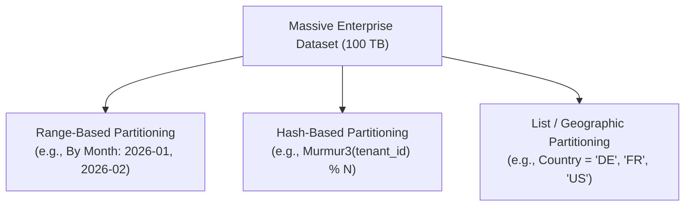
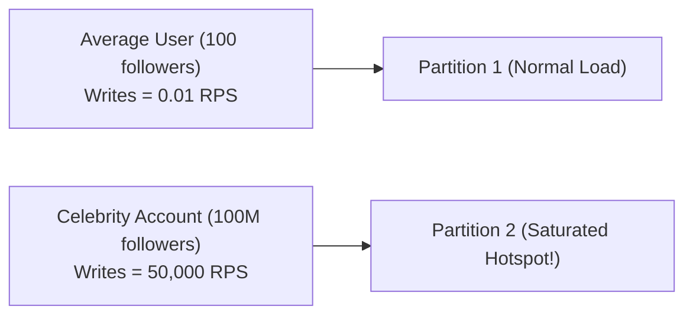

# Partitioning Strategies & Hotspot Mitigation

> **Domain**: `00-foundations/distributed-systems`  
> **Status**: Approved  
> **Target Audience**: Solution Architects, Data Architects, Database Administrators

---

## 1. Simple Explanation

**Partitioning** (also known as segmentation or split-table architecture) is the practice of breaking a single massive dataset into smaller, independent subsets (partitions) so that operations can execute in parallel, reducing scan times and disk I/O.

---

## 2. Architect-Level Deep Dive: Partitioning Strategies

### 2.1 Range-Based Partitioning
* **Mechanics**: Data is assigned to partitions based on continuous key ranges (e.g., Date ranges, Alphabetic ranges $A-C, D-F$).
* **When to Use**: Time-series telemetry, financial transaction audit logs.
* **Severe Anti-Pattern / Failure Mode**: **The Append Hotspot**. If range partitioning is applied to `created_at` on high-throughput writes, **100% of all writes hit the single current active partition node**, while older partition nodes sit 100% idle.

### 2.2 Hash-Based Partitioning (Consistent Hashing)
* **Mechanics**: A cryptographic or non-cryptographic hash function (Murmur3, CityHash) is applied to the partition key:
  $$\text{Partition ID} = \text{Hash}(\text{Key}) \pmod{\text{Number of Partitions}}$$
* **Advantage**: Uniformly distributes writes across all physical partition nodes. Eliminates append hotspots.
* **Trade-off**: Destroys range scan performance. Querying `WHERE age BETWEEN 20 AND 30` requires a scatter-gather query across all partitions.

### 2.3 List / Geographic Partitioning
* **Mechanics**: Data partitioned explicitly based on a categorical attribute (e.g., `EU_Customers`, `US_Customers`).
* **Architectural Driver**: Strict regulatory compliance (GDPR data sovereignty rules mandating that EU citizen data cannot leave Frankfurt cloud data centers).

---

## 3. The Hotspot & Celebrity Problem

Even with hash partitioning, systems fail when individual partition keys have extreme imbalances in traffic.

### Architectural Mitigations for Hotspots
1. **Key Salting**: Append a pseudo-random suffix or modulo range to the hot partition key:
   $$\text{Partition Key} = \text{CelebrityID} + \text{"\_"} + \text{Random}(1, 10)$$
   This spreads the celebrity's writes across 10 distinct physical partitions. Read queries must query all 10 salted keys and merge results in memory.
2. **Read-Aside Caching**: High-cardinality hot read keys are intercepted at the edge/Redis layer, completely shielding the partitioned storage engine from lookup traffic.
