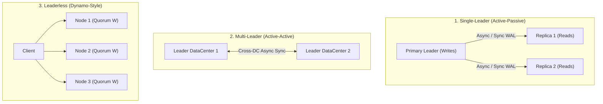

# Data Replication Models & Mechanics

> **Domain**: `00-foundations/distributed-systems`  
> **Status**: Approved  
> **Target Audience**: Solution Architects, Data Architects, Infrastructure Engineers

---

## 1. Simple Explanation

**Replication** means keeping a copy of the same data on multiple physical machines connected via a network. We replicate data for two distinct reasons:
1. **High Availability**: If Machine A crashes, Machine B can immediately take over without service interruption.
2. **Scalability & Latency**: Users in Europe read from European replicas, while users in Asia read from Asian replicas, minimizing speed-of-light network latency.

---

## 2. Architect-Level Deep Dive: The Three Replication Topologies

### 2.1 Single-Leader (Leader-Follower / Primary-Replica)
* **Mechanics**: All write operations (`INSERT`, `UPDATE`, `DELETE`) must go to the single primary leader. The leader writes to its Write-Ahead Log (WAL) and replicates changes to follower replicas. Followers serve read-only queries (`SELECT`).
* **Examples**: PostgreSQL streaming replication, MySQL master-slave, MongoDB primary-secondary.
* **Trade-offs**:
  * *Advantage*: Simple mental model; zero write conflicts (single sequencing authority).
  * *Disadvantage*: Write throughput is bounded by the capacity of the single leader node. Failover causes momentary downtime and potential data loss if asynchronous.

### 2.2 Multi-Leader (Active-Active)
* **Mechanics**: Multiple nodes across different geographic regions accept writes concurrently. Leaders asynchronously replicate their writes to each other.
* **Examples**: Multi-region Aurora, CouchDB, Cassandra (configured per-datacenter).
* **The Core Challenge**: **Write Conflict Resolution**:
  * If User A in London changes address to "Street 1" and User A in New York concurrently changes it to "Street 2", how do the leaders reconcile?
  * *Resolution Strategies*: Last-Write-Wins (LWW - causes silent data loss due to clock skew); Conflict-Free Replicated Data Types (CRDTs); or custom application merge functions.

### 2.3 Leaderless (Dynamo-Style)
* **Mechanics**: Any replica accepts writes and reads directly from clients. Clients achieve consistency via **Quorum Consensus**:
  $$W + R > N$$
  * $N$: Total number of replicas (e.g., 3).
  * $W$: Number of replicas that must acknowledge a write before returning success (e.g., 2).
  * $R$: Number of replicas that must be queried during a read (e.g., 2).
* **Examples**: Apache Cassandra, Amazon DynamoDB, ScyllaDB.

---

## 3. Synchronous vs. Asynchronous Replication

| Dimension | Synchronous Replication | Asynchronous Replication | Semi-Synchronous (Default in Cloud) |
| :--- | :--- | :--- | :--- |
| **Write Durability** | $100\%$ guaranteed (RPO = 0) | Data loss risk during master crash | High (at least one replica has committed) |
| **Write Latency** | High (waits for network RTT of slowest node) | Ultra-low (leader returns immediately after local disk write) | Balanced (waits for 1 replica, others async) |
| **Availability** | Low (if 1 replica hangs, all writes stall) | High (replicas can crash without blocking writes) | High (tolerates follower crashes) |

---

## 4. Replication Lag Anomalies in Production

When using asynchronous read replicas, clients experience **Replication Lag** (typically 50ms to several seconds). This causes three major production bugs:

1. **Reading Your Own Writes Anomaly**: User updates profile, refreshes page, and sees their old profile because the load balancer routed the `GET` to a lagged replica.
   * *Mitigation*: Route user reads to the primary leader for 10 seconds following any mutating write, or track the client's write WAL position.
2. **Monotonic Reads Anomaly**: User refreshes page repeatedly. Request 1 hits an up-to-date replica; Request 2 hits a lagged replica. Time appears to move backwards.
   * *Mitigation*: Sticky session routing based on user ID.
3. **Consistent Prefix Reads**: Violation of causal ordering (e.g., an answer appears before the question).
